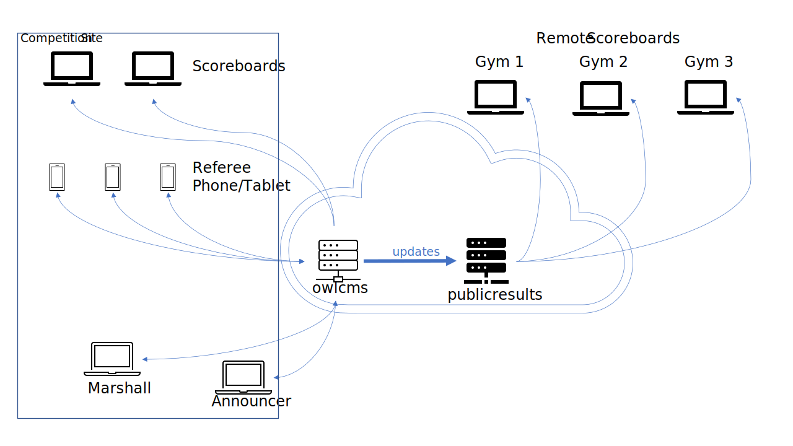

# OWLCMS - Olympic Weightlifting Competition Management System 
This software is a complete rewrite of `owlcms` which has been used to manage Olympic Weightlifting competitions since 2009. 

### Features, Documentation and Demo

See the application [Web Site](https://owlcms.github.io/owlcms4/#) for a full overview.  See [this page](https://owlcms.github.io/owlcms4/#/Demo) for a live demo.

### Basic Installation Options
Several installation options are possible, depending on what is available at the competition site

#### Easiest: Cloud-Based Installation (Internet required)

If there is good internet communication at the competition site, there is no need to install anything locally. 

- There is a one-click install procedure to a free (0$) cloud service called Heroku (a division of Salesforce.com). 
- The install will create your own private copy of the application, with your own database.
- The owlcms software runs as a web site. All the various display screens and devices connect to the cloud using the competition site's wifi or ethernet network.

* [Heroku Cloud Installation Instructions](https://owlcms.github.io/owlcms4/#/Cloud)
* Heroku Cloud releases for for [owlcms](https://github.com/owlcms/owlcms-heroku/releases/latest) and [publicresults](https://github.com/owlcms/publicresults-heroku/releases/latest)

#### Stand-alone: Laptop installation

If there is no Internet connectivity at your competition site, you can use a stand-alone setup and run the software on a laptop.

- The software runs on a laptop (labeled owlcms in the diagram). 

- All the other screens and officials connect to that laptop using only a web browser, so you can use whatever you want (old laptops, chromebooks, tablets, firetv sticks, etc.).  All the communications take place over a local network (wifi or ethernet).

- You can run owlcms on the same machine as one of the officials.  It is often the case that owlcms runs on the same machine as the announcer or the competition secretary.  In the simplest setups, there is just the announcer, and maybe one scoreboard.

- You can referee using hand signals, flags, phones, or dedicated devices. See [this page](https://owlcms.github.io/owlcms4/#/Refereeing)

  

See the following instructions

  * [Windows Stand-alone Installation](https://owlcms.github.io/owlcms4/#/LocalWindowsSetup)
* [Linux or Mac Stand-alone Installation](https://owlcms.github.io/owlcms4/#/LocalLinuxMacSetup)
* [Release repository](https://github.com/owlcms/owlcms4/releases/latest) for installers

### Virtual Competitions and Individual Scoreboards

There are additional modules available to support more involved scenarios.  For example, it is possible to have individual scoreboards available to every coach -- supporting physical distancing.  This can also be used to provide individual scoreboards to every member of the public watching the competition remotely.

A competition with a main site and remote gyms connected by videoconferencing could look as follows

The following pages describe these options and others.

*	[Distancing using Individual Scoreboards](https://owlcms.github.io/owlcms4/#/Distancing)
*	[Cloud Installation of the publicresults Application](https://owlcms.github.io/owlcms4/#/Remote)
*	[Virtual Competitions and Remote Referees](https://owlcms.github.io/owlcms4/#/Virtual)
*	[Video-Conference Setup](https://owlcms.github.io/owlcms4/#/Video)

### Pre-releases

Refer to the following [page](Releases) for the various modules and releases, including preliminary releases for early adopters.

### Support

- [Discussion list](https://groups.google.com/forum/#!forum/owlcms)  If you wish to discuss the program or ask questions, please add yourself to this discussion [group](https://groups.google.com/forum/#!forum/owlcms).  You can withdraw at any time.
- [Project board](https://github.com/jflamy/owlcms4/projects/1) This shows what we are working on, and our work priorities.  Check here first, we may actually already be working on it...
- [Issues and enhancement requests](https://github.com/jflamy/owlcms4/issues) This is the complete log of requests and planned enhancements. Use this page to report problems or suggest enhancements.

### Licensing and Notes

This is free, as-is, no warranty *whatsoever* software. If you just want to run it as is for your own club or federation, just download from the [Releases](https://github.com/owlcms/owlcms4/releases) repository and go ahead. You should perform your own tests to see if the software is fit for your own purposes and circumstances.

If however you wish to provide the software as a service to others (including by hosting it), or if you create a modified version, the license *requires* you to make full sources and building instructions available for free &ndash; just like this software is (see the [License](https://github.com/owlcms/owlcms4/blob/master/LICENSE.txt) for details.)

### Translation to Other Languages

- You are welcome to translate the screens and reports to your own language, or fix a translation.  Refer to the [translation documentation](https://owlcms.github.io/owlcms4/#/Translation) if you wish to contribute.

### Credits

The software is written and maintained by Jean-François Lamy, IWF International Technical Official Category 1 (Canada)

Thanks to Anders Bendix Nielsen (Denmark) and Alexey Ruchev (Russia) for their support, feedback and help testing this version of the software.

See the file [pom.xml](pom.xml) for the list of Open Source software used in the project.  In particular, this project relies heavily on the [Vaadin](https://vaadin.com) application framework, and their long-standing support for open-source software.