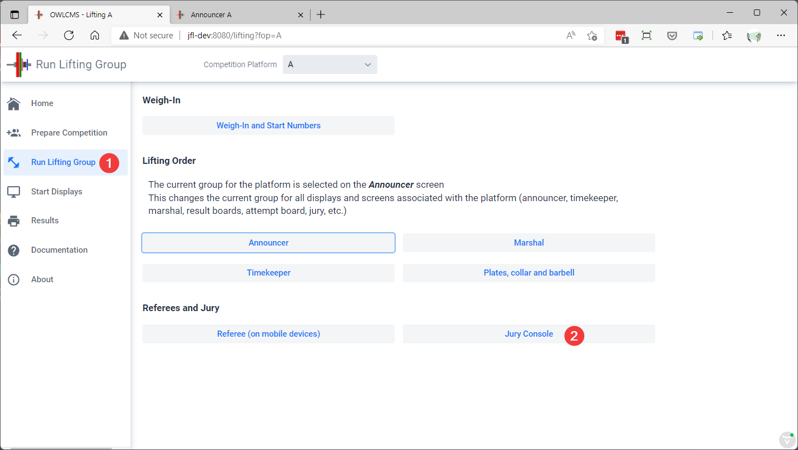
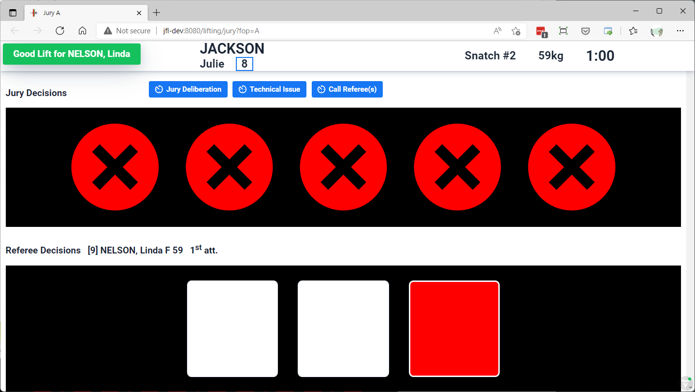
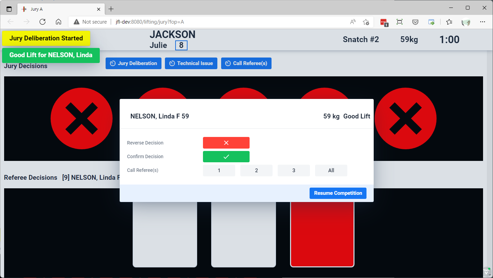
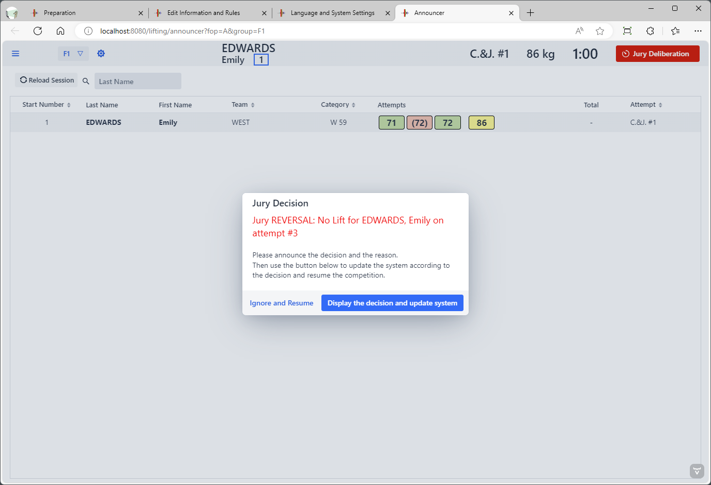
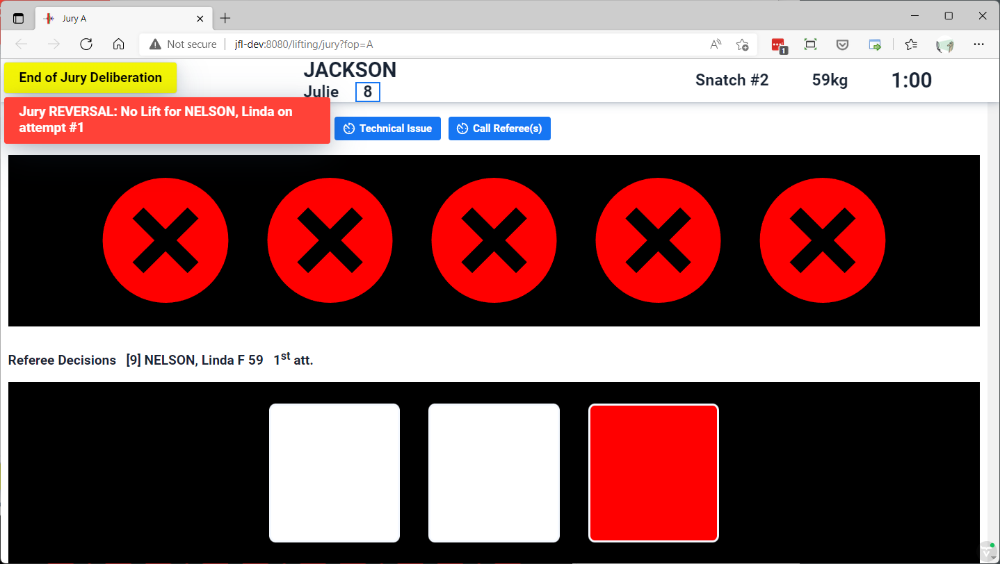
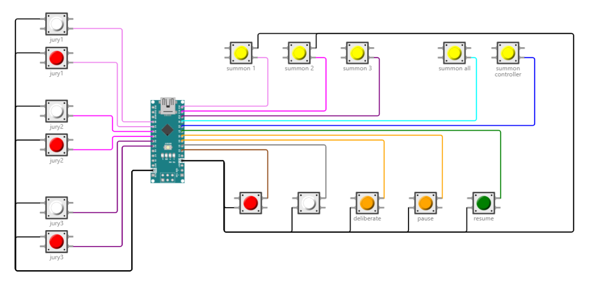
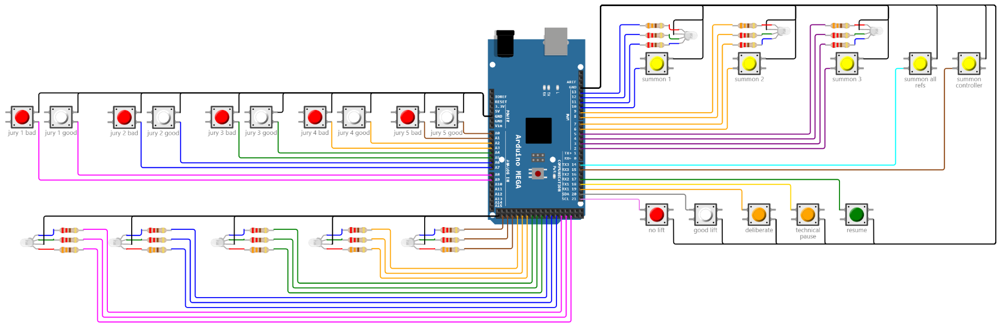

The jury is operated from the Jury Console page.  In order to use a Jury  you need 3 or 5 keypad devices connected to the computer running the Jury Console.  You may optionally have a separate keypad for the jury president (see below) in order to initiate deliberation and transmit decisions.

The jury console is started from the "run a lifting group" page.

 

## Jury Console

The jury console operates according to IWF rules:

- In the bottom part of the screen the referee decisions are shown <u>as soon as they are made</u>  
- In the top part of the screen, the decisions circle for a jury member shows that he or she has made a decision, but the individual decisions are only shown in red or white <u>after they have all been given</u>.

## Jury Deliberation

The jury console now allows direct reversal/confirmation of lifts 

  - The Jury Deliberation button opens a dialog whereby the lift can be confirmed or reversed,
  - During deliberation, it is possible to call the referees to the Jury table.  The referees get a notification on their device if the device is feedback-capable (such as a phone or a full-feedback keypad).

### Decision Announce

By rule, the announcer must announce the decision of the jury and the reason for which a lift was overturned.

When the jury presses the reverse or confirm button, the announcer receives a prompt.

After the announcer has done the announce, he presses the blue button, so that

1. The system is updated. 
2. Jury decisions are shown to the other technical officials consoles to keep them informed.
3. The decision (reversal or confirmation) is shown on the attempt boards.

This behavior (Announcer control of the display of jury decisions) is actually optional.  If it is disabled in the Competition Rules section, the display of the jury decisions will be immediate.  The announcer is still expected to announce the reason for reversal.

## Calling Referees

The "Call Referee(s)" button is used to summon referees to the Jury Table outside of a lift-reversal deliberation.  It is also possible to start a technical break if the Jury notices something is wrong with the platform or the equipment.

## Jury Devices

There are two ways to build jury devices.  The first way is to emulate a keyboard (one-way to owlcms), the second way is to use an Arduino to communicate with owlcms (bi-directional).

### Jury Keypads

You can configure programmable keypads for each of the jury members and for the jury president.  Refer to the [Keypads](../100-AdvancedTopics/180-Keypads) Advanced topic documentation for information.

### Arduino-based Jury Devices

Another way to build a device is to use the MQTT protocol that owlcms supports which provides bi-directional communcations.   Commercially available devices that use this approach are being developed (see the [BlueOwl project](https://github.com/scottgonzales/blue-owl)).

But you can in fact use the same approach to build your own devices. Arduino boards are an affordable way to build your own devices.  Designs are available on [this page](https://github.com/owlcms/owlcms-firmata/tree/main/README.md) for working timekeeper, referee, and jury setups.  The Firmata firmware that runs on the Arduino and the [interface program for owlcms](https://github.com/owlcms/owlcms-firmata) are provided.  There is actually nothing to program.  

##### Button-only Jury Box

A simple button-only jury control box and the associated jury member buttons, using the owlcms display to look at decisions, is shown here.  This is the same hardware as required to build a jury keypad, except that you don't have anything to program since all the software is already provided.  You would only adjust the configuration file if you needed to use different pins in your build.

 

##### Full Jury Control Box with Indicator Lights

A full 5-member jury device is shown below.  In actual practice, you might want to include only 3 jury members and if so you would only keep 3 sets of buttons on the left.   This design includes all the green/red/white indicator lights and uses an Arduino Mega to provide more pins.

 

owlcms uses the MQTT protocol used in Internet-Of-Things automation and monitoring applications to talks to the devices.  See the [MQTT](../100-AdvancedTopics/190-MQTT) page for more details and for schematics that you can use for your own devices.  Commercially available pre-built devices using the same protocol are also being developed.

