It is possible to run an application in the cloud that will display the competition scoreboards live, such that anyone in the world can see them.  This includes people in the audience when it is not feasible to have a large main room scoreboard.

The scoreboards are provided by the Tracker application, and the simplest way to get this done is to run tracker on the [fly.io](https://fly.io) cloud.  Running scoreboards for a meet will very likely be free, as it falls under the minimum amount for billing. Just remember to use **`Stop`** on the scoreboards after the competition is done.

### Cloud Setup

Go to the [owlcms-cloud](https://owlcms-cloud.fly.dev) application (https://owlcms-cloud.fly.dev) that will handle this for you.

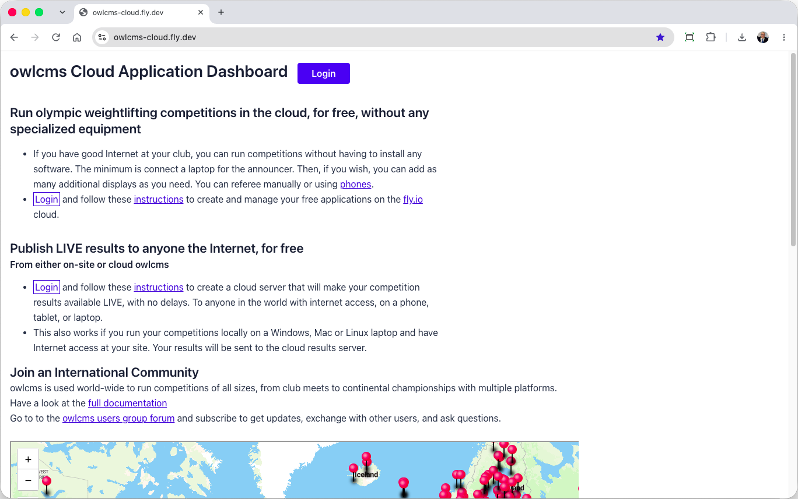

Use the Login button.  If you don't have an account, create one.  As stated earlier, if you run your meet and stop the application after the meet, you should be under the 5$/month minimum charging threshold and your usage will be free.

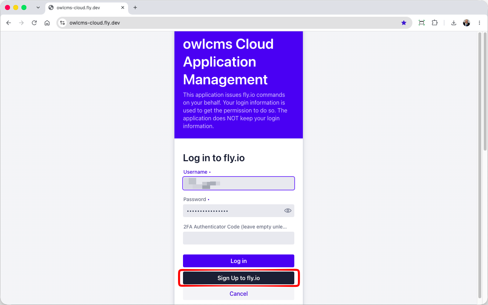

You will then create the web application that people will access.  In the example below, people will use `my-comp.fly.dev` to see the scoreboards

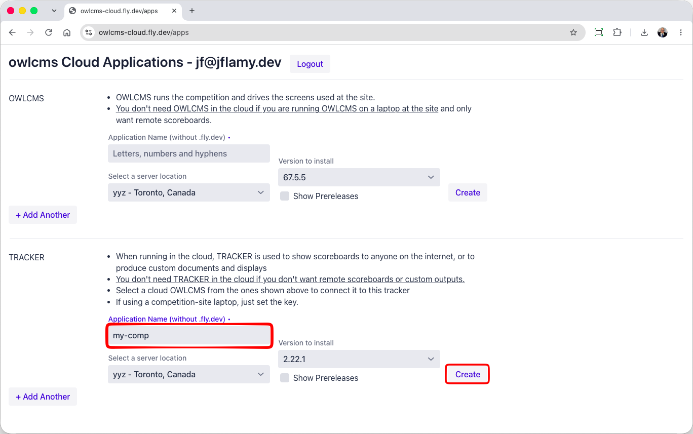

The application will then start and report it has started.  We then need to set a key to protect from vandalism.

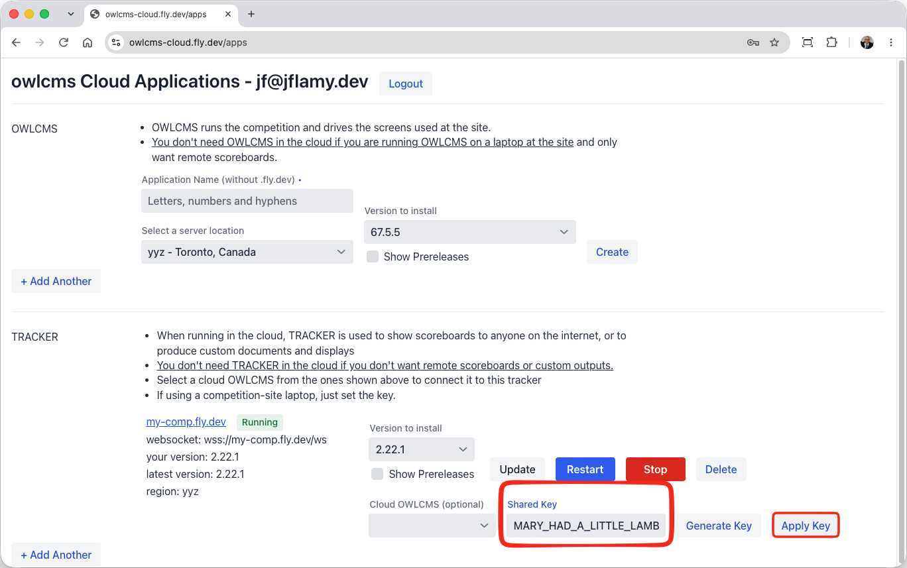

### Connecting a local OWLMCS to the Scoreboards

First, make sure you have the latest control panel installed (**version 3.8.0 or more recent**). You should get a warning if you are out of date. The warning includes a link to the download location for the current release. You can also check  https://github.com/owlcms/controlpanel/releases/latest directly.

Start the control panel, and select the `Tracker Connection` option next to the release you are using to run the competition.

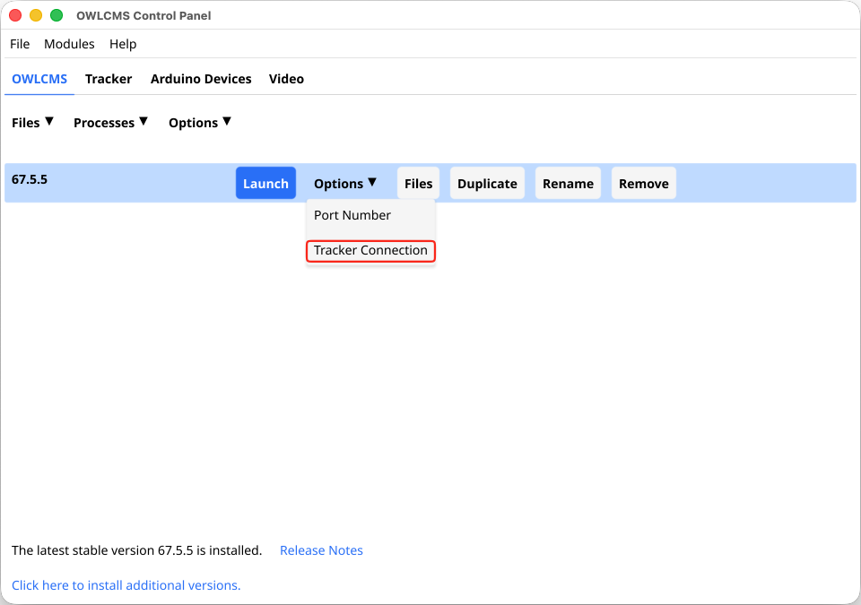

Then we enter the same information as on the owlcms-cloud screen and save. 

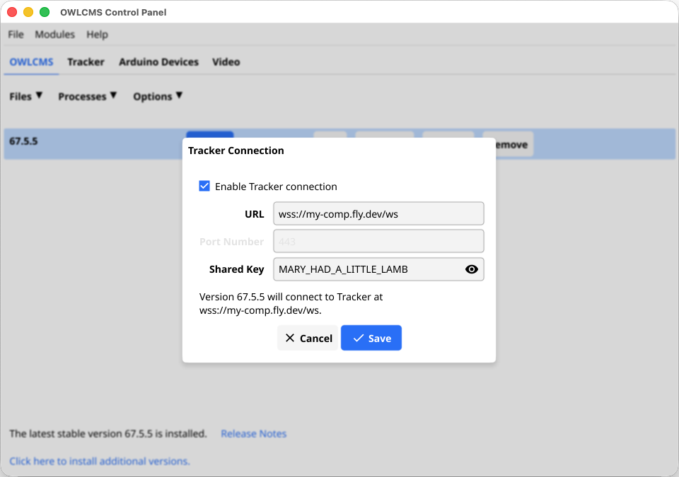

Then we start OWLCMS, and check that the connection worked.  The startup dialog will show

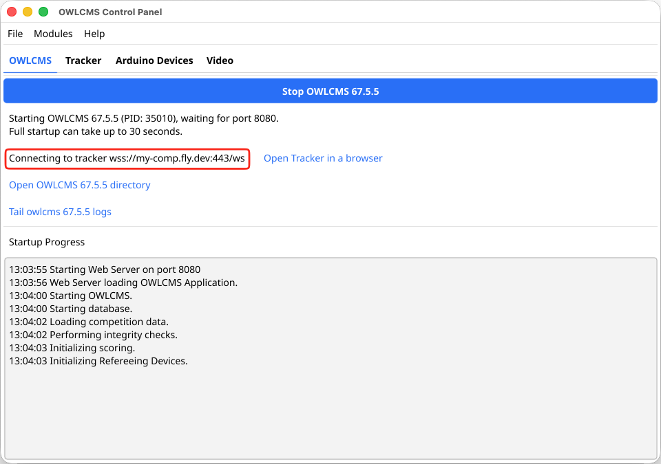

And the opening the remote URL will show

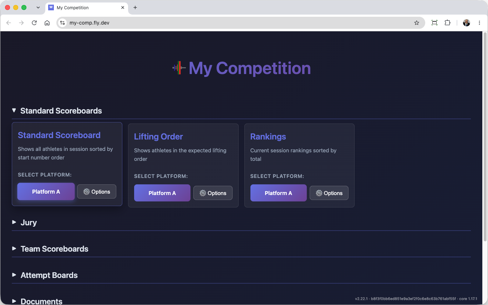

> **To make life easier for your users, see the section [Making Direct Links Available](#making-direct-links-available)**

### Connecting a Cloud OWLCMS to the Cloud coreboards

Let's assume we have also created an OWLCMS application under the name my-comp-owlcms.fly,dev (as explained on the [cloud installation page](../020-RunningInTheCloud/010-Fly.md).  Configure the competition name in OWLMCS.

1. Stop both the tracker and the OWLCMS application
2. In the tracker application section
   1. Select the OWLCMS app
   2. Enter a shared key
   3. Click Connect
   4. Start Tracker
   5. Start OWLCMS.  Open a browser and wait for it to be visible

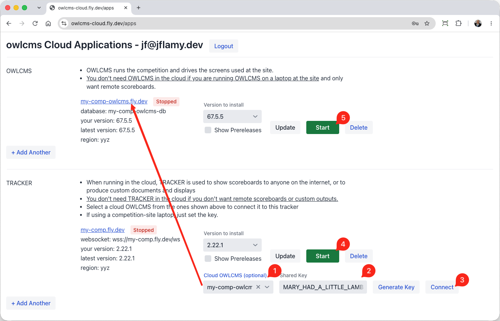

Once OWLCMS has started, it will connect to tracker and Tracker will update

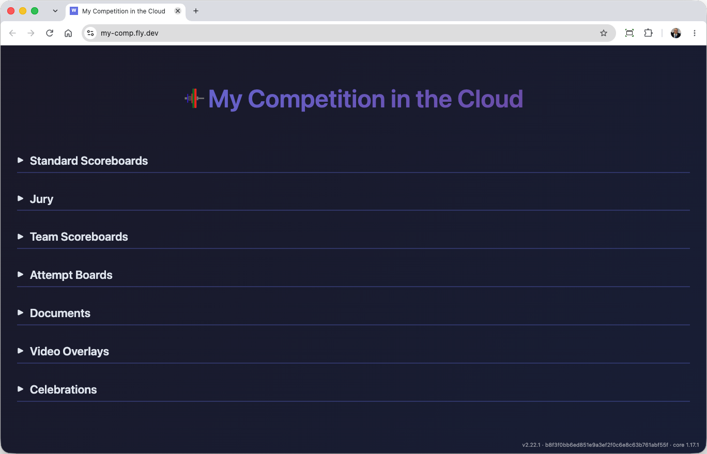

### Making Direct Links Available

Say you want coaches to see the lifting order directly on their phones. They can select the scoreboard directly
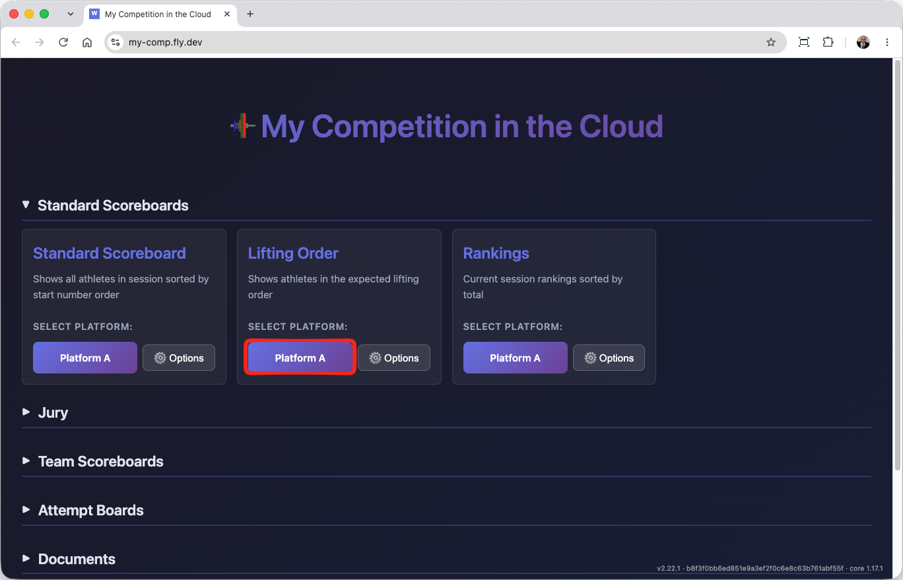

Or you can make a directl link on your site :  `https://my-comp.fly.dev/lifting-order?fop=A` by copyiing the URL.

Right-clicking in Chrome allows you to create a QR code you can print and display on-site (same on Edge, if you don't want the T-Rex in the center, similar on Firefox, right-click on the tab)

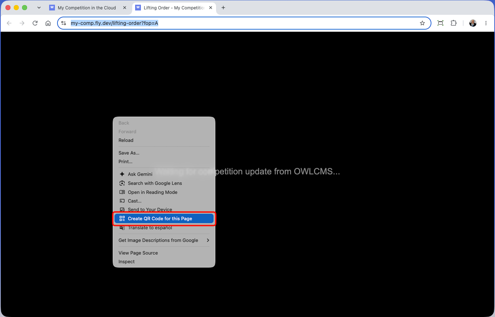

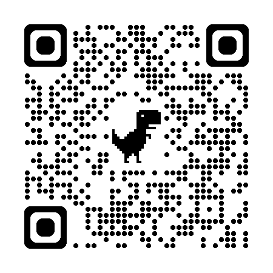