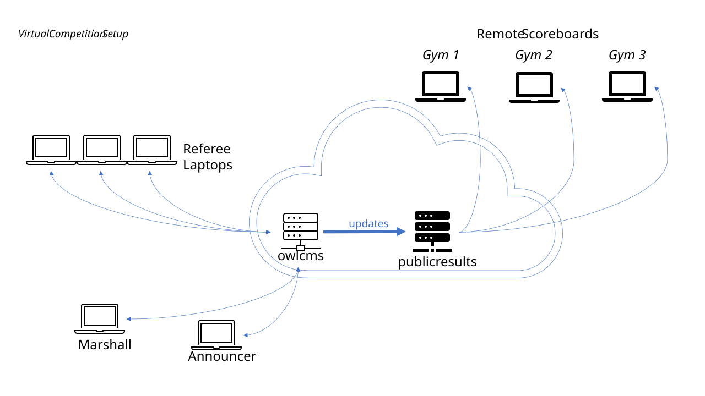

# Cloud-Based Virtual Competitions

In a virtual competition, the officials and athletes are in multiple locations.  

- In order to allow referees to see the athletes, a videoconferencing software is used. Zoom is well suited for this task. This also allows coaches to communicate declarations and weight changes.
- In order to allow access by all officials, `owlcms` is run in the cloud and supports remote refereeing -- see the following [page](../060-Refereeing/010-Refereeing#Mobile-Device-Refereeing) for details. Remote referees need to use a laptop because a proper screen is needed for refereeing but unfortunately iPads do not support simultaneous use of video and of the refereeing application.

Two cloud-based applications are used.  The officials use owlcms.  A second application called publicresults makes the scoreboard available.  Because they run on two different computers, they can be scaled up independently.

The following pages will guide you through setting up a virtual competition. First, install and configure the applications:

- [Setup Fly.io for a Virtual Competition](../020-RunningInTheCloud/010-Fly) : Follow the standard instructions, but make sure that you configure the publicresults module.

Once the application is installed, you can set up the video and broadcasting elements:

1. [Preparing the Zoom Setup](./020-PrepareZoomBroadcasting)
2. [Participant Instructions for Zoom](./040-UserInstructionsForZoom)
3. [Preparing a Live Video Broadcasting Setup](../090-Video/010-OBS)
4. [Live Streaming an Event](../090-Video/020-Streaming)
5. [Optional Modified Competition Rules](../100-AdvancedTopics/010-ModifiedRules)

