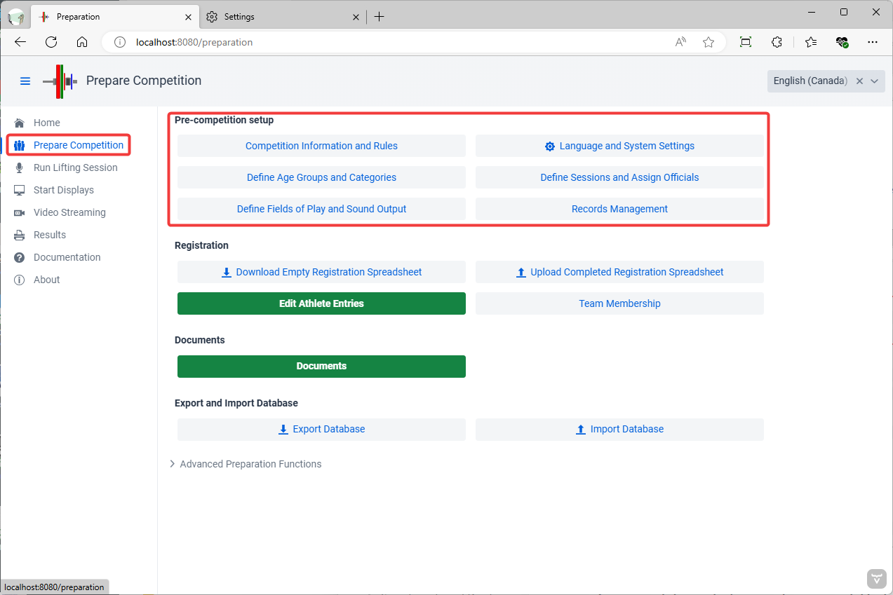
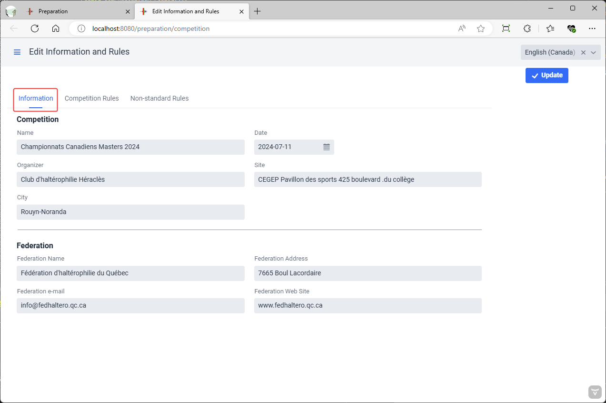
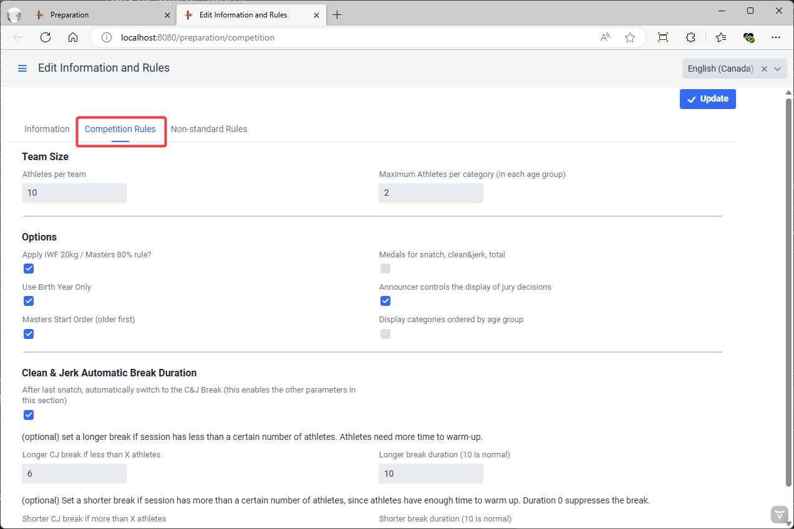
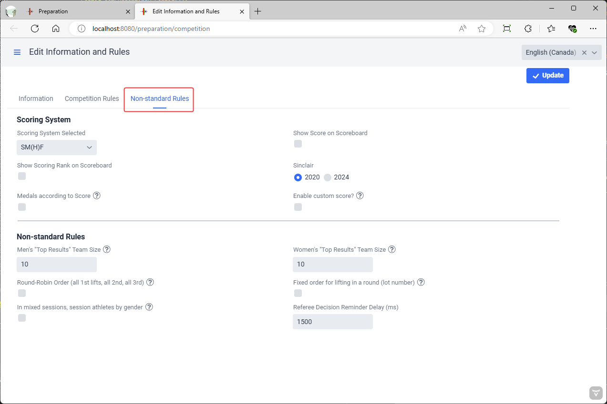
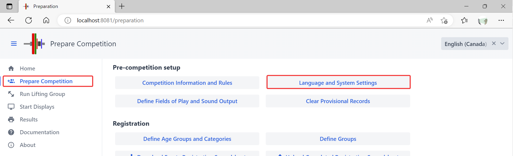
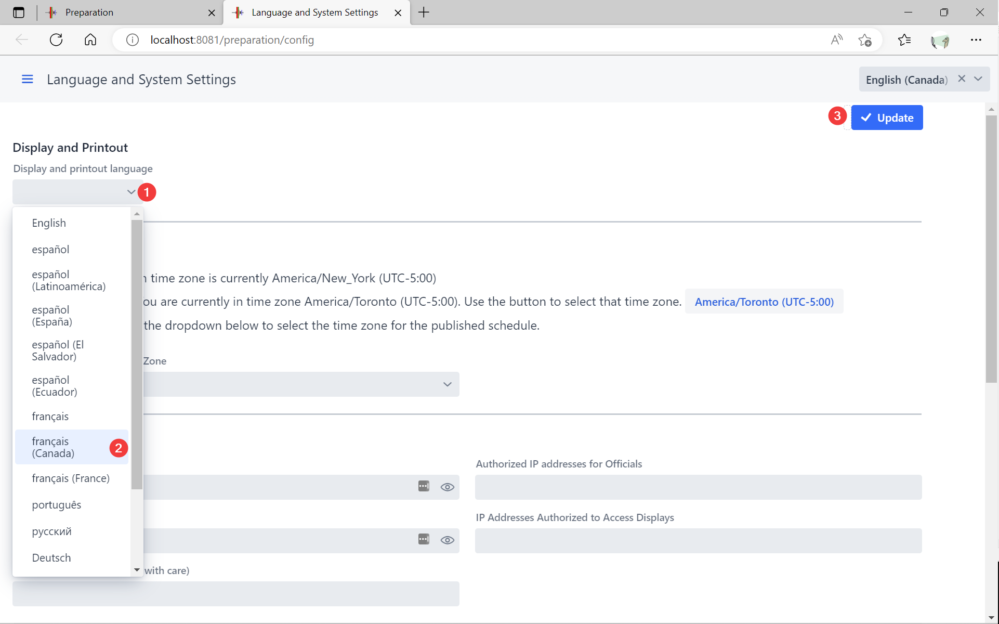
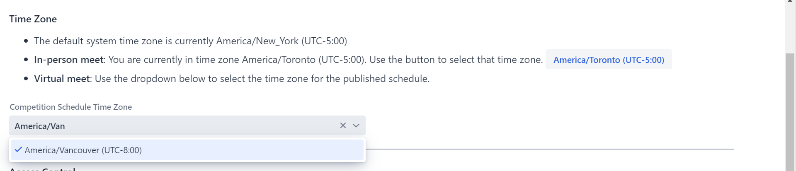

The first step in preparing for a competition is to provide general information about the meet and define the major settings.

## Competition Information and Rules

The `Competition Information and Rules` button leads to a page where general information about the competition is entered.

First, the name and other data about the competition and hosting federation is provided. This information appears on screens and documents.

#### Standard Competition Rules

The screen also allows selecting common variations on IWF rules.

- The `Apply initial total weight rule` determines whether the 20kg rule (15/10 for Masters) will be enforced.  Some local or regional meets do not enforce this rule.
- The `Medals for snatch, clean&jerk, total` checkbox determines whether separate rankings will be computed and shown for snatch and clean & jerk.  Leave it unchecked for a "total-only" competition.
- The `Use Birth Year Only` allows the use of only the 4-digit birth year for athletes, instead of a full date as required by IWF.
- The `Sinclair` setting determines which version of the coefficients is used.  The 2020 coefficients (issued in 2017) were used until the new ones were issued in fall 2022.  This setting does *not* affect the Masters SMF and SMHF coefficients.
- `Referee Decision Reminder Delay` When using phones/tablets to referee, or MQTT devices that can provide feedback to the referee, this determines the delay (in milliseconds) before sending a reminder.
- The Masters switch is used when running a Masters-only competition, and is *not* required for competitions that have both Masters and non-Masters groups.

  - The Masters settings changes the sorting order for displays and weigh-ins -- Masters traditionally start with the older lifters.
  - The determination to apply the IWF 20kg or the IWF Masters 80% rule is automatic, based on whether the athlete is registered in a regular or Masters category.

#### Non-Standard Rules

Additional options are used when running team, kid, or virtual competitions. 

- `Top Resuts Team Sizes`  in some youth competitions, points are awarded as usual, but the teams are not pre-determined. Instead, the best "n" athletes point scores are counted towards the team total (e.g. 15 athletes are entered for a team, but the best 10 point results are kept for the team score)
- `Round-Robin Order` In team leagues, it is common for all first lifts to be done before the second lift, and so on.
- `Fixed order for lifting` Some league competitions use round-robin play and also decide in advance the lifting order.  This setting means that the lot number assigned to the athlete decides the lifting order within each lift.
- `Group Athletes by Gender`  When hosting kid competitions, it is common to group kids in mixed groups according to age or weight. This setting makes all girls go first to avoid changing bars.
- `Sinclair Meet` If this is selected, the program will behave as if there were a single male category and a single female category.  The scoreboards will show the Sinclair score, and the leaderboard will consider all the athletes of the same gender.
- `Enable Custom Score` This adds a box on the Athlete Card where a custom score can be entered.  This will typically add bonus points or subtract penalty points.  This is sometimes used for kid competitions where bonuses are given for 5/6 or 6/6 performances.

## Language and System Settings

The second button in the group gives access to the technical settings for the application.

### Display and Printout Language

owlcms allows selecting the language for each session using the menu at the top right.  The `Display and printout language` selection box allows changing the default setting.  If no selection is made the user's browser language will be used if available, and English if not.

The display language can also be set via a configuration file or environment setting (see [here](Heroku#configure-your-time-zone-and-locale) and [here](LocalSetup#id=defining-the-language)).

### Time Zone Configuration

When running in the cloud, you need to set the time zone so it matches the competition schedule.

### Advanced Technical Settings

Other settings are available, but not generally needed for normal situations. See this [page](2120AdvancedSystemSettings) for details.

## Defining Fields of Play (Platforms)

OWLCMS supports multiple competition fields of play used at the same time.  A field of play corresponds to a platform and the corresponding warm-up area.   Displays and technical official screens are associated with a field of play.

 Using the `+` button allows you to create additional fields of play.  Clicking once on a platform in the list allows you to edit it.  This is useful if you want to rename the platformé

### Changing the Audio Output

Normally, only the Athlete-Facing Display emits sound.  **The recommended sound setup is to connect speakers directly to the athlete-facing computer and to use the default "Use Browser Sound"**

However, in certain circumstances, this may not work (for example, some computer-browser combinations produce garbled sound).  You can then use the main laptop to produce the sounds instead.  If you are running locally on a laptop, then you can get the computer to generate the sound. 

Notes:

- if you need to produce sound from the main laptop for more than one platform, you will need one audio output per source.  The easiest way to add more (in addition to the audio headset jack) is to use an [*analog* USB converter](https://www.amazon.com/UGREEN-External-Headphone-Microphone-Desktops/dp/B01N905VOY/ref=lp_3015427011_1_5?s=pc&ie=UTF8&qid=1564421688&sr=1-5) -- do not use digital or wireless connections, they introduce perceptible lags and are needlessly expensive.  The various adapters available will appear in the list, you need to assign each platform with an adapter.
