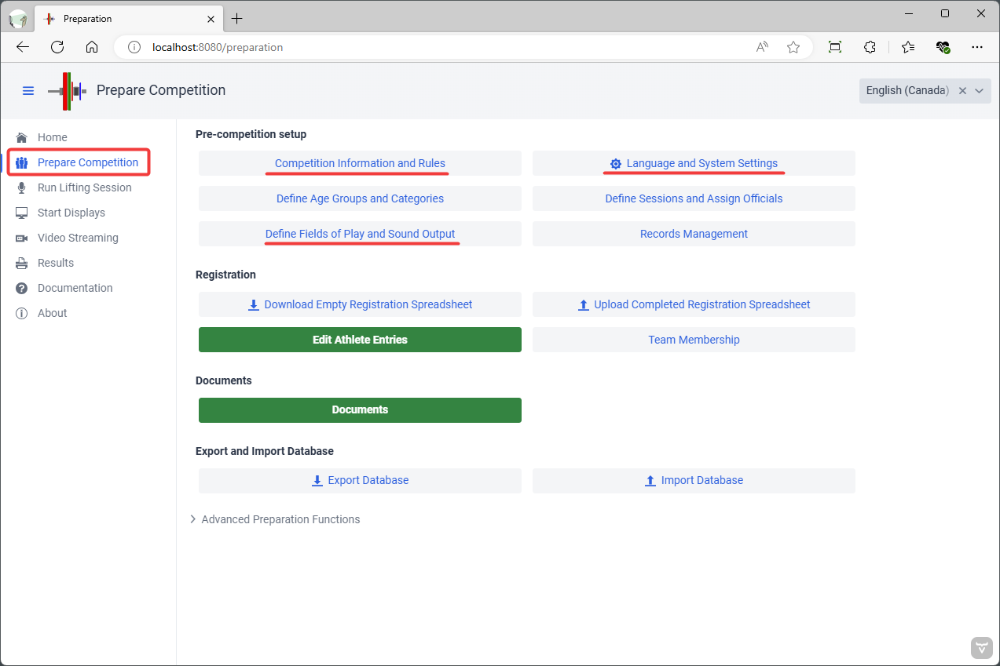
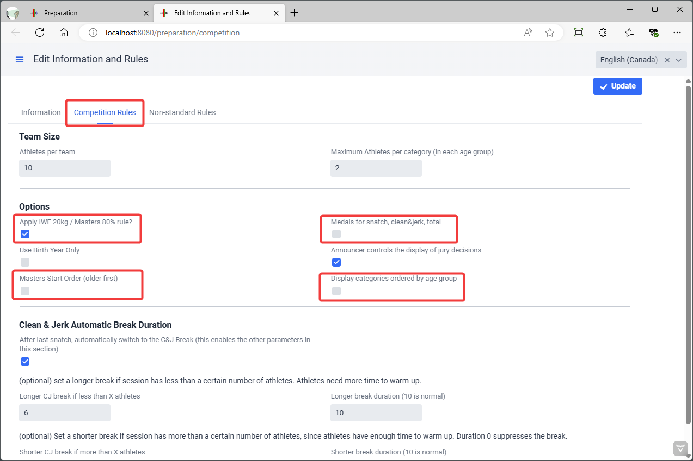
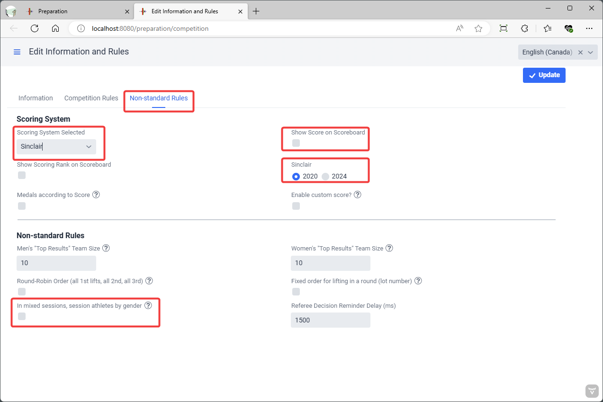

> This page provides information about the main competition options that are used in most competitions.  The full set of options is described in the [Competition Options Reference](2600AdvancedPreCompetitionSetup) page.

The first step in preparing for a competition is to provide general information about the meet and define the major settings. To reach the competition options, use the "Prepare Competition" menu entry.

## Competition Information and Rules

The `Competition Information and Rules` button leads to a page where general information about the competition is entered.

First, the name and other data about the competition and hosting federation is provided. This information appears on screens and documents.

#### Standard Competition Rules

The screen allows selecting common variations on IWF rules.  For most competitions, the options that need to be checked are outlined below.  See the [Advanced Pre-Competition Options](2600AdvancedPreCompetitionSetup) page for the others.

- Options
  - The `Apply initial total weight rule` determines whether the 20kg rule (20% for Masters) will be enforced.  Some local or regional meets do not enforce this rule.
  - The `Medals for snatch, clean&jerk, total` checkbox determines whether separate rankings will be computed and shown for snatch and clean & jerk.  Leave it unchecked for a "total-only" competition.
  - The `Masters Start Order` settings changes the sorting order for displays and weigh-ins -- Masters traditionally start with the older lifters. The display will be grouped by age group first, and then by weight category.
  - The `Display Categories Ordered by Age Group` setting is like Masters Start Order, but reversed, younger age groups are shown first and weighed-in first.   In a normal IWF scoreboard, Junior and Senior athletes are not separated on the scoreboard (this switch would be off).  This switch is typically used when several youth age groups are competing together in the same session, and younger athletes are unlikely to compete for the older age group medals.

#### Non-Standard Rules

Additional options are used when running team, kid, or virtual competitions.

- Scoring System
  - `Scoring System Selected` determines several things
    - On the results screens, the scoring system will be shown, in addition to Sinclair and Robi
    - If the `Show Score on Scoreboard` option is used, this is the score that will be shown.
  - The `Sinclair` setting determines which version of the coefficients is used.  The 2020 coefficients (issued in 2017) were used until the new ones were issued in fall 2022.  This setting does ***not*** affect the Masters SMF and SMHF coefficients.
  - `Enable Custom Score` This adds a box on the Athlete Card where a custom score can be entered.  This will typically add bonus points or subtract penalty points.  This is sometimes used for kid competitions where bonuses are given for 5/6 or 6/6 performances.
- Non-Standard Rules
  - `Group Athletes by Gender`  When hosting kid competitions, it is common to group kids in mixed groups according to age or weight. This setting makes all girls go first to avoid changing bars.

## Language and System Settings

The second button in the group gives access to the technical settings for the application.

### Display and Printout Language

owlcms allows selecting the language for each session using the menu at the top right.  The `Display and printout language` selection box allows changing the default setting.  If no selection is made the user's browser language will be used if available, and English if not.

### Time Zone Configuration

When running in the cloud, you need to set the time zone so it matches the competition schedule.

### Advanced Technical Settings

See this [page](2120AdvancedSystemSettings) for details about technical settings used to control access, connect to complementary applications, etc.

## Defining Fields of Play (Platforms)

OWLCMS supports multiple competition fields of play used at the same time.  A field of play corresponds to a platform and the corresponding warm-up area.   Displays and technical official screens are associated with a field of play.

 Using the `+` button allows you to create additional fields of play.  Clicking once on a platform in the list allows you to edit it.  This is useful if you want to rename the platformé

### Changing the Audio Output

Normally, only the Athlete-Facing Display emits sound.  **The recommended sound setup is to connect speakers directly to the athlete-facing computer and to use the default "Use Browser Sound"**

However, in certain circumstances, this may not work (for example, some computer-browser combinations produce garbled sound).  You can then use the main laptop to produce the sounds instead.  If you are running locally on a laptop, then you can get the computer to generate the sound.

Notes:

- if you need to produce sound from the main laptop for more than one platform, you will need one audio output per source.  The easiest way to add more (in addition to the audio headset jack) is to use an [*analog* USB converter](https://www.amazon.com/UGREEN-External-Headphone-Microphone-Desktops/dp/B01N905VOY/ref=lp_3015427011_1_5?s=pc&ie=UTF8&qid=1564421688&sr=1-5) -- do not use digital or wireless connections, they introduce perceptible lags and are needlessly expensive.  The various adapters available will appear in the list, you need to assign each platform with an adapter.
