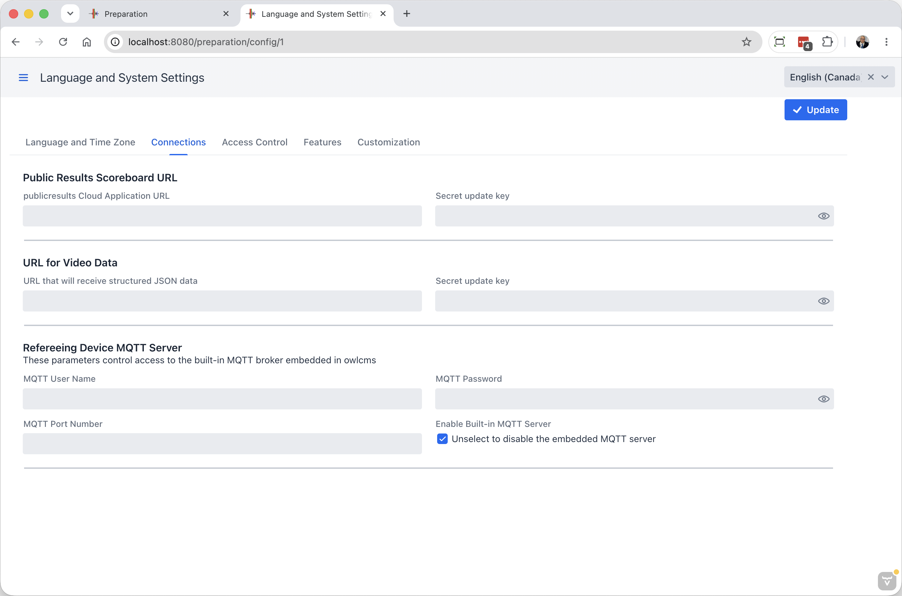
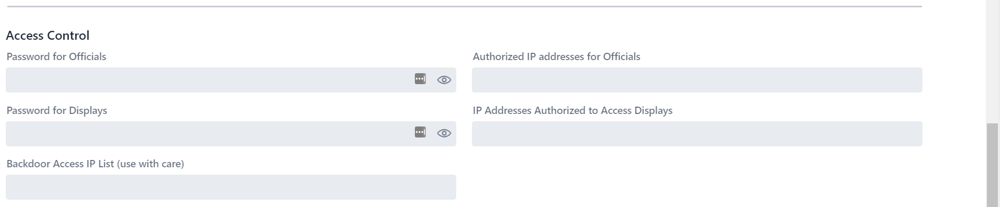
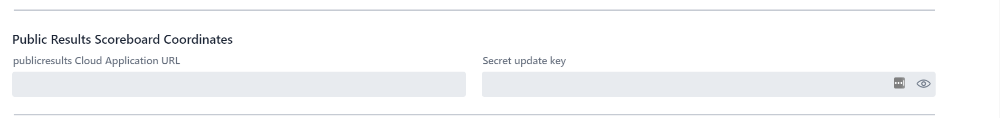

## Advanced System Settings

These settings are used when running large competitions, or when running in the cloud.

### Connections

#### External Event Feeds

The first two sections are completely interchangeable; their names are historical and reflect typical usage.  The selection of the format used depends entirely on what you put in as URL

- Public Results Scoreboard URL 
  - The `publicresults Cloud Application URL` is normally refers to a [Tracker](Tracker.md) program running in the cloud.   It will take the form `wss://scoreboards.fly.dev/ws`  (where scoreboard is the actual name of the application in the cloud).  To create a Tracker in the cloud, you will use the same steps as described on the [Cloud Installation](Fly) page, but you will use the Tracker and Shared Key sections.
  - The `Secret Update Key` is the one set using the Shared Key section.  There is normally one if the target is in the cloud
- URL for Video Data
  - There are two formats used for Video Data.  The first one is exactly the same as the scoreboard, except that video data is typically processed on a machine on the same network as OWLCMS.  So the difference is that the URL is of the form `ws://192.168.1.101/ws` where there is no encryption (ws instead of css, and typically a numerical IP address is used.)
  - For some applications developed before the websocket (ws) format, you can use the legacy HTTP version.  In that case, the URL is whatever the application specifies. On a local area network, it will probably be something like `http://192.168.1.101/video` as determined by the receiver.
  - The `Secret Update Key` is sometimes omitted when running on a closed local network with a dedicated router.

#### Refereeing Devices MQTT Server

This section is used if you wish to add protection to the OWLCMS server.  It is normally not used when running locally, and when running remotely you need to use secrets so the MQTT broker inside OWLCMS knows what to require `OWLCMS_MQTTUSERNAME` and `OWLCMS_MQTTPASSWORD` need to be set as secrets if security is expected.

This section controls who can access the system.

The settings are as follows.  In actual practice only the first (Password for Officials) is in common use.

- **Password for Officials**  When doing streaming, it is possible that you want to prevent the people running the video from accessing the technical official's consoles. A password will be required for the various technical official screens
- **Authorized IP addresses for Officials** For the same reason, you may want to instead (or in addition to password) use whitelisting.  Technical officials will be required to come from this network.  If running in the cloud but from a gym, this would be the public IP address shown by https://ip4.me/.
- **IP Addresses Authorized to Access Displays** and **Password for Displays**.  You may want to authorize a video production company to see your displays, likely without setting a password.  The screen password setting is there for symmetry and is unlikely to be used.
- **Backdoor Access IP**  This grants access without requesting a password, to all the technical official screens and displays.  This also is required to [launch a simulated competition](Simulation).

### Public Results Scoreboard

This section controls how owlcms reaches the [Public Scoreboard](PublicResults) application in order to send it updates. The installation of `publicresults` is documented for [fly.io](Fly) .

- **publicresults Cloud Application URL**  This is the location of the publicresults application. It will be something like https://myclub-results.fly.dev if you used `myclub-results` as the name.  When deploying on fly.io this box is empty because a shared secret is used -- a shared secret defines an environment variable which takes precedence.
- **Secret Update Key** the publicresults application is installed, it is configured with a secret key.  owlcms needs to send this secret key to publicresults for its update to be considered valid.  When deploying on fly.io this box is empty because a shared secret is used -- a shared secret defines an environment variable which takes precedence.

### Overriding Styles and Templates

The installation directory on a laptop contains a folder called `local`.  Underneath that folder are found all the files and resources used by the program.  You may edit these files if you need to change translation wording, scoreboard colors, the Excel templates, etc.   

If you want to run the program in the cloud, you will need to perform the changes on a local laptop, and zip the local directory.  See the page on [Uploading Customizations](2125UploadingCustomizations) for details.

