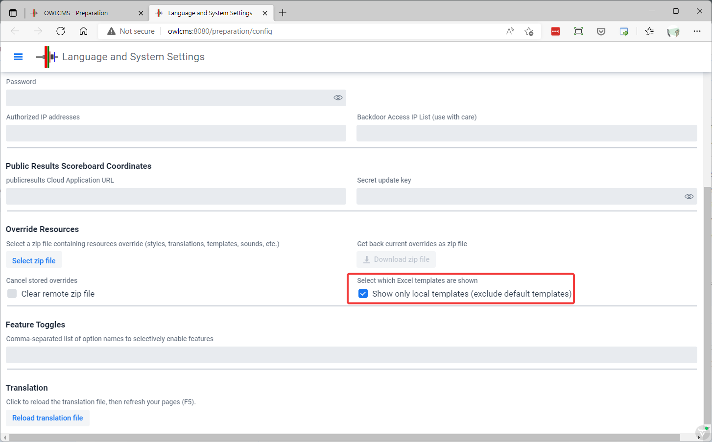
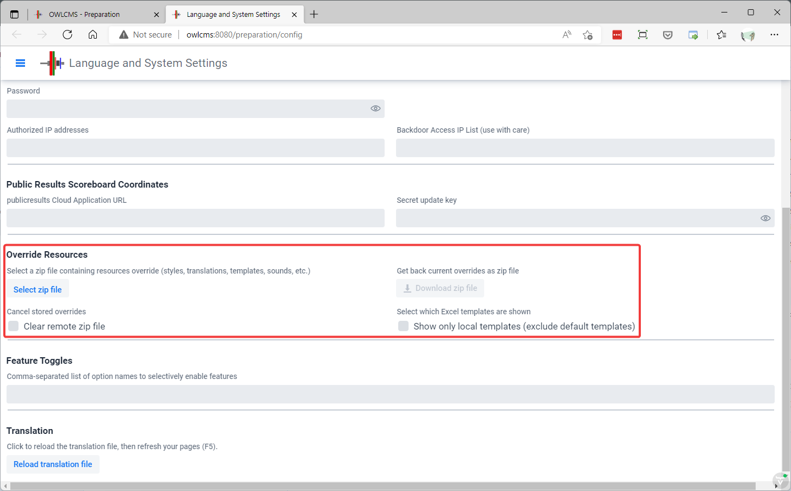

### Local Customization

If you want to customize the Excel templates, CSS style sheets, Age Group definitions, the translations, or the sounds, proceed as follows

1. Install owlcms locally

2. Locate the `local` folder where owlcms is installed

3. There is a folder for each kind of items (`agegroups`, `templates`, `styles`, `sounds`, etc.)
4. Edit the items you want and test locally

   - Note that for editing CSS style sheets you should activate Developer mode in your Chrome, Edge or Firefox browser (F12). Go to the `Network` tab on the left and <u>disable the cache</u>.  
   - CSS Style sheets are cached for one week, so you may need to clear caches on your display browsers if you fix things during a meet.

> Owlcms attempts to preserve your local files when you re-install a newer version.  It is always prudent, however to create a zip file with your setup, as a backup.  You can also use that zip file for cloud-based setups, as explained below.

### Selecting Which Templates are Shown

You can remove template files from the local folder if you are not using them.  You can also add your own, or change the names to use local or translated names. But by default, owlcms will still show the default files (it has its own copy inside the binary files).  

If you cleanup the local directory, you can tell owlcms to hide the default files using a checkbox, see below. When that is checked, owlcms ignores it's own copy. 

Note that the best idea is to create a zip after your cleanup and renaming,  and to upload it to the database as explained below.  In this way, the zip in the database takes precedence over the local folder, and if an update puts back files in the `local` folder, they won't mess things up.

### Uploading to a cloud-based setup

Cloud-based setups are created on demand, and do not include persistent local files.  The local customizations are stored inside the database as a zip file, and unzipped when the application starts (or a new zip is uploaded).

In order to use your customized files in a cloud setup, proceed as follows

1. Create a zip file of the `local` folder

2. Go to the Preparation > Language and System Settings section of the Cloud-based application

3. Upload your zip.  You can re-upload the zip as needed, this will reset the remote local override files.

4. > IMPORTANT: Make sure to use the Update button on the page -- otherwise the zip won't actually get stored.  Same thing if you use the "Clear" checkbox, it will only take effect when the Update button is used.

