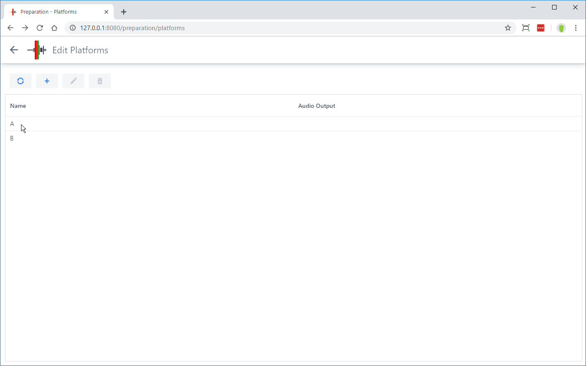
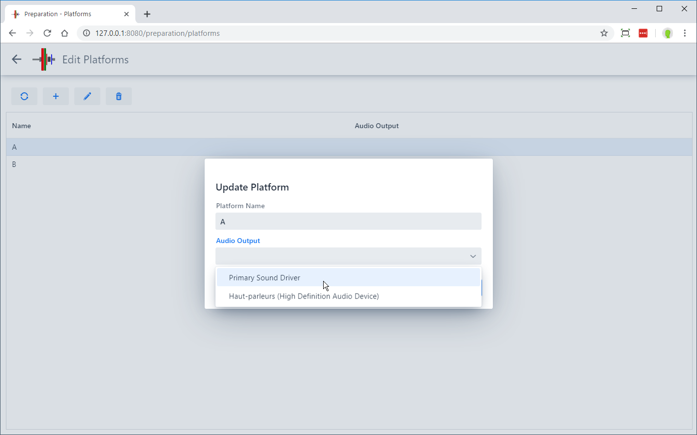

## Defining Fields of Play (Platforms)

OWLCMS supports multiple competition fields of play used at the same time. A field of play corresponds to a platform and the corresponding warm-up area. Displays and technical official screens are associated with a field of play.

Using the `+` button allows you to create additional fields of play. Clicking once on a platform in the list allows you to edit it. This is useful if you want to rename the platform.

## Changing the Audio Output

There are 4 common configurations:

- When using USB devices (including joysticks), the recommended sound setup is to connect speakers directly to the athlete-facing computer and to use the default "Use Browser Sound" (this minimizes delay)
- When connecting the athlete-facing computer to speakers is not possible, another option is to use server-generated sounds and connect the server to the public-address speakers.
- When using [owlcms-firmata](https://github.com/owlcms-firmata) build-it-yourself MQTT devices, the recommended setting is to use the server-generated sounds.
- When using [Blue-Owl](https://blue-owl.nemikor.com/) devices with a down signal tell the athlete-facing computer to not generate sounds

Notes:

- If you need to produce sound from the main laptop for more than one platform, you will need one audio output per source. The easiest way to add more (in addition to the audio headset jack) is to use an [analog USB converter](https://www.amazon.com/UGREEN-External-Headphone-Microphone-Desktops/dp/B01N905VOY/ref=lp_3015427011_1_5?s=pc&ie=UTF8&qid=1564421688&sr=1-5) -- do not use digital or wireless connections, they introduce perceptible lags and are needlessly expensive. The various adapters available will appear in the list; you need to assign each platform with an adapter.
