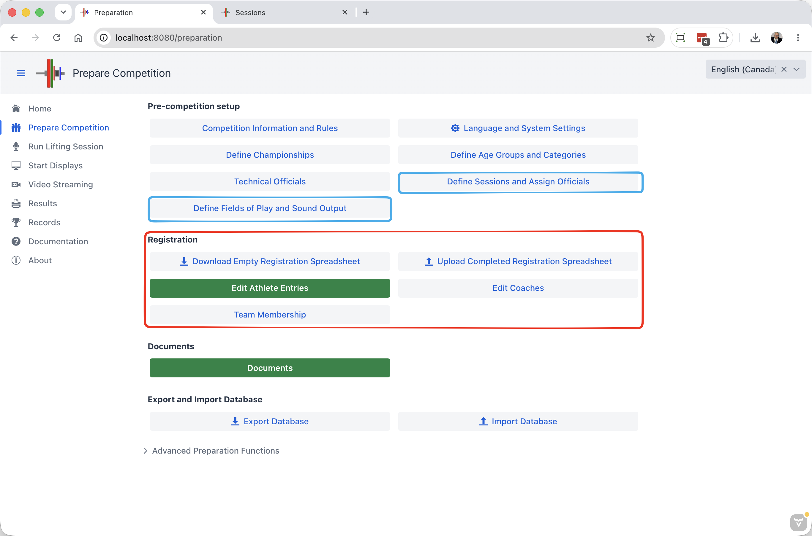

The next step in preparing a competition is registering the athletes.  This involves
- Entering the initial list of participating athletes
- Defining an initial schedule of competition sessions
- Assigning athletes to sessions

These steps are performed from the `Prepare Competition` page

## Registering the Athletes

There are two ways to enter athletes.  For a very small competitions, you can enter them interactively using the `Edit Athlete Entries` screen.  But as soon as you have more than about 20 athletes, it is much easier to use a spreadsheet.

### Manual Registration

To add athletes manually, see the [Edit Athlete Entries](2300EditAthleteEntries) page.  Use the `+ Add` button at the top of the page.

### Downloading an Empty Registration Spreadsheet.

For anything but very small club competitions, it is faster to prepare a spreadsheet. From the `Prepare Competition` page, 

- Click on the `Download Empty Registration Template` button.  This will download a file with the sessions you created before.  

- Save the downloaded file to your own documents area

### Automatic Category Assignment Mode

This method will automatically assign athletes according to their age and assigned category.  If athletes are eligible to more than one category, they will be assigned to all categories,

See below for explicit category assignments.

1. Fill the Excel with the information about your athletes.  

   - For each athlete, you need to provide at least the birth year, the gender, and a way to determine the body weight category.
     - The most intuitive way is to enter the category limit in the category column.  For a M89 category, the gender would be M and the category column 89.  
     - For heavyweight categories you can use 109+ or >109. 
       BUT if there are overlapping age groups with different categories, it is better to enter the expected bodyweight. For example for a Youth expected to weigh 105, you can enter 105 in the bodyweight column and leave the category empty. The athlete will be correctly placed in the YTH >102 and JR 109 categories.
     - We recommend that you use the international `yyyy-MM-dd` format for dates (4-digit year, month, day) but the program should recognize correct Excel dates as well.

   

2. The groups that you use on the "Athletes" tab **must** be defined on the second "Sessions" tab.  If you need new groups, go add them to the Sessions tab. An example of the Sessions tab is shown below.

   - The program will create groups with the code names you use.  You can use numbers, or any *short* code.
   - You should use the Description field instead of making complicated group codes.  This will be used as a description. For example, "Men 70 kg B, 65 kg A"

   - You can leave the times alone and fix them later in the program.  But if you are entering them in the spreadsheet either use the format that Excel shows you (which may vary based on your Office and operating system settings) or (even better) use the international `yyyy-MM-dd hh:mm`  format (4-digit year, month, day, 24-hour hour, minutes).

   

#### Initial Upload of the Completed Spreadsheet

1. **Upload the completed form** using the `Upload Completed Registration Spreadsheet` button. Note that this **deletes the previous athletes and groups** 

   The Excel sheet should contain all the athletes that will compete.

2. **Fix errors**, if any. If there are errors detected on the upload, they will be shown (for example, unreadable dates in a cell, or a missing group).  The athlete will still be created, but without the faulty information.  You can either upload again after correcting.  If you use the program to fix the errors, make sure you export the information so you can reload it later.

#### Initial Schedule and Allocation of Athletes

Change your initial spreadsheet and add sessions to the Sessions tab until you are satisfied that you have a good first approximation of your competition with a workable schedule.

### Preparing a Spreadsheet (Explicit Category Assignment Mode)

Sometimes there are additional competition categories created for special awards.  For example, there may be a national competition hosted in a state, and the state competition will take place at the same time.  In such a case, it will be necessary to use explicit names of categories in the file.

As an example, we assume that the National competition will use the Open categories. If we go to the Age Group definition page, we notice that the categories are named "W55" "W 59" and so on. **You must use the same category names are shown on the Age Groups page**

For the state championship, an additional age group has been created for men and one for women, with the same weight categories.  Assume that the State age group has the code ST.  The categories would be "ST W 55" and so on.

The categories are listed in sequence. The first category listed is the one that will be shown on the scoreboard. It determines when the athlete will compete.  If an athlete is both Youth and Junior, the Youth category would go first.

In our example, we have 3 cases

- Athlete competes in both National and State.  We want National to be shown.  A female 55kg athlete would be entered as
  `W 55;ST W 55`  

- Athlete competes in National only
  `W 55`

- Athlete competes in State only.  For these athletes, it is presumed that they did not meet the qualifying total for the National, and they will be shown as state-only on the scoreboard

  `ST W 55`

Say that we also have Masters taking place at the same time.  National Masters use the normal `W40 55` groups.  State Masters have been given a STW40 age group, and would be noted `STW40 55`.

In such a case, an athlete eligible to all 4 would be noted `W40 55;STW40 55;W 55;ST W 55`.  We put `W40 55` first so that this is shown on the scoreboard.

### Team Membership in the Registration File

Each category in the Category column can be annotated with a team marker after a `/`.  The markers are `+T` (or `YesTeam`), `-T` (or `NoTeam`), `+MT` (or `YesMixed`) and `-MT` (or `NoMixed`).  Several markers are separated by a comma, for example `W 55/-T,+MT`.  How an *unmarked* category is interpreted depends on the `explicitTeams` feature switch (see [Feature Switches](FeatureToggles)).

In both modes, the imported row determines category eligibility and team membership, including when using "Update Athletes". Previous selections on the athlete card or Team Membership page are replaced for the athletes being imported. Full category names specify the categories to use; a short form such as `55` infers eligible categories from the category limit and athlete information. A blank Category cell infers categories from gender, birth date, bodyweight, and qualifying total, so the necessary athlete information must be supplied.

Mixed-team membership always requires `+MT`, regardless of the switch. A short form such as `55/+T,+MT` applies the team markers to the inferred categories, with mixed membership limited to championships configured for explicit mixed-team members. Without `+MT`, including a blank Category cell, mixed membership is cleared.

#### Implicit membership (default, `explicitTeams` feature toggle is off)

- Every athlete is automatically a member of the team in every category they are eligible for.  Leave the Category column as `W 55`, `55`, or blank.
- Use `-T` only to exclude an athlete from a team: `W 55/-T`.  A trailing `/` with nothing after it means the same thing.
- When re-importing with "Update Athletes", memberships are recalculated from the row: unmarked categories include the athlete in the gendered team, even if the athlete was previously excluded. A blank category also recalculates eligibility and applies this default.
- The export is compact: only `-T` and `+MT` are written.

#### Explicit membership (`explicitTeams` feature toggle is on)

Use this when only a subset of the registered athletes count for their club or country and you want the registration file to say exactly who they are.

1. Turn on the `explicitTeams` feature switch **before** importing or exporting.
2. Mark the team members in the file: `W 55/+T`.  Anything without `+T` (`W 55`, `55`, blank category) makes the athlete eligible for the category but **not** a member of the team.  Add `+MT` for mixed teams as usual.
3. Import.  The file is authoritative: athletes with no team marker on their row are removed from any team they were previously on, and athletes marked `+T` are added.
4. The export writes `+T` for every member, so an exported file re-imports identically.  You can still change memberships afterwards on the athlete card or on the Team Membership page, but re-importing the same file will reset them to what the file says.

> **Switching modes:** an export done with `explicitTeams` off contains no `+T` markers. If you turn the switch on and re-import that file, the imported athletes lose their gendered-team memberships; mixed-team memberships marked with `+MT` remain. Turn the switch on first, export, then edit and re-import.

## Editing Competition Sessions

From the `Prepare Competition` page, clicking `Define Sessions` allows you to create or edit competition sessions.  You can use the `+ Add` button at the top of the list of sessions to create additional sessions.

Clicking on a session or using the `Edit Details` button enables you to define the expected starting time. This will be used to order the sessions on the start list or schedule.

The other tabs allow you to enter the officials and the jury.  These will be printed by default on the session protocol and jury sheets.

## 