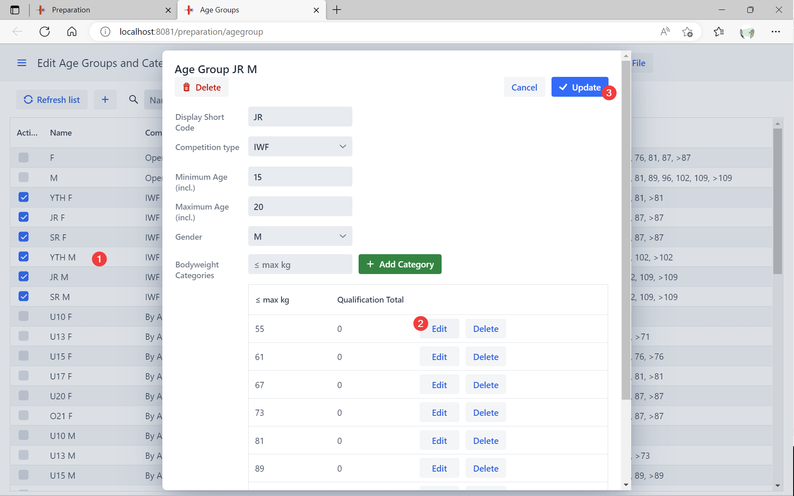
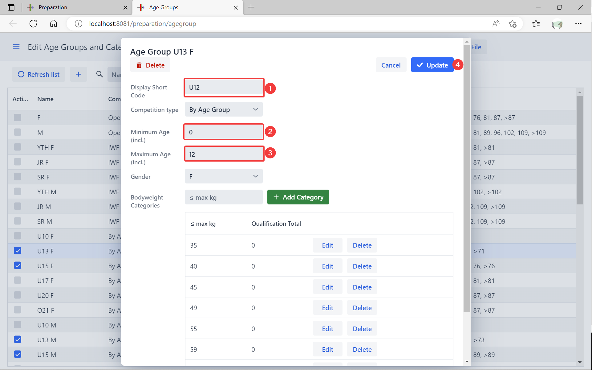
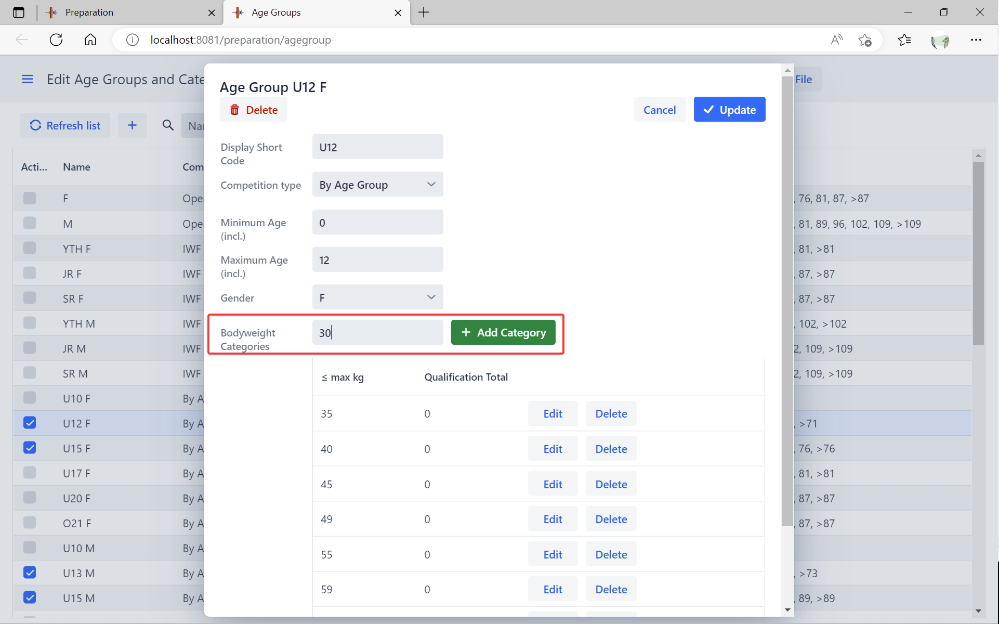
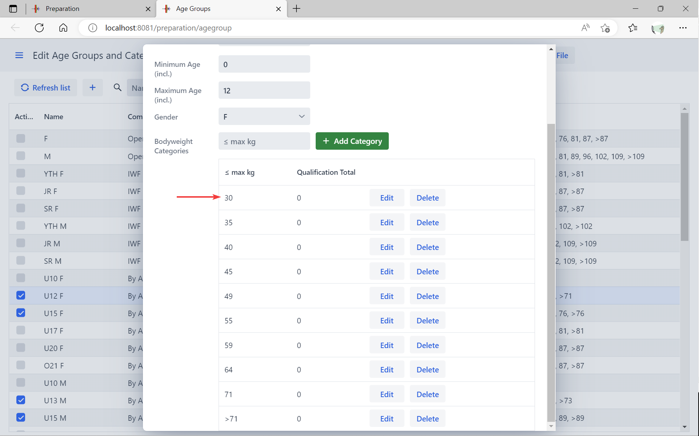
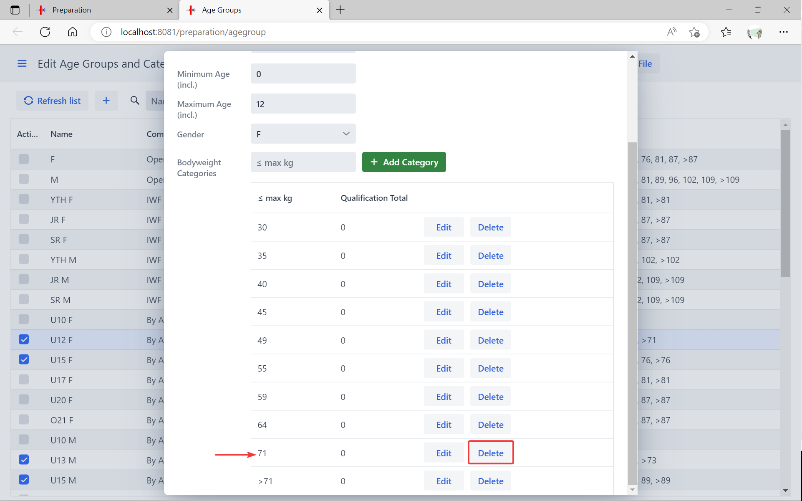
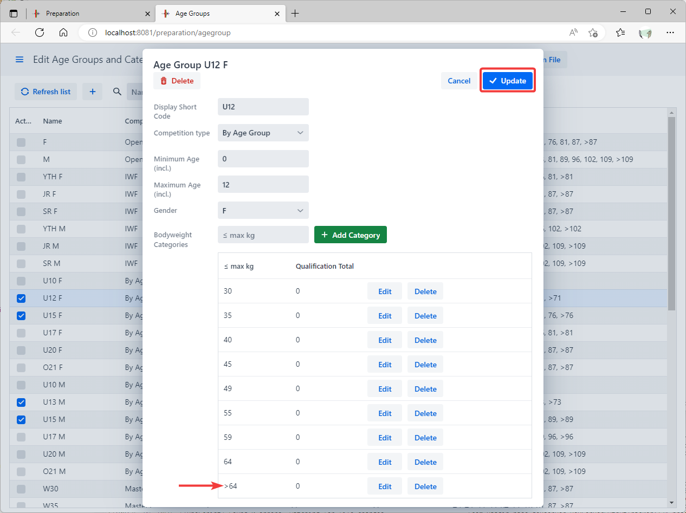
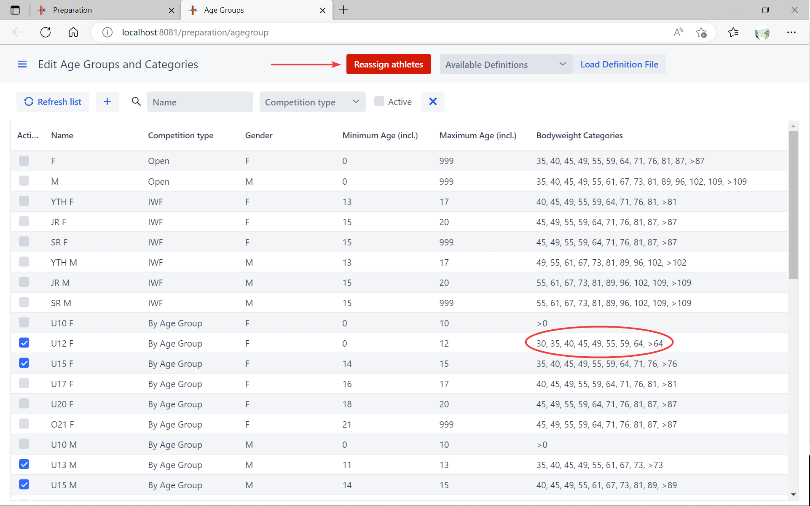

OWLCMS computes the category of an athlete based on the age group (based on the birth year) and the body weight.  For example, IWF Youth age groups have different categories than IWF Senior age groups.

The age groups and categories are fully customizable. 

## Default Age Groups and Categories

In order to keep things simple for club or regional meets, by default there are two divisions active:  one for men and one for women. These divisions cover all ages and all bodyweight categories. 

## IWF Competitions

IWF Competition Age Groups are predefined.  Just select the applicable age groups from the list.  The program will automatically assign the athlete based on age, body weight and qualifying total, if defined.

If your championship has qualifying totals, you can edit the qualifying totals by going to the age group and clicking on the category. For example, lets define a qualifying total of 100 for Junior Men 55kg.  We click on the age group, then click on edit next to the category.

We type the desired total and click "OK".  You can do the same with the other categories.

NOTES:

1. Once we are done with all the categories, we click the blue Update at the topto save the Age Group.
2. Because this is time consuming, you may prefer to enter the qualifying totals using a spreadsheet.  See further down on this page.

## Age Group Competitions

From the  `Prepare Competition` page, in the `Registration` section,  select the `Define Age Groups and Categories` button.  

This leads to a list of currently defined age groups.  By default, we see that the two "All Ages Included" age groups are selected, with all the bodyweight categories.

## Editing an Age Group

Let's assume that we want to change the default U13 group to be U12.  We change the code, and the minumum and maximum age range.

For the sake of our example, let's assume that the bottom category for U12 is 30kg, and so we add a category.

After pressing the green button, a 30kg category is added at the beginning.  

Let's now assume we want the heaviest category to be >64kg.  We don't want a 71kg category anymore.  If we delete it, the system will automatically adjust the heaviest category.

After Deletion, the categories are adjusted. The changes to the age group are only registered when you click on the blue "Update" button at the top of the form.

## Reassigning the athletes

After updating an age group with new categories, the program highlights the `Reassign Athletes` button at the top.  *Note that you will need to review team memberships after reassignment*.

## Adding an Age Group

Let's assume we need U23 age groups (one for female, the other for male).  In order to add a group, we use the `+` icon at the top of the table.  Let's add the Female U23 group:

We now fill in the information, and select Add.

## Notes for Masters Age Groups

The default list contains non-standard Masters age groups:

- some federations accept 30-34 year-olds in their Masters meets. If you don't want these age groups, simply leave them unselected.
- Similarly, some federations have gender-equality rules and include the same age groups for women as for men.  The default list allows you to select a W70 for 70-74 and a W75 group if you so desire..

- The applicability of the percentage rule (as opposed to the 20kg rule) is based on the category in which the athlete is registered.  If an athlete has a Masters category selected, he is expected to lift in a Masters group, where the rule will apply to all lifters.  In a mixed group with senior and Masters lifters, the which rule applies would depend on the lifter.  The fairest rule would be to set the category to Senior for all athletes: Because they are qualified as Masters, the dual eligibility athletes can still appear in the Masters result sheets.

## Creating a Definition File for Local or Federation Settings

If you look at the installation directory under the `local/agegroups` directory, you will notice files with a name similar to `AgeGroups.xlsx` .  

1. The first Tab in each file defines the bodyweight categories in use for a given federation or club.  
2. The second Tab says which bodyweight categories are active for each age group.

This step needs to be done on a local installation.  Once you are ready, you can upload you local settings to a cloud installation, as explained in [this page](UploadingLocalSettings)

Let's say we want to create age groups for our annual U15 U17 competition.  We go to the local/agegroups directory, and copy the `AgeGroups.xlsx` file to another name (for example `AgeGroupsU15U17.xlsx` or whatever suits you).

In the example above, the cells outlined in red is interpreted to mean that in women's <u>category U17 F59, the qualifying total is 77</u>

So in this example

- there are four age groups defined (U15 and U17 for women, U15 and U17 for men)
- the four groups are active (column G)
- from column H onward, each cell defines the body weight categories and (if present, the qualifying total)
  - The U17 female group has bodyweight categories F40, F45, F49, F55, F59, F83 and so on.
  - The first part of each cell is a **bodyweight category code** that **must match** one of the codes defined in the first tab of the spreadsheet (`BW Categories`)  **If you need additional categories, add them in the first tab*.*
  - When a number is present after the category code, it is the qualifying total
  - Empty cells are ignored

## Loading the Age Group  Definition File

The drop-down at the top of the page shows the available files.  After loading the file, the athletes will automatically be reassigned.

