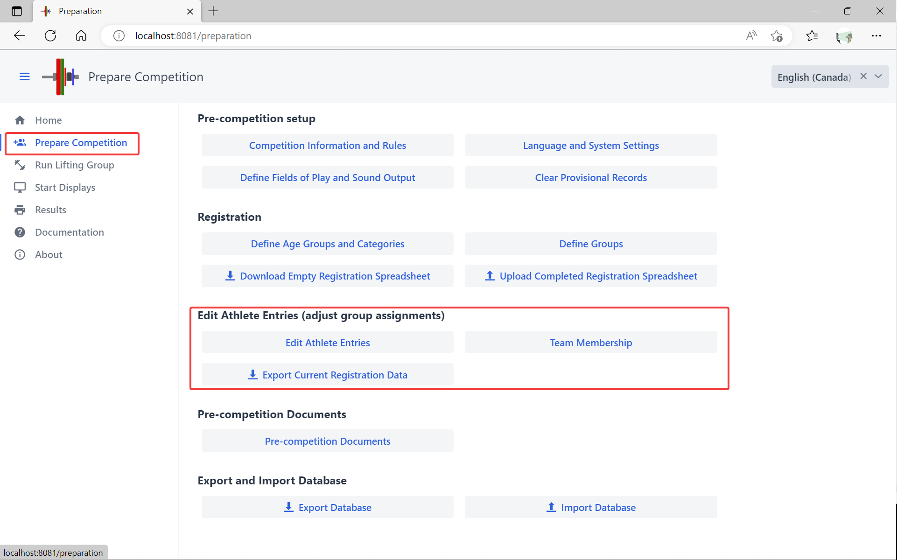
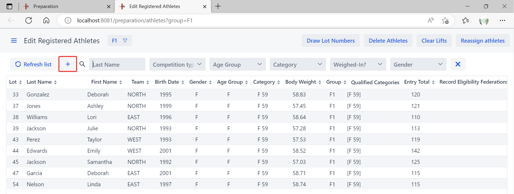
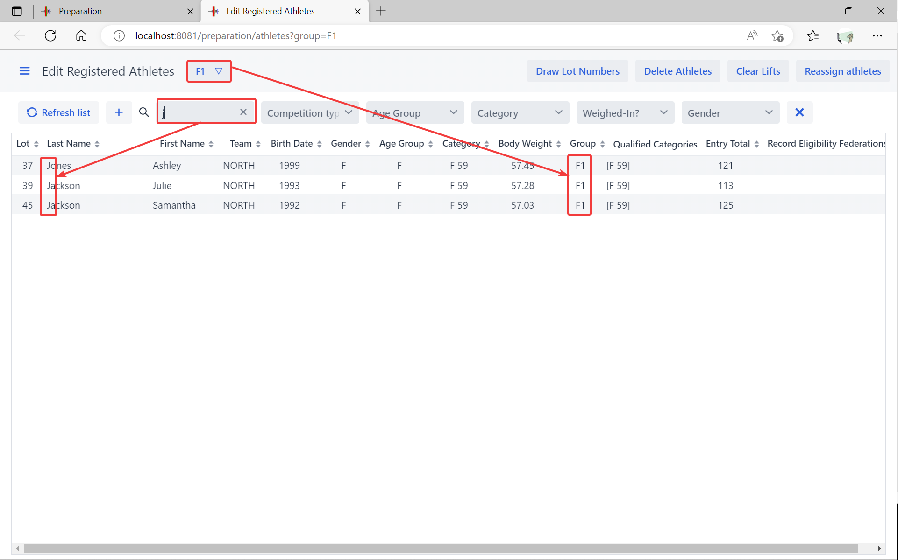
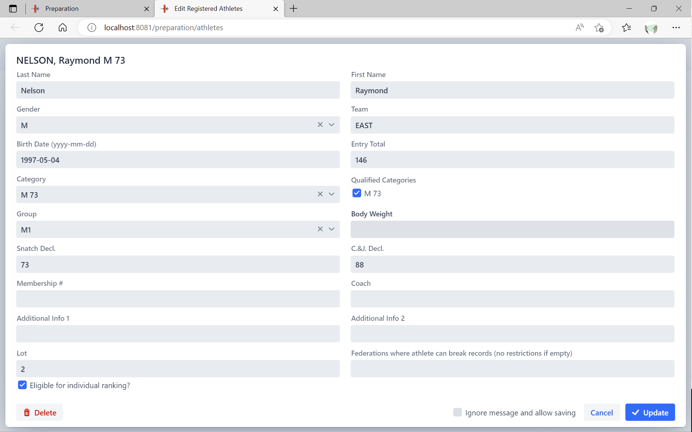
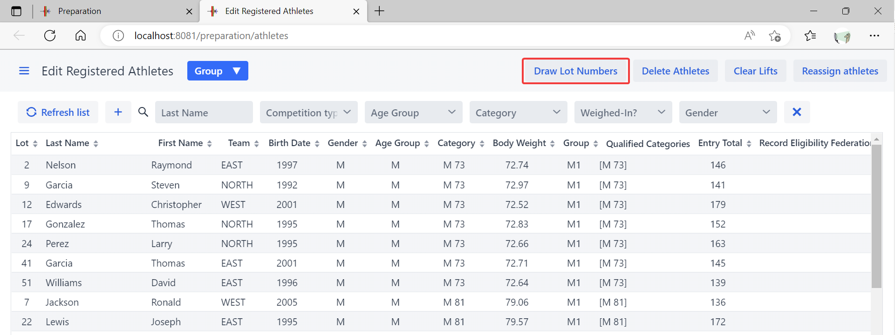
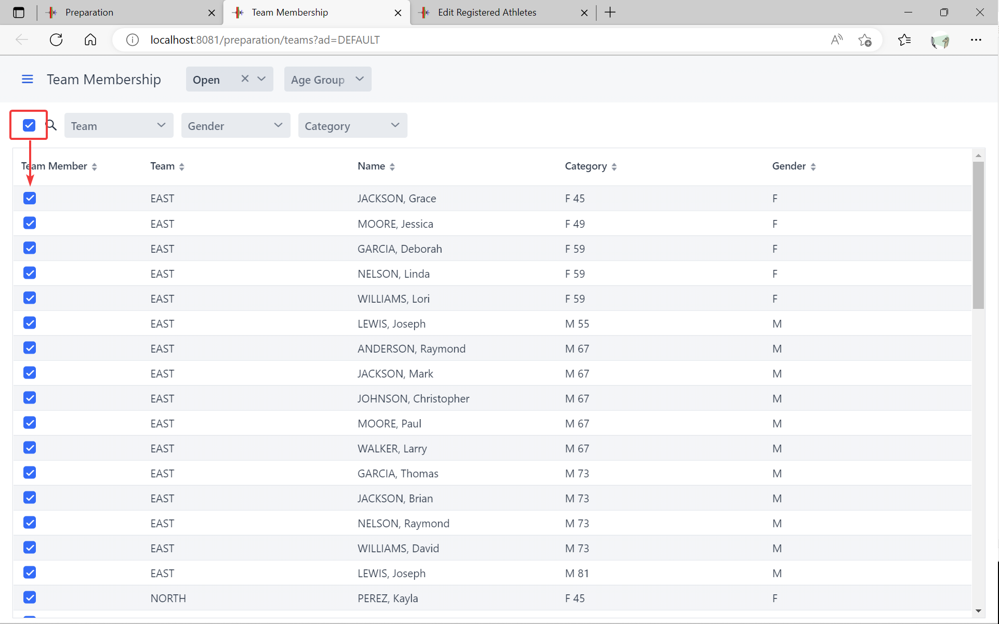
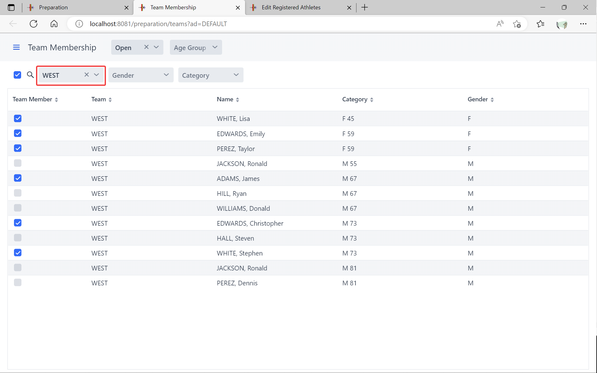
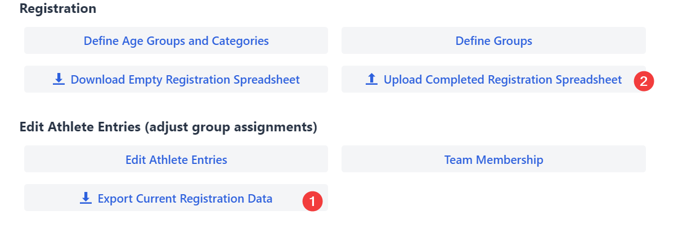

The next step in preparing a competition is adjusting the registrations and finalizing the entries.  This involves

- Drawing lots
- Finalizing the assignment athletes to groups
- Assigning Referees to groups
- Producing a Start List
- Producing Athlete cards

These steps are performed from the `Prepare Competition` page

## Adding or Editing Athletes

In order to add or edit athletes, use the `Edit Athlete Entries` button.

- To add an athlete, use the `+` button at the top of the list.  If you have selected a group at the top, the athlete will be added to that group.
- To edit an athlete click ONCE on the name of the athlete in the list.  You can select a group at the top and type values in the filters at the top of the list to narrow down the list.

You may then fill the form.  The eligible categories will be computed automatically, and if the athlete is eligible to several categories the most specific category will be assigned based on the age (this is in order to compute start numbers, and will be used on scoreboards).

The `Eligible for individual ranking` checkbox is used to determine whether the athlete is eligible for medals or is competing "out-of-competition".  Some meets may allow an athlete from another jurisdiction to compete in order to meet a qualification requirement, but not include the athlete in the medals.

## Drawing lot numbers

After all athletes have been entered, you should draw the lot numbers.  If you are splitting a group and have several athletes with the same entry total, you may need to use the lot number to determine what athlete goes to which group.

## Team Membership

Before [producing the Start List and Team Lists](2400PreCompetitionDocuments), it is important to make sure that the team memberships are correct.  The `Team Membership` page makes it possible to see the team members for each team. 

On initial load, the athlete is automatically made a team member for all the age groups in which he is qualified.  If an athlete qualifies for both JR 55 and SR 55, he is assumed to be part of the JR and SR teams.

The checkbox at the top left allows to set team membership in bulk. This is useful after reassigning categories because reassigning categories clears the team memberships.

In the following example, 3 female and 3 male athletes are kept on the WEST team

## Major Changes

If you need to make important changes after adjusting eligibility and team membership, you can export what you have already loaded back to an Excel sheet, do the changes in Excel, and reload.   This is very useful if there are schedule changes and you need to rearrange the groups.

The export format preserves everything about the athlete categories, team memberships, group assignments, and officials.

The same `Upload Completed Registration Spreadsheet` button from the `Registration` section is used for loading the export format as for the initial loads. As stated earlier, loading a spreadsheet will recreate the athletes and groups from scratch, so *do not do this after the competition has started!*

If you export the information after loading the database, the format for categories includes the additional eligibilities if any, and the team memberships. The format is as follows

- The main category is first.  For a Youth athletes, this could be `YTH M 81` as an example.  If there are no additional eligibility categories, then only the main category is shown. 
- If the athlete is eligible to more than one category because qualifying totals were met, the additional categories are added after a `|`, and separated by a `;`.
  -  So a YTH athlete also eligible to both JR and SR would be `YTH M 81|JR M 81;SR M 81`  and
  - If only eligible for JR, the string would be `YTH M 81|JR M 81`

- Any category can be annotated with `/NoTeam` if the athlete is not part of the corresponding team (by default, an athlete is included in the teams where he is eligible).
  - `YTH M 81|JR M 81;SR M 81/NoTeam` means that the athlete is NOT part of the SR Team
  - `YTH M 81/NoTeam` means that the athlete is registered as a youth, but NOT part of the team
  - `YTH M 81/NoTeam|JR M 81;SR M 81/NoTeam` means that the athlete is only part of the JR team.

- The recommended practice is to load the database, and do the eligibility or team adjustments using the program, and then re-export. Exporting and re-importing is very useful when reallocating groups, less so when doing minor changes.

