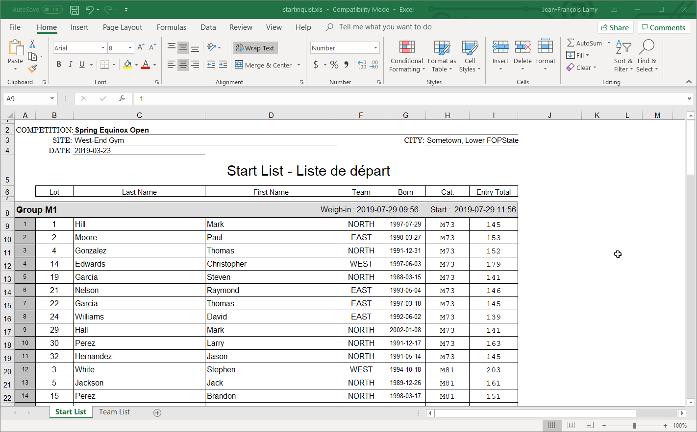
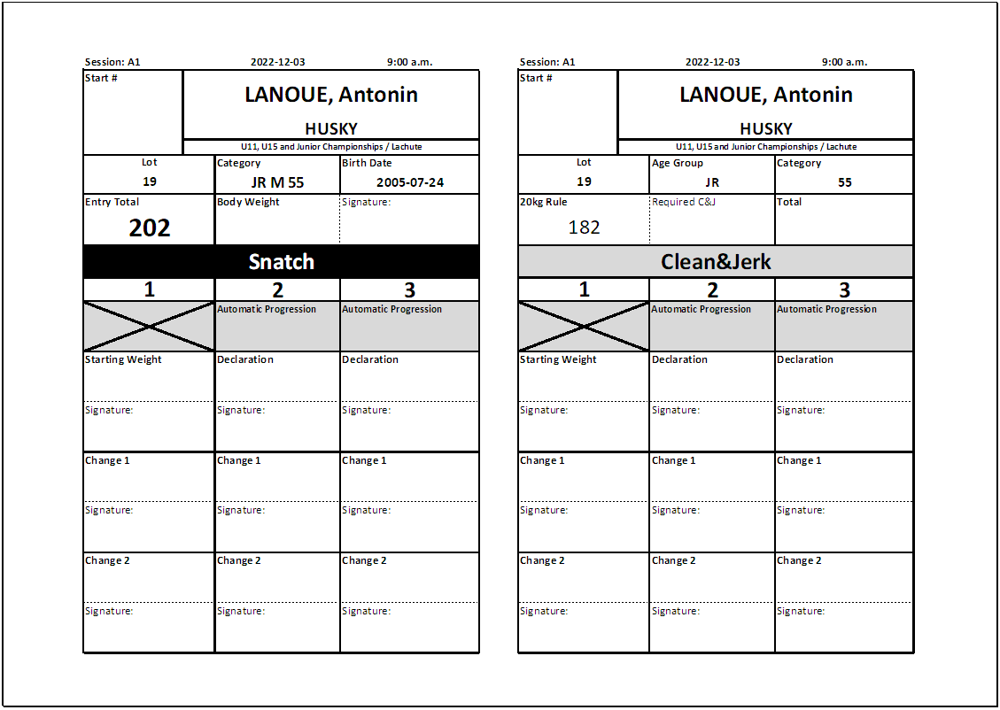

The next step in preparing for a competition is preparing the documents.  This involves

- Producing a Start List
- Producing Athlete cards

These steps are performed from the `Prepare Competition` page

## Producing the Start List

The starting list shows all the athletes that will compete, in which group, and the order in which the athletes will be weighed-in.  The button for producing the starting list is at the top of the page.

## Athlete Cards

Athlete Cards are the cards that will be used by the Marshall to record changes.  In many federations, they are printed out in advance, because the athletes will be asked to write down their starting weights and counter-sign their body weight at weigh-in.  

If athlete cards are printed in advance of the weigh-in, the start numbers are not known.  They are written by hand on the cards after they have been assigned at weigh-in.  This is usually done by the competition secretary, comparing the [Starting Weight List](#starting-weight-list) as a reference and cross-check.

 The button for producing the athlete cards is at the top of the page.  You can restrict the printing to a group by selecting it in the drop-down.

The recommended setting is to use the IWF format. Each page is folded in half, so one side is snatch, the other is clean & jerk.

