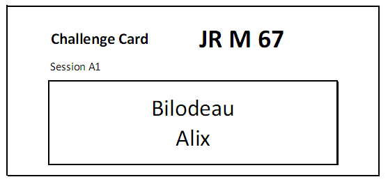

The Documents page is used

- To check registration and team memberships
- To publish a schedule and start list, and to assign officials
- To print the marshal cards and the weigh-in forms
- To print the manual backup protocol sheet and the jury documents

It is reached from the `Prepare Competition` page, selecting the `Documents` button

The page has two sections.  The top section includes buttons to print the various documents.  The bottom section is used to select sessions.

- The documents in the top two lines (Entries and Pre-Competition) are global for a competition.
- The documents in the bottom two lines are typically produced for one or more sessions at a time.  The sessions are selected using the checkboxes in the bottom section.

### Multi-Session Documents and Document Sets

- An Excel is produced if you select a single session and click on a specific document.
- However, a zip will be produced when more than one session is selected -- each session document will be a separate entry in the zip.  The zip is then downloaded.  On Windows, if you use "Extract All"  (right-click on the zip file) you can use the `print.ps1` script to print all the documents to your default printer (right-click on the script and select "Run using PowerShell".)
- If you use the "Document Set" option, all the documents for which you selected a template will be included in the zip.  The typical use of "Document Set" is to produce both the weigh-in form and the athlete cards together. If you select several sessions, the documents will be created for the selected sessions.

## Start List

The start list (or starting list) shows all the athletes that will compete, in which group, and the order in which the athletes will be weighed in.  When you click on the start list button, you are given a choice of templates to use according to the paper format and whether or not you want the platform information to be visible.

### Officials' Schedule

The `Officials` buttons creates a summary of all the officials assigned to each group.

## Athlete Cards

Athlete Cards are the cards that will be used by the Marshall to record changes.  The `Cards` Template is meant to be similar to the IWF format. Each page is folded in half, so that one side is snatch, the other is the clean & jerk.  Normally the start number box at the the top left is empty.  The start numbers are written by hand, with a red marker, after the weigh-in data has been entered into the system.

You can produce the cards for one or more sessions.  

- If you do NOT select sessions in the bottom section, and have less than 100 athletes, you can produce the cards as a single Excel, but depending on your system this can be slow.
- If you select multiple sessions, a zip file is produced with the different sessions.
- You can combine the athlete cards with the weigh-in form in a single zip by using the "Document Set" button.

### Challenge Cards

Challenge cards are printed from the same menu as Athlete Cards, by selecting the Challenge template instead.

## Registration Checks

### Registration Categories List

The Categories List is a variation on the Start List that is useful before allocating groups.  It shows which athletes have registered in which category. An athlete can be shown several times if eligibible in multiple categories.

### Eligibility Categories List

### Team Membership List

The Teams list is used to check that all athletes are assigned correctly

