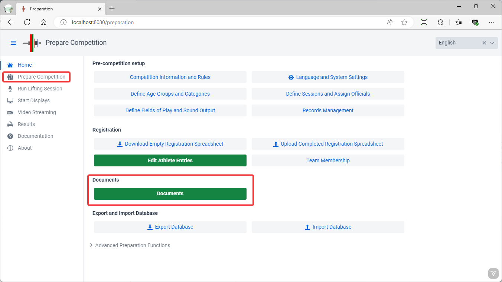
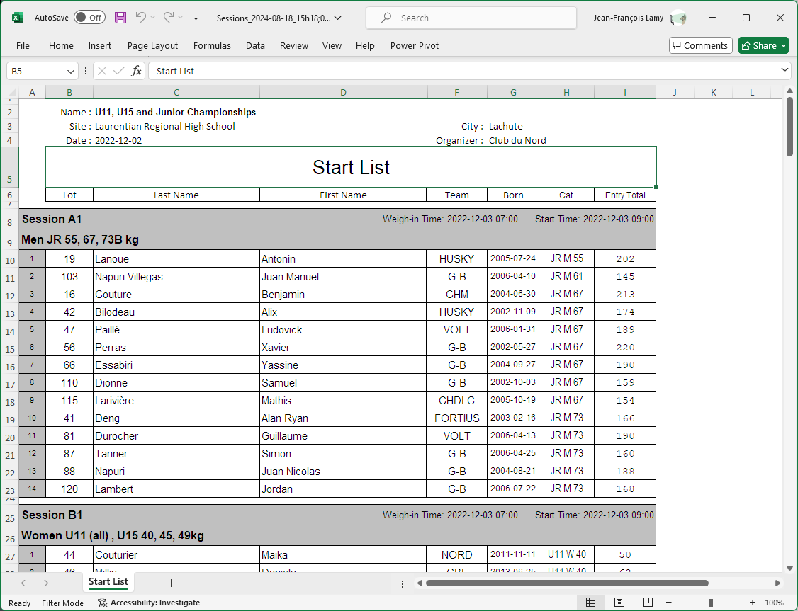
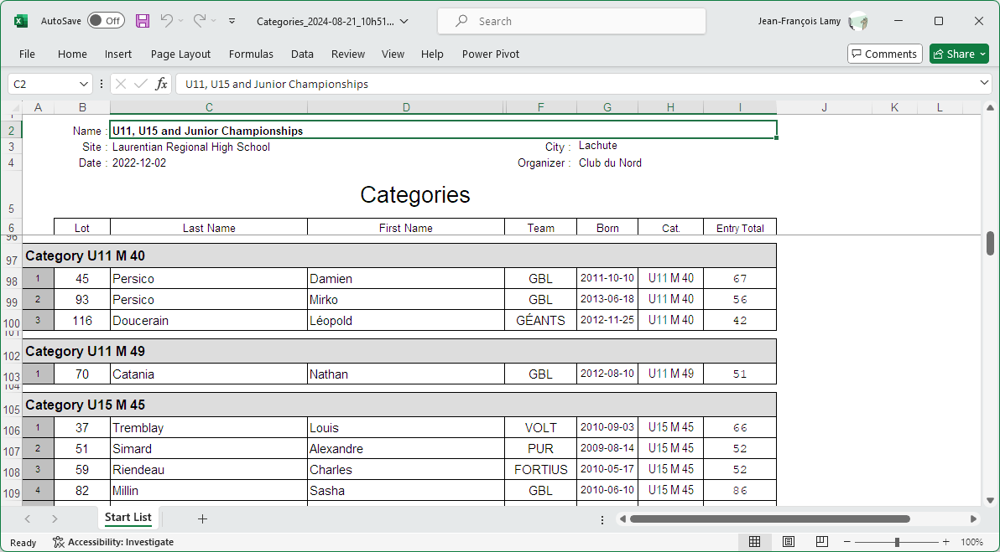
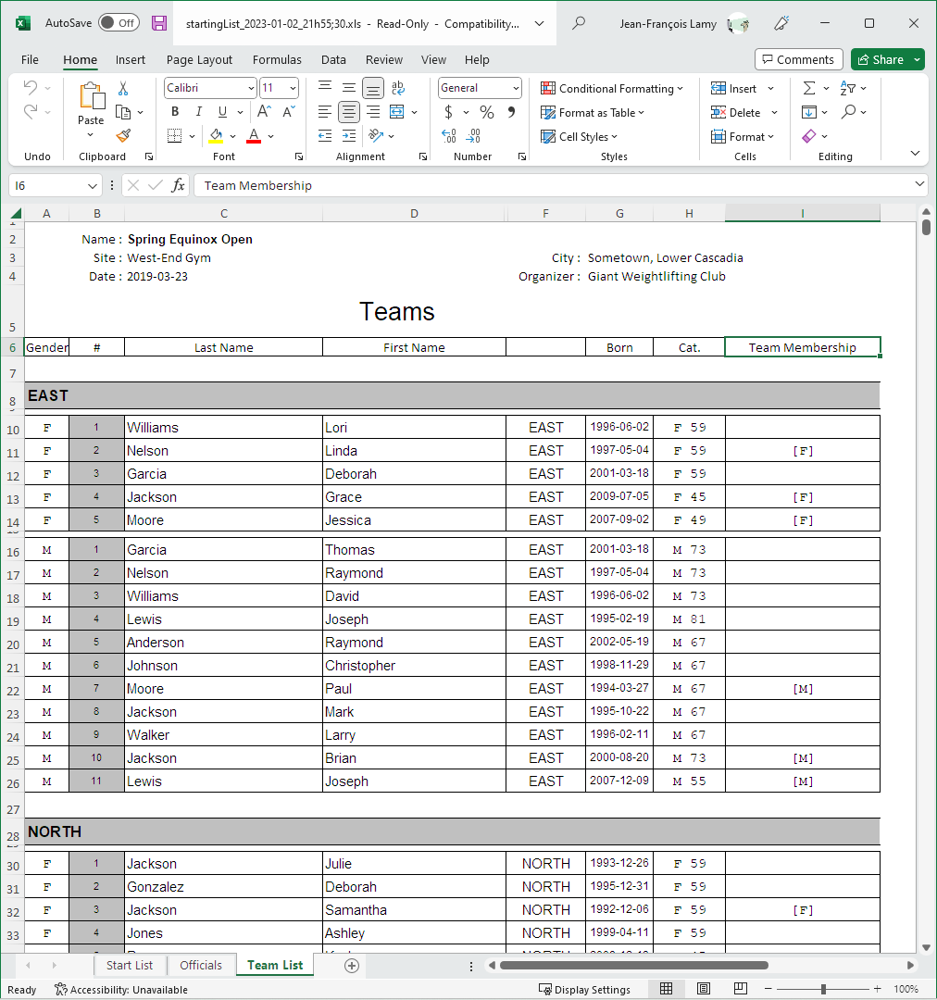

The next step in preparing for a competition is preparing the documents.  This typically involves

- Checking that all athletes are in the [correct category](#categories-list)
- Checking [team membership](#team-membership-list) if team points are assigned
- Producing a [**Start List**](#start-list)
- Producing [**Athlete Cards**](#athlete-cards)
- Producing the [Official's Group Assignments](#officials-schedule)

These steps are performed from the `Prepare Competition` page, selecting the `Pre-Competition Documents` button

The various documents are shown at the top of the page.  The filters at the top of the list make it possible to restrict what is extracted.  For example, you may wish to produce Athlete Cards for only one group, or create a Start List for one platform only.

## Start List

The starting list shows all the athletes that will compete, in which group, and the order in which the athletes will be weighed-in.

## Athlete Cards

Athlete Cards are the cards that will be used by the Marshall to record changes.  In many federations, they are printed out in advance, because the athletes will be asked to write down their starting weights and counter-sign their body weight at weigh-in.  

If athlete cards are printed in advance of the weigh-in, the start numbers are not known.  They are written by hand on the cards after they have been assigned at weigh-in.  This is usually done by the competition secretary, comparing the [Starting Weight List](#starting-weight-list) as a reference and cross-check.

 The button for producing the athlete cards is at the top of the page.  You can restrict the printing to a group by selecting it in the drop-down.

The recommended setting is to use the IWF format. Each page is folded in half, so one side is snatch, the other is clean & jerk.

## Categories List

The Categories List is a variation on the Start List that is useful before allocating groups.  It shows which athletes have registered in which category.

## Team Membership List

The Teams also includes a tab for who is registered for which club, allowing coaches to spot errors in spelling or in categories.  In addition, when a team points competition is held, the teams in which the athlete participates are shown.  

In the example below, there are 3 women in the F team and 3 men in the M team.  In a competition with multiple age groups, a single athlete can potentially score points in multiple teams (for example, as a JR and as a SR).  The team membership column will then show the teams where the athlete has been selected.

### Officials' Schedule

The Officials buttons creates a summary of all the officials assigned to each group.