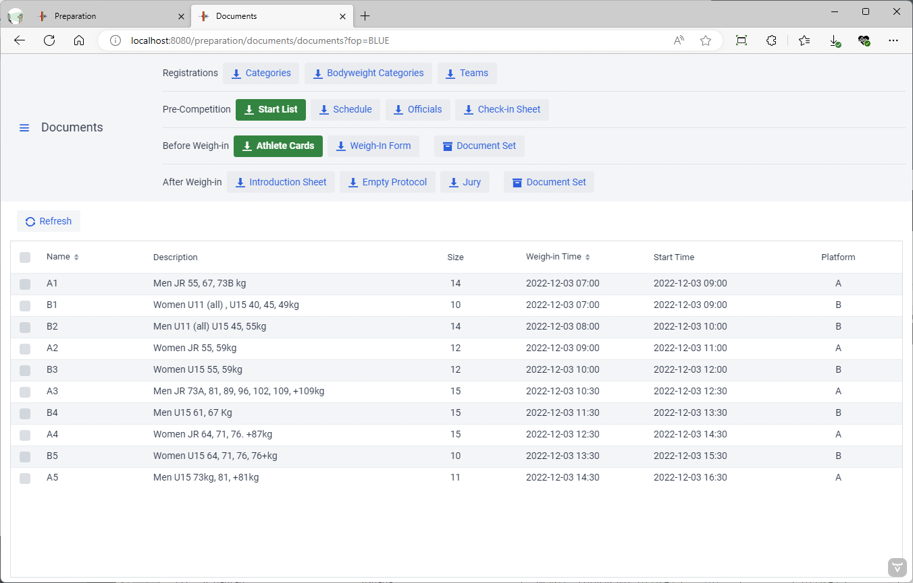
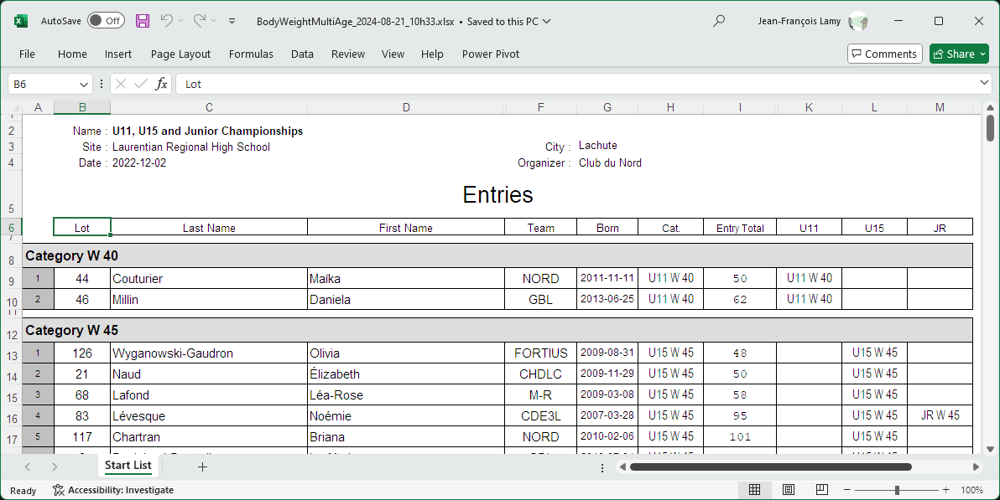
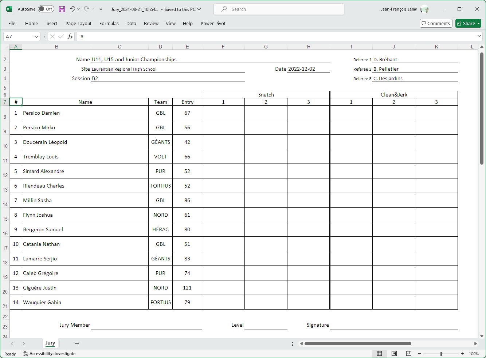
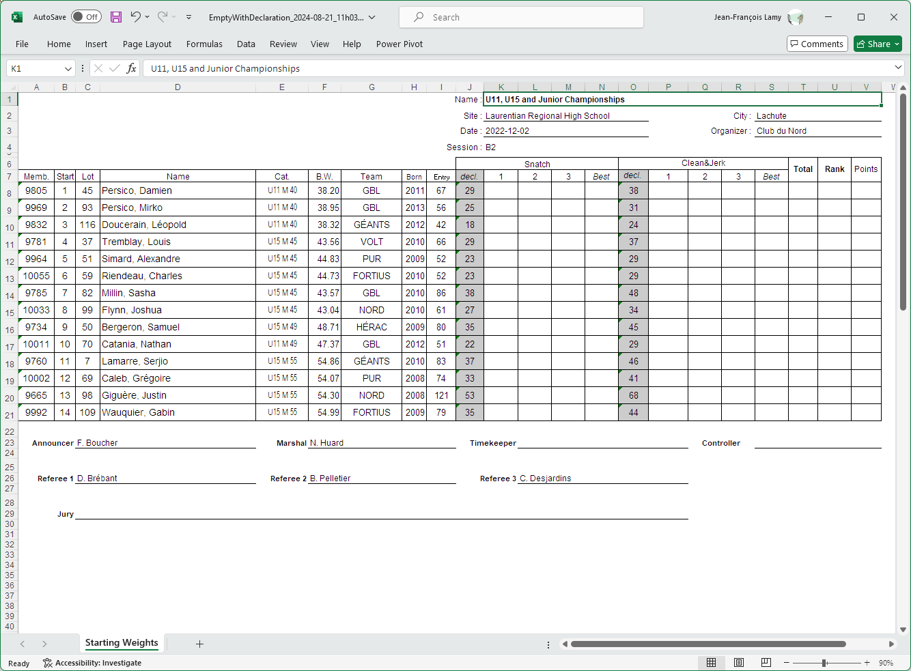

The Documents page is used

- To check registration and team memberships
- To publish a schedule and start list, and to assign officials
- To print the marshal cards and the weigh-in forms
- To print the manual backup protocol sheet and the jury documents

It is reached from the `Prepare Competition` page, selecting the `Documents` button

The page has two sections.  The top section includes buttons to print the various documents.  The bottom section is used to select sessions.

- The documents in the top two lines (Entries and Pre-Competition) are global for a competition.  Selecting sessions has no effect.
- The documents in the bottom two lines are typically produced for one or more sessions at a time.  The sessions are selected using the checkboxes in the bottom section.  

### Multi-Session Documents and Document Sets

- An Excel is produced if you select a single session and click on a specific document.
- However, a zip will be produced when more than one session is selected -- each session document will be a separate entry in the zip.  The zip is then downloaded.  On Windows, if you use "Extract All"  (right-click on the zip file) you can use the `print.ps1` script to print all the documents to your default printer (right-click on the script and select "Run using PowerShell".)
- If you use the "Document Set" option, all the documents for which you selected a template will be included in the zip.  The typical use of "Document Set" is to produce both the weigh-in form and the athlete cards together. If you select several sessions, the documents will be created for the selected sessions.

## Start List and Schedules

The start list (or starting list) shows all the athletes that will compete, in which group, and the order in which the athletes will be weighed in.  When you click on the start list button, you are given a choice of templates to use according to the paper format and whether or not you want the platform information to be visible.

Some federations have their own formats for the Start List.

### Schedule

Some federations have a Schedule template that is a simplified Start List, sometimes with additional information such as the categories and entry total range.

### Officials' Schedule

The `Officials` buttons prints a schedule of all the officials assigned to each group.

## Athlete Cards

Athlete Cards are used by the Marshall to record changes.  The `Cards` Template is meant to be similar to the IWF format. Each page is folded in half, so that one side is snatch, and the other is the clean & jerk.  Normally the start number box at the the top left is empty.  The start numbers are written by hand, with a red marker, once the weigh-in data has been entered into the system.

You can produce the cards for one or more sessions.  

- If you do NOT select sessions in the bottom section, and have less than 100 athletes, you can produce the cards as a single Excel.
- If you select multiple sessions, a zip file is produced with the different sessions in individual files.
- You can also combine the athlete cards with the weigh-in form in a single zip by using the `Document Set` button.
- A utility script is included in the zip for use on Windows. Right-click on the zip and use `Extract All`.  In the extracted folder, right-click on `print.ps1` and use `Run in PowerShell`.  This will print all the files on your default printer.

### Challenge Cards

Challenge cards are printed from the same menu as Athlete Cards, by selecting the Challenge template instead.

## Registration Checks

### Registration Categories List

The Categories List is a variation on the Start List that is useful before allocating groups.  It shows which athletes have registered in which category. An athlete can be shown several times if eligible in multiple categories.

### Bodyweight Categories Lists

Some federations do multiple age group competitions but combine all age groups according to bodyweight, and then split sessions according to entry total.  To validate the registrations for such competitions, you can use the Body Weight list.

### Team Membership List and Verification of Final Entries

The Teams list is used to check that all athletes are assigned correctly - IWF rules put limits on how many athletes there can be in a team and in a given category.
The VFE template is also useful to record changes during VFE.   When the session is done in person, the team representative's signature can be obtained as confirmation. 

## Lifting Session Documents

The following documents are normally printed after weigh-in, before the session starts

### Introduction Sheet

In some federations, an easier to read introduction sheet is given to the speaker.

### Jury Sheet

The Jury Sheet is used by the jury to assess lifts, and to evaluate officials.  The jury sheet can also be used as a manual backup to record lifts.

### Empty Protocol

The empty protocol sheet is used as a manual backup.  In some events, such sheets are printed for the coaches to count attempts (the starting requested weights are printed on the sheet)

