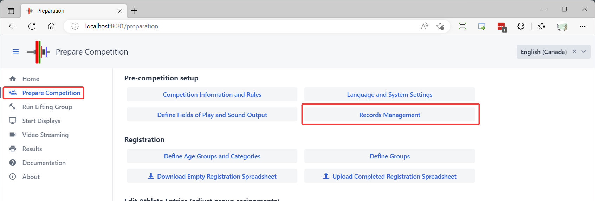
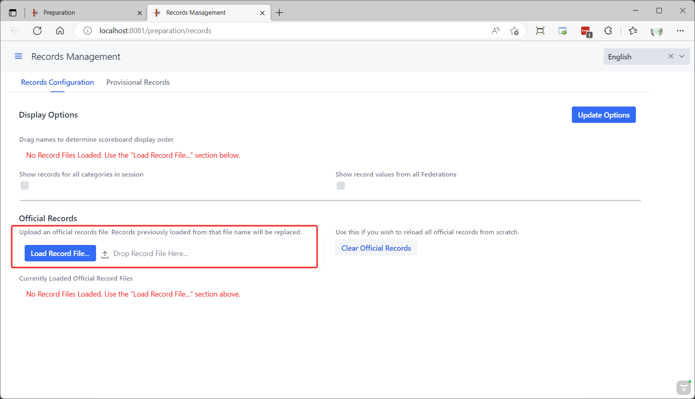
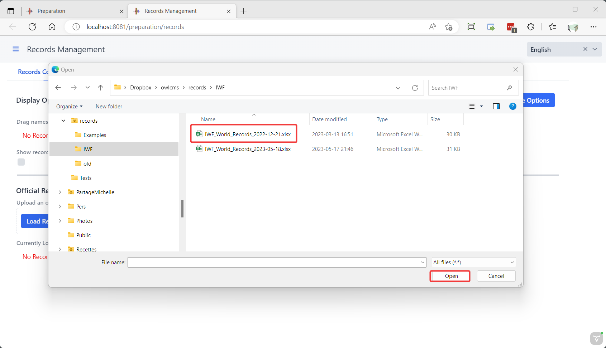
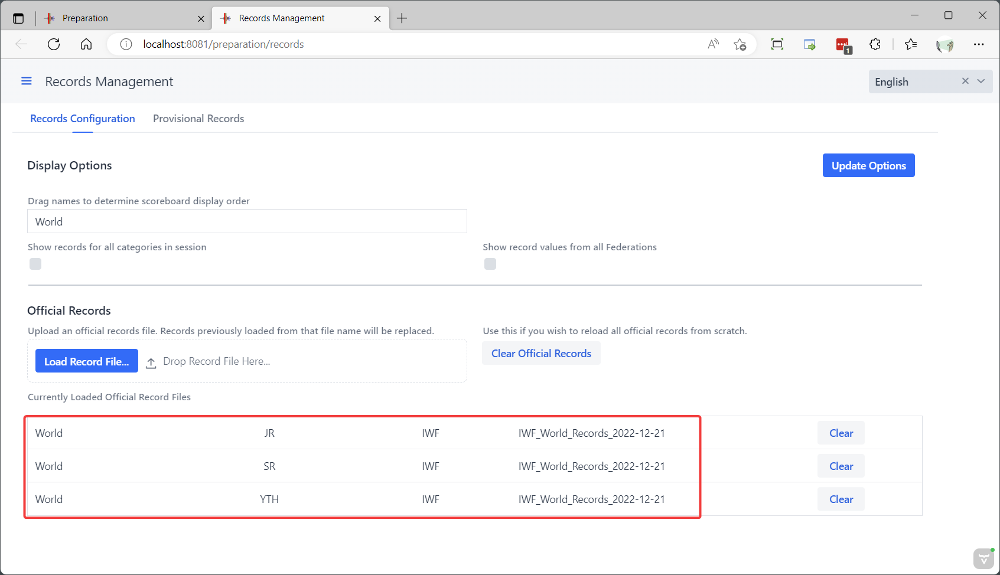
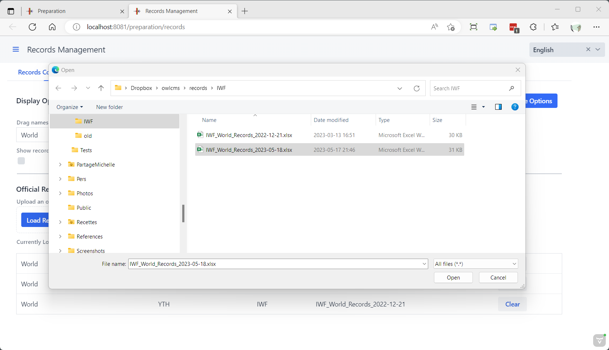
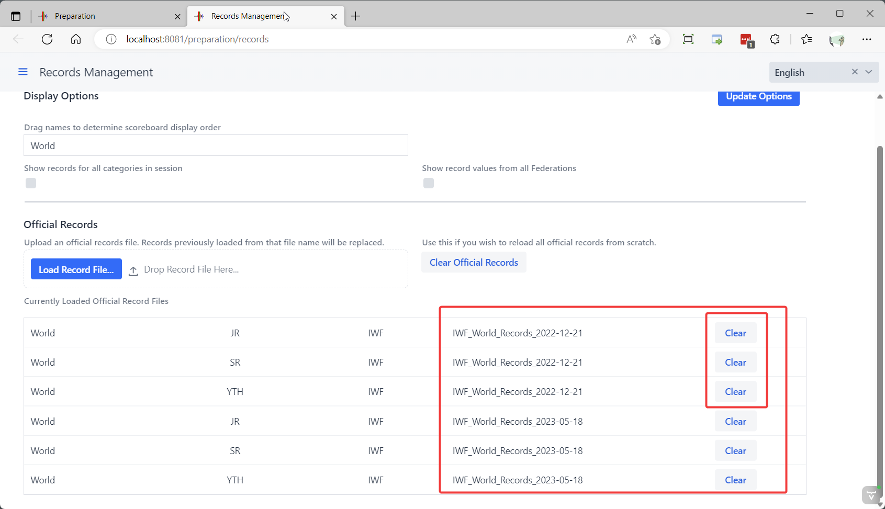
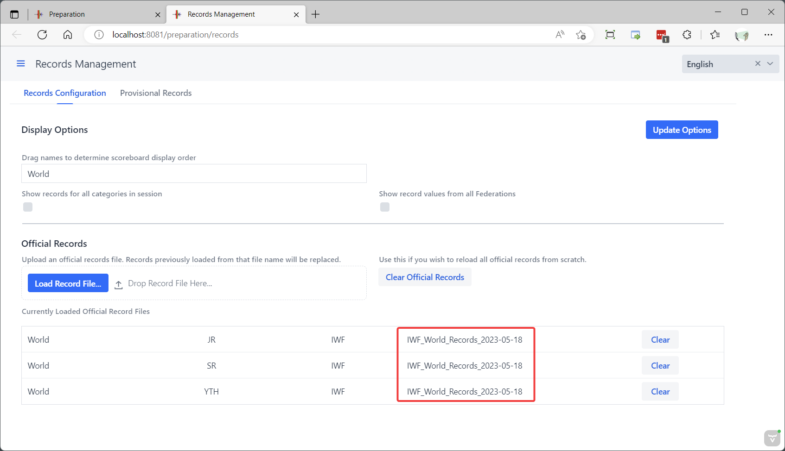
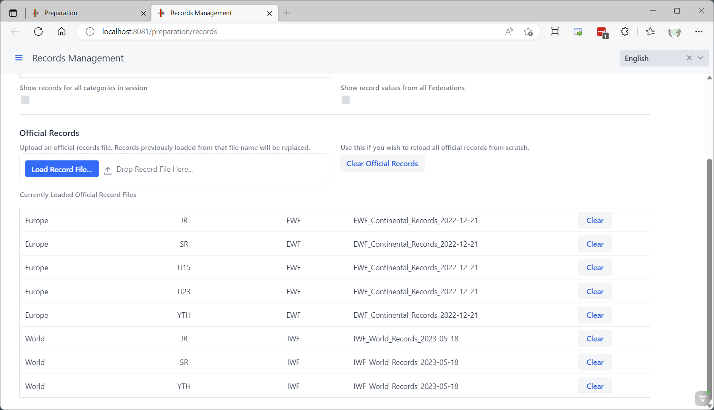
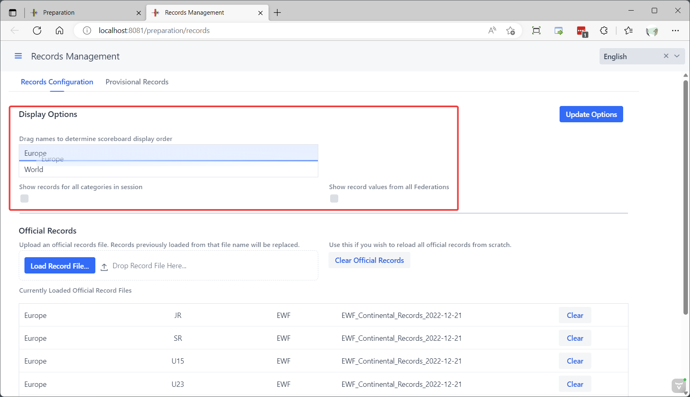

Record definition files can be loaded in owlcms so that when an athlete is about to lift, the records for his/her categories can be shown.  As many record files as needed can be loaded, so that state, national, continental, world, or event-specific records can all be shown.

In the following example

- the athlete can potentially break records in categories from two age groups (JR 45 and SR 45)
- the records from two federations have been loaded to illustrate. Normally one might expect related state, national and continental federations to be used in a given meet.
- the next lift would break the records highlighted in purple (assuming of course that the athlete meets citizenship and that other record requirements such as proper referee levels are met).
- the athlete had, in fact, just set the records on the previous lift-- the system updates the display when a record is provisionally set during a meet.

*Official records* are provided in Excel files that are loaded in the system.  The format for these files is explained [below](#record-file-format).

If records are broken during a meet, they are stored in the database.  They are *not* considered to be official records.  For them to become official, they need to be approved by the appropriate association or federation, and then added to the correct Excel file.  Once the Excel file has been updated, it becomes the new reference and can be loaded in the database.

### Records Management

The Records Management page is reached from the Prepare Competition section

### Loading Official Records

Records are defined in an Excel file.  To load a file, use the "Load Record File..." button or drag  the file to the area next to it.

The system shows that the IWF World records for 3 age groups were present in the file.

### Updating Records

When loaded in the database, the system remembers the file from which the record was loaded.  If a file with the same name is loaded again, old records from that file are replaced with the new content.   However, to keep track of updates, you probably want to include the date of updates in the name of the record file.  If you do so, you will need one extra step to remove the records from the previous file name.

Let's load an updated file with a different file name.

We now have 3 more types of records in the database.  We can use the "Clear" button to remove the obsolete ones.

And we now have the updated version only.

### Multiple Records

It is also possible to add records from multiple federations or to add records that are specific to an event. We now add a second federation in exactly the same way as before.

### Managing Display Options

The order in which the records will be shown on the scoreboard is determined in the top section of the page.  You can drag the names to determine the order.

Normally, the scoreboard will only show the records for which the current athlete is eligible.

- It is sometimes desired to show the records for all the body weight class in a session, or all the age groups in a a session, if they fit on the scoreboard.  The "Show records for all categories in session" checkbox enables this.
- It is sometimes desired to show records that cannot actually be beaten in the current competition.   This requires two steps:
  1. To define the eligibility federations for all athletes.  For example, in an EWF event where IWF events *cannot* be beaten, all the athletes would have "EWF" as their Record Eligibility Federation.  See [Eligibility Criteria](#eligibility-criteria) below.
  2. The second checkbox "Show record values from all federations" would be used.  In this way, both the EWF and IWF records would be shown (all the loaded records, actually), but only the eligible ones would be highlighted.
- The "All Federations" checkbox can also be used in multi-regional events. In a joint PanAm + South American event, some athletes could beat PanAm Records only, others might beat South American *and* PanAm records.  The key is to correctly set the eligibility criteria for the athletes. See [Eligibility Criteria](#eligibility-criteria) below.

### Record File Format

The following fields are expected in the file, in that specific order.  The first line contains the names of the field.  The program stops reading at the first line where the Federation field is blank.

| Field      | Content                                                      |
| ---------- | ------------------------------------------------------------ |
| Federation | The acronym of the federation with authority to certify the record.  In competitions that involve athletes from multiple federations, this can be used to check whether an athlete belongs to the correct federation to break a record (see [Eligibility Criteria](#eligibility-criteria) below). Using the official federation acronym is recommended (e.g. IWF) |
| RecordName | The name of the record, used for naming the rows in the display.  *This field can be translated to the local language.* For an IWF record, the name will likely be "World". **Note:**  Because the name of the files controls the ordering of the rows, records that bear the same name should all be in the same file.  If you have "National" Masters records and "National" SR records, and you want them to be on the same row, then combine the two in the same file.  Otherwise there will be several rows with the same name. |
| AgeGroup   | The age group to which the record applies.  The codes should match those that have been specified when loading the Age Groups (see the [Age Groups and Categories](Categories) page).  In competitions that involve multiple age groups, this can be used to determine which records can be broken by an athlete (see [Eligibility Criteria](#eligibility-criteria) below). Note that there can also be records whose age group does not match a competition age group -- for example, a record that can be broken by anyone.  If the name does not match an age group active in the competition, the eligibility checks will be skipped. |
| Gender     | M or F depending on the gender of the athlete.               |
| ageLow     | Lowest inclusive age for breaking the record.  For IWF JR, you would use 15. |
| ageCat     | Highest inclusive age for breaking the record. For IWF JR you would use 20. Use 999 when there is no upper limit. |
| bwLow      | Lowest *exclusive* body weight for breaking the record.  For the women under 55kg category, this would be 49 with the understanding that the body weight must be strictly above 49. |
| bwcat      | Highest *inclusive* body weight for breaking the record. For the women under 55kg category, the field would be 55. |
| Lift       | The kind of record: `SNATCH`, `CLEANJERK`, `TOTAL`.  Note that only the first letter (`S` `C` `T`) is actually checked. |
| Record     | The weight lifted for the record                             |
| Name       | The name of the athlete holding the record (optional).  Not currently displayed by the program, but available in some federations' databases; could be used in the future. |
| Born       | The date of birth of the athlete holding the record (optional). |
| Nation     | The nationality of the athlete holding the record (optional).  Not currently displayed by the program, but available in some federations' databases; could be used in the future. |
| Date       | The date at which the record was established (optional).  Not currently displayed by the program, but available in some federations' databases; could be used in the future. |
| Place      | The location where the record was established. Typically City, Country. |

The following figure shows the content of the 10_Canada file, organized with one age group per tab.

### Eligibility Criteria

For a record to be broken, in addition to meeting the age and bodyweight requirements, the athlete must be eligible according  to the Federation Eligibility Field

For each record in the record definition Excel, there is a federation code.

In the database, the athlete's registration record can optionnally have a list of federations under which they can break records.  

- By default, the list is empty and athletes are eligible for the records from all the listed federations if they meet the age group, age and weight requirements.
- If a list of federations (comma-separated) is given, the athletes are restricted to these federation records. 

##### **Example 1:**

- Joint IWF-certified Canada-USA-Mexico meet.  All athletes can break records for their country, and also a PanAm record.
- The record files have PAWF for PanAm records, CAN as federation for Canadian Records, USA for American Records, MEX for Mexican Records.
- A Canadian athletes would have `CAN,PAWF` as their Record Eligibility Federations on the the Athlete registration page

##### Example 2:

- If, in a joint South American and PanAm championship, `SudAm` and `PanAm` records have been loaded, then South American athletes would have `SudAm,Panam` and all others (such as North American Athletes) would have only `PanAm` to determine who can break what record.

|      |      |
| ---- | ---- |
|      |      |
|      |      |
|      |      |
|      |      |
|      |      |
|      |      |
|      |      |
|      |      |
|      |      |
|      |      |
|      |      |
|      |      |
|      |      |
|      |      |
|      |      |
|      |      |