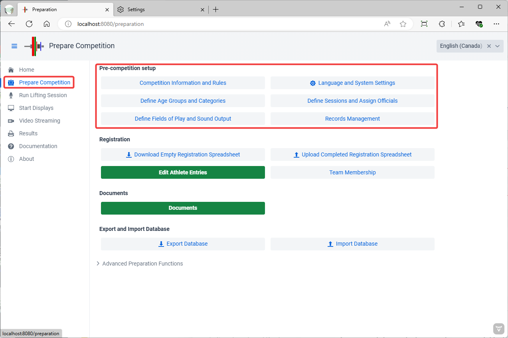
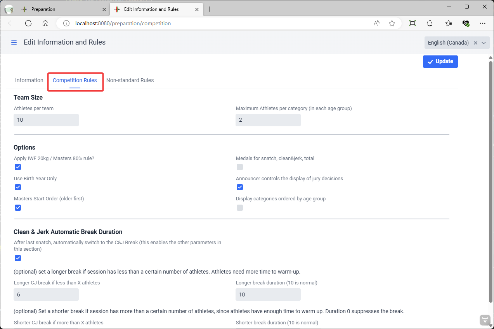
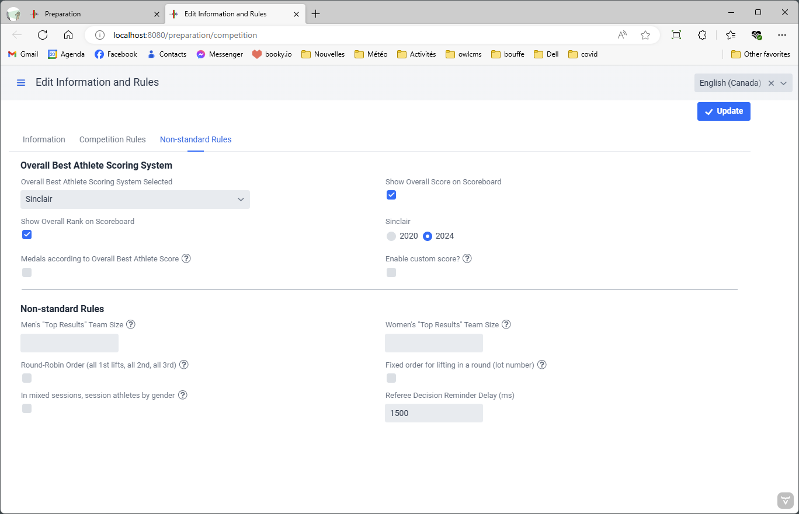

> This page describes the full set of options available, including specialized options for children meets, etc.

The first step in preparing for a competition is to provide general information about the meet and define the major settings.

## Competition Information and Rules

The `Competition Information and Rules` button leads to a page where general information about the competition is entered.

First, the name and other data about the competition and hosting federation is provided. This information appears on screens and documents.

#### Standard Competition Rules

The screen also allows selecting common variations on IWF rules.

- Team Size: these settings will provide warnings on the team membership pages when the numbers are exceeded

  - IWF competitions normally limit the number of athletes to 10, with 2 athletes per category.

- Options

  - The `Apply initial total weight rule` determines whether the 20kg rule (20% for Masters) will be enforced.  Some local or regional meets do not enforce this rule.
  - The `Medals for snatch, clean&jerk, total` checkbox determines whether separate rankings will be computed and shown for snatch and clean & jerk.  Leave it unchecked for a "total-only" competition.
  - The `Use Birth Year Only` allows the use of only the 4-digit birth year for athletes, instead of a full date as required by IWF.  Note that the athletes will be registered internally as being born on January 1.
  - `Announcer controls the display of jury decisions` When this setting is checked, the announcer will receive a notification if the jury console screen is used to grant/deny a lift.  When IWF procedures are followed, the announcer will wait and announce the reason, and then click for the competition to resume.  If this setting is not checked, the jury decision is displayed immediately on the attempt board.
  - The `Masters Start Order` settings changes the sorting order for displays and weigh-ins -- Masters traditionally start with the older lifters. The display will be grouped by age group first, and then by weight category.
  - The `Display Categories Ordered by Age Group` setting is like Masters Start Order, but reversed, younger age groups are shown first and weighed-in first.   In a normal IWF scoreboard, Junior and Senior athletes are not separated on the scoreboard (this switch would be off).  This switch is typically used when several youth age groups are competing together in the same session, and younger athletes are unlikely to compete for the older age group medals.

- Clean and Jerk Automatic Break Duration

  - Normally the system will go into break automatically after the last snatch.  The first checkbox is used to enable or disable this.
  - `Longer CJ Break if less than X athletes`  If there are less than 7 athletes (6 or less) some federations grant a longer break (15 minutes instead of 15).  You can control the number of athletes to be what you need, and the longer duration.
  - `Shorter CJ Break if more than X athletes`  Conversely, in some federations, when there are many athletes, is is determined that there is plenty of time for athletes to warm up, so the break duration is reduced to (for example) 5 minutes, or the break is eliminated (0 minutes).

#### Non-Standard Rules

Additional options are used when running team, kid, or virtual competitions. 

- Overall Best Athlete Scoring System
  - `Overall Best Athlete Scoring System` determines two things
    
    - On the Competition Results page, this will be the default scoring system shown in the table.
    - If the `Show Overall Score on Scoreboard` option is used, this is the score that will be shown.
    
  - `Show Overall Score on Scoreboard` and `Show Overall Rank on Scoreboard` is used when there is a best lifter award in play, and the global ranking is desired
  
    > Note: if you have selected to [award medals based on a scoring system](ScoreBasedCompetitions) the score columns will be shown automatically, but this will be used for the score used for the medals in that category. If there is no scoring system selected for medals, the total will be used as the score, otherwise, the medal scoring system chosen for the category will be used.
  
  - The `Sinclair` setting determines which version of the coefficients is used.  The 2020 coefficients (issued in 2017) were used until the new ones were issued in fall 2022.  This setting does ***not*** affect the Masters SMF and SMHF coefficients.
  
  - (deprecated) `Medals according to Score` gives out medals for the whole competition based on the selected scoring system (for example, the 3 best Sinclair across all Sessions). This is the same as using the [Score-based Competitions]() capability, with all men in a single open category (all ages and all bodyweights together), and all women likewise. Using the score-based category approach is more flexible as you can have separate age groups if you wish, and also award the normal medals.
  
  - `Enable Custom Score` This adds a box on the Athlete Card where a custom score can be entered.  This will typically add bonus points or subtract penalty points.  This is sometimes used for kid competitions where bonuses are given for 5/6 or 6/6 performances.
  
- Non-Standard Rules
  - `Top Results Team Sizes`  in some competitions, points are awarded as usual, but the teams are not pre-determined. Instead, the best "n" athletes point scores are counted towards the team total (e.g. 15 athletes are entered for a team, but the best 10 point results are kept for the team score)
  - `Group Athletes by Gender`  When hosting kid competitions, it is common to group kids in mixed groups according to age or weight. This setting makes all girls go first to avoid changing bars.
  - `Round-Robin Order` In team leagues, it is common for all first lifts to be done before the second lift, and so on.
  - `Fixed order for lifting` Some league competitions use round-robin play and also decide in advance the lifting order.  This setting means that the lot number assigned to the athlete decides the lifting order within each lift.
  - `Referee Decision Reminder Delay` When using phones/tablets to referee, or MQTT devices that can provide feedback to the referee, this determines the delay (in milliseconds) before sending a reminder.
  - (deprecated) `Sinclair Meet` If this is selected, the program will behave as if there were a single male category and a single female category.  The scoreboards will show the Sinclair score, and the leaderboard will consider all the athletes of the same gender. (deprecated) 
    -  Use the [Score-based Competitions]() capability instead to give out medals based on score, ignoring body weights and according to whatever ages you want.

## Language and System Settings

The second button in the group gives access to the technical settings for the application.

### Display and Printout Language

owlcms allows selecting the language for each session using the menu at the top right.  The `Display and printout language` selection box allows changing the default setting.  If no selection is made the user's browser language will be used if available, and English if not.

### Time Zone Configuration

When running in the cloud, you need to set the time zone so it matches the competition schedule.

### Advanced Technical Settings

Other settings are available, but not generally needed for normal situations. See this [page](2120AdvancedSystemSettings) for details.

## Defining Fields of Play (Platforms)

OWLCMS supports multiple competition fields of play used at the same time.  A field of play corresponds to a platform and the corresponding warm-up area.   Displays and technical official screens are associated with a field of play.

 Using the `+` button allows you to create additional fields of play.  Clicking once on a platform in the list allows you to edit it.  This is useful if you want to rename the platformé

### Changing the Audio Output

Normally, only the Athlete-Facing Display emits sound.  **The recommended sound setup is to connect speakers directly to the athlete-facing computer and to use the default "Use Browser Sound"**

However, in certain circumstances, this may not work (for example, some computer-browser combinations produce garbled sound).  You can then use the main laptop to produce the sounds instead.  If you are running locally on a laptop, then you can get the computer to generate the sound. 

Notes:

- if you need to produce sound from the main laptop for more than one platform, you will need one audio output per source.  The easiest way to add more (in addition to the audio headset jack) is to use an [*analog* USB converter](https://www.amazon.com/UGREEN-External-Headphone-Microphone-Desktops/dp/B01N905VOY/ref=lp_3015427011_1_5?s=pc&ie=UTF8&qid=1564421688&sr=1-5) -- do not use digital or wireless connections, they introduce perceptible lags and are needlessly expensive.  The various adapters available will appear in the list, you need to assign each platform with an adapter.
