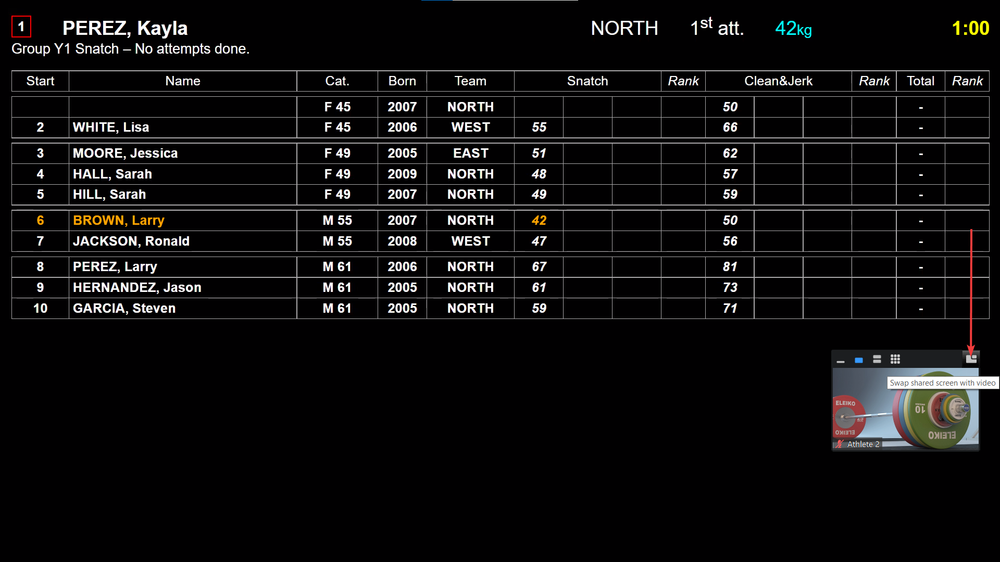
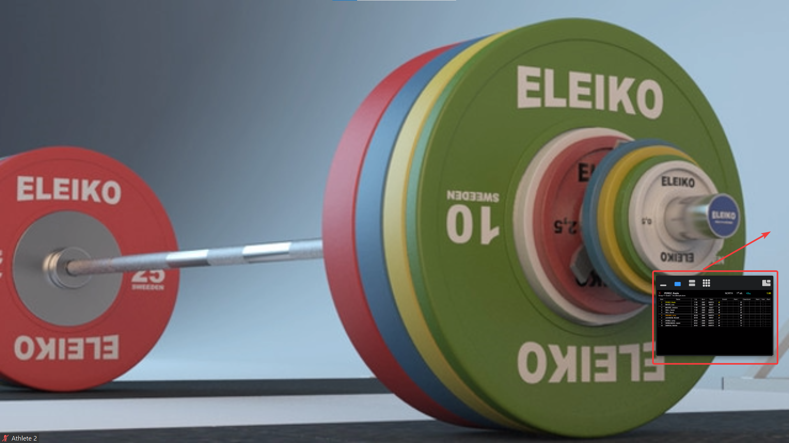
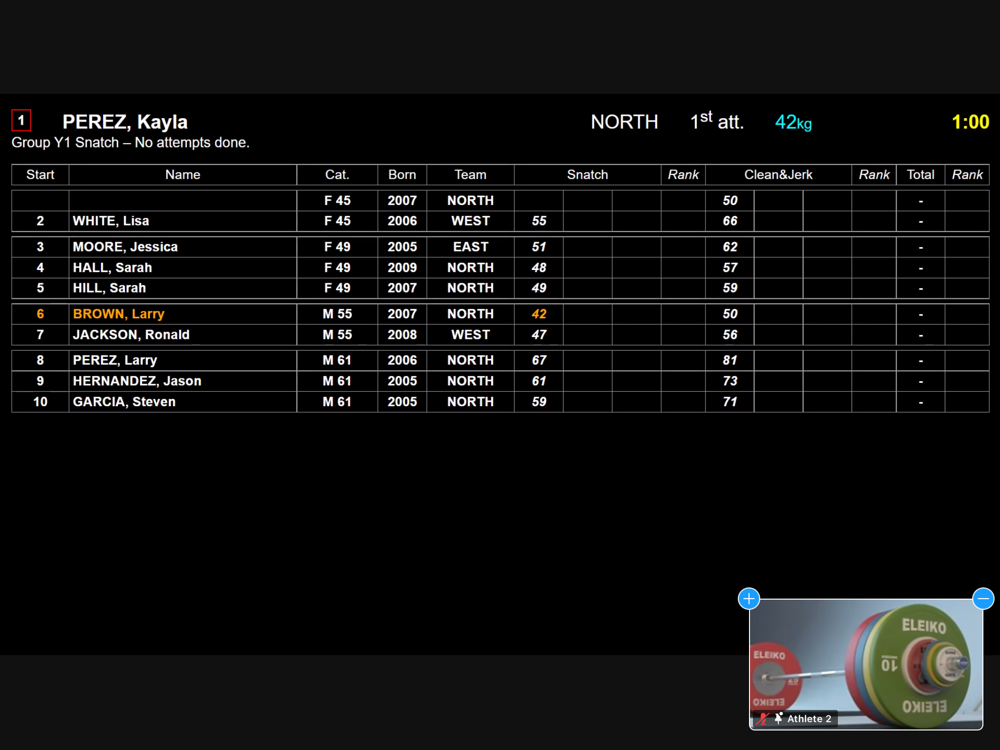

# User Instructions For Zoom

> This section only applies if the scoreboard is broadcast using Zoom.
>
> If the scoreboard is seen using the publicresults application, then the athletes/coaches see the scoreboard using a regular browser (Chrome, Edge, Safari, Firefox) on a tablet, phone or laptop.

#### Laptop Users: switching between athlete view and scoreboard

For users on a laptop, depending on the way the users interact with their Zoom application, there are two possibilities to select between the athlete and the scoreboard.

- a "View" button at the top right.  There is an entry in the menu to switch views between the shared scoreboard and the current athlete lifting.

- Or, a small preview window.  The switch is done by using the icon at the top right of the preview window.

  

  In a real competition, the host would have selected an athlete and not a dummy background, obviously

  

#### Phone/Tablet Users: switching between athlete view and scoreboard

For users on a tablet or phone, the switch between the two views is simple: just touch the preview area.

