After a group has been weighed-in, the actual process of running the competition takes place from the various Technical Officials screens which are started from the `Run Lifting Group` page.

The first thing to do is to check that the correct field of play (platform) is displayed at the top of the page (and if not, to select the correct one.)

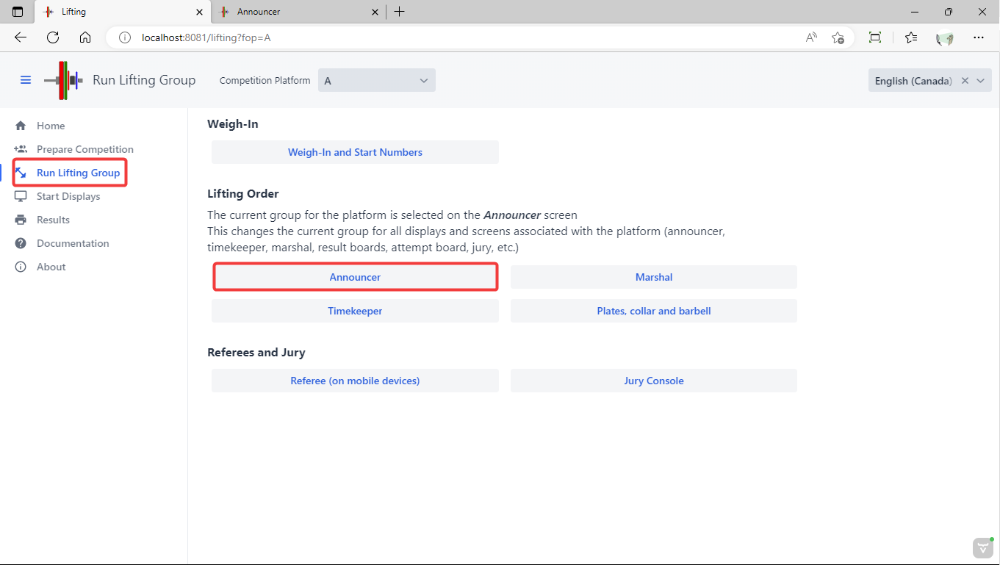

## Selecting the current group

The current group is normally selected on the announcer screen (but may also be selected on the timekeeper screen).  When the current group is selected, all the displays for the field of play switch to that group.

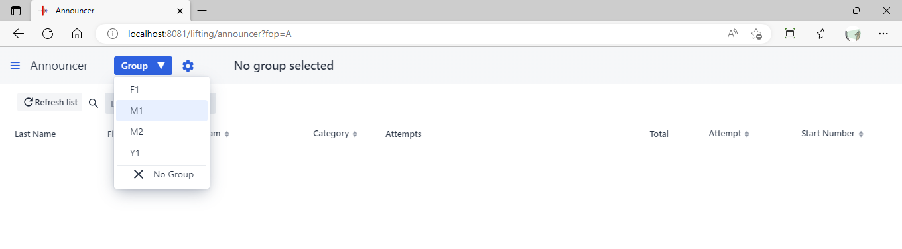

However, before lifting starts for a group, there is normally an official protocol followed, where athletes and officials are introduced, and a warm-up period is given after the introduction.  Applying this protocol for intermissions and breaks is explained on the [Intermissions and Breaks](Breaks) page.

Let's assume we are running an informal club meet and we want to start lifting right away.  We select the green `Start Lifting` button.

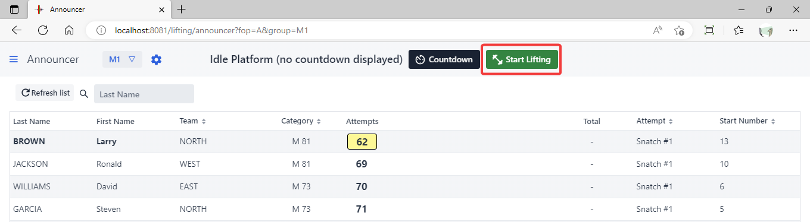

## Announcing an athlete

The display shifts to the lifting order and announcing mode.  The next athlete to lift is displayed. Athletes are shown in lifting order. The next weight requested is highlighted in yellow.

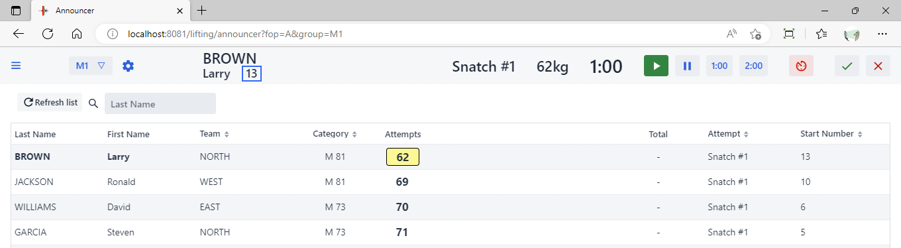

Following the IWF rules, the announcer should then proceed as follows

1. The announcer says: "**Loaders, please load 62kg on the ba**r"
2. Once the platform is clear, the announcer says, in the local language then in English: "**The bar is now loaded with 62kg for the first attempt of Larry BROWN**"
3. When pronouncing the **family name of the athlete in English**, [start the clock](#starting-the-clock) -- see the next section -- by using the `Play` (triangle) button.

## Starting the clock

Either the announcer or the timekeeper can start the clock.  

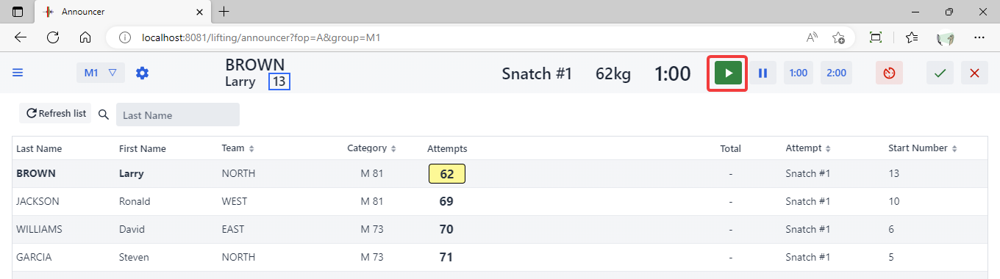

## Stopping/Restarting the clock

The announcer (if acting as timekeeper), or the timekeeper (using the timekeeper screen), can stop the clock when the bar leaves ground.  Either person can restart the clock if the bar is put down not having travelled above the knee.

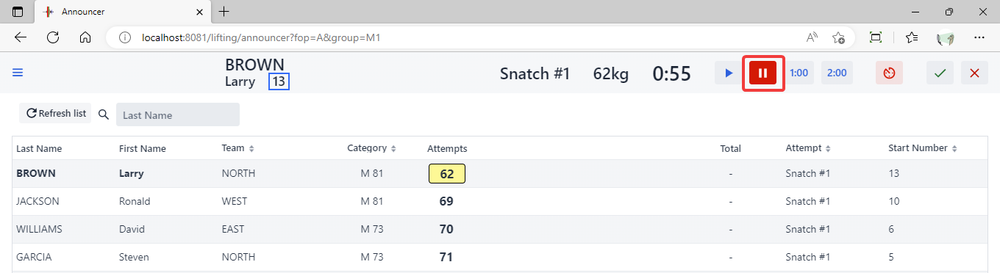

## Manual Refereeing

If no refereeing devices are being used, the announcer captures the decision given using flags, cards or hand signals.

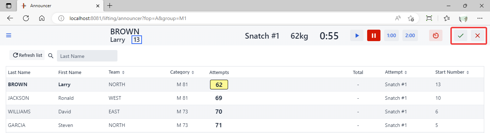

## Announcing the decision

When a decision is entered (whether manually by the announcer, or automatically by referees using refereeing devices), a confirmation is shown for five seconds.

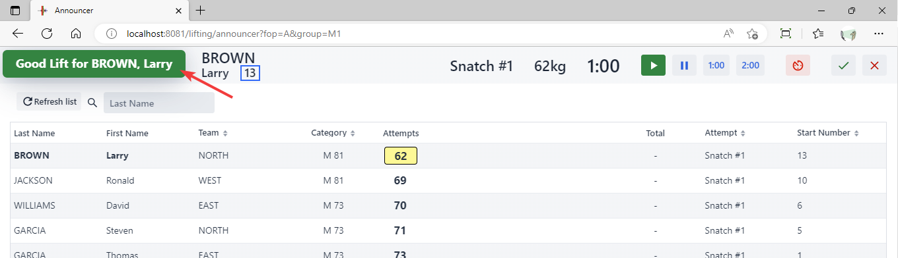

## Declarations and Weight Changes

Announcers may act as marshall and handle declarations and changes themselves.  Weight changes are entered by clicking once on the the athlete's name.  The athlete's card then pops up and can be edited. Hitting "Enter" is the same as clicking "Update".

Notes:

- The first time an athlete or coach indicates a weight should always be noted in the Declaration row. It is *not* the first change.  The official should pay attention and refuse a declaration after the first 30 seconds have elapsed. In a two-minute situation, further changes cannot be made if a declaration has not been given.

- When the jury screen is used, reversal of decisions is automatic.

- In order to manually reverse a ruling, edit the bottom row which is the actual weight that was lifted or failed (negative number).  In the screen shot below, changing the snatch 1 from "62" to "**-62**" <u>on the bottom row</u> would mark the lift as <u>failed</u>.

  > NOTE: the ability to edit the results is OFF by default on the Marshall screen, to prevent entering an extra change by mistake (which would then count as a good lift)

- The withdrawal buttons are a shortcut and mark all the remaining lifts as not taken (0). You can also enter a zero (0) in the bottom row

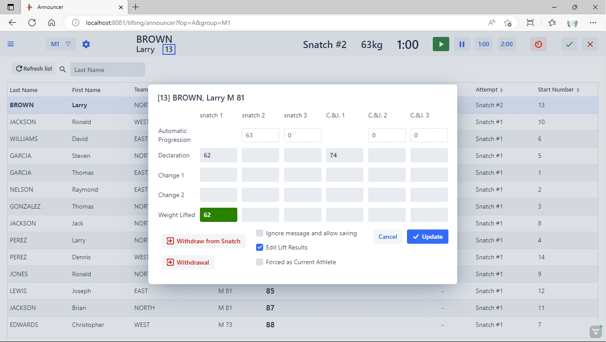

## Rules for Moving Down

An athlete may request a smaller weight than on a previous declaration or previous change, but only if this does not cause him to lift out of order.  For example, if on the first lift, athlete A (start number 1) and B (start number 2) both request 80 kg, Athlete A cannot move up to 85, let B lift, and then request 80 again.  By rule, on first attempt, a smaller start number must go first at a given weight.

In summary, moving down is only allowed if the requested weight does not cause the athlete to lift out of order (that is, moving is denied if the athlete should have lifted the weight earlier according the the rules, and is therefore gaining unfair recovery time).  The exact rules enforced are as follow:

- An athlete cannot move to a weight smaller than an already started clock, or an already lifted weight (bar weight does not go down except to correct marshalling or announcing errors)
- If moving to a value for an already started clock or an already attempted weight
  - If an athlete previously lifted the requested weight and did so on an earlier attempt, then the moving athlete cannot move (at a given weight, cannot take attempt 2 before attempt 1)
  - If an athlete previously lifted the requested weight and did so on the same attempt, then the moving athlete must have lifted later (taken a larger bar on the previous attempt - smaller progression)
  - If an athlete previously lifted the requested weight and did so on the same attempt with the same previous weight, then the moving athlete must have  larger start number (for example, on a first attempt start 1 cannot lift after start 2 by moving up, then moving down after start 2 has lifted)
- If an illegal move down is detected, the rule being broken is shown and it is not possible to update.

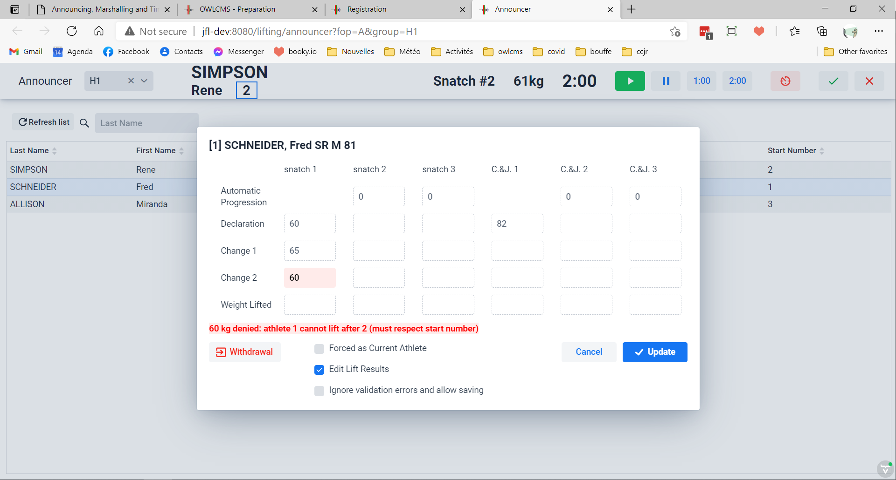

- Because sometimes there is confusion when entering weights -- similar names, fatigue, etc., the rules can be waived. There is a check box at the bottom that cancels validations and allows saving.  Use with care, this is only meant to fix major marshalling or announcing errors.
- Note: The rules are not applied for mixed children groups with "all girls before all boys" (since the first boy will likely request less than the last girl)

## Weight Change for Current Athlete

When a weight change occurs for the athlete currently announced, a notification is shown on the other officials' screens. For example, if the marshal makes the change, the jury and the announcer will see the notification

## Forcing the current athlete

In some small competitions, the official lifting order is not followed. It is possible to force an athlete to become the current athlete using a checkbox on the athlete card.  In the example below, using the checkbox means that Jackson will be lifting next even though Brown has a lower requested weight.

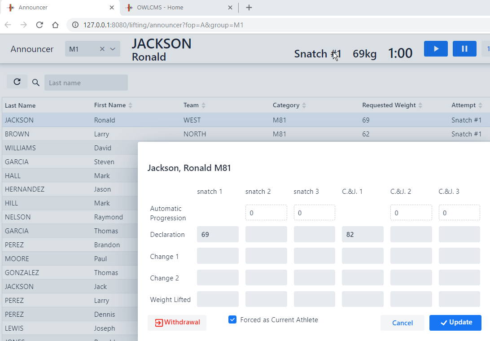

## Breaks

If there is a technical difficulty (blood on the bar, problem with the platform, etc.) use the Break button.  By default,  `Technical Issue` setting will be selected if invoked during lifting.  YOU DO NEED TO START THE BREAK by using the "Play" triangle at the bottom.

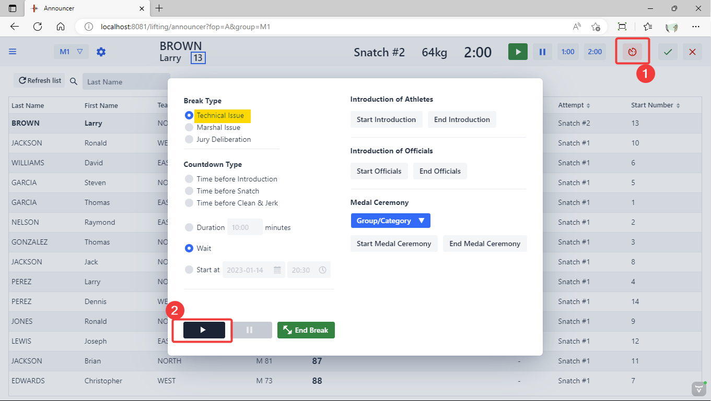

You can resume competition by using the `End Break` button.

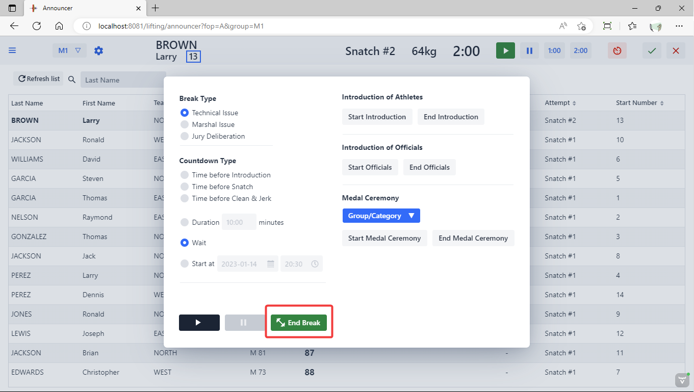

## Intermissions

See the [Breaks and Ceremonies](Breaks) page for how to manage the timers before introduction, before the first snatch, and before clean&jerk.

## Marshal

In larger competitions, a separate Marshal desk is set up in the warm-up area.  The Marshal screen is very similar in operation to the announcer screen. The Marshal can use the break button to signal a problem with the lifting order.

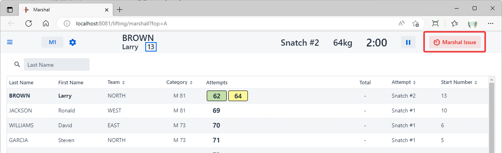

 As explained in the [Weight Change for Current Athlete](#weight-change-for-current-athlete) section, a notification is shown on the announcer screen if a change is made for the current athlete.  The other technical officials are also notified when a declaration is posted.

## Timekeeper

The timekeeper screen operates like the announcer screen.  Both the announcer and timekeeper can start and stop time.  For example, the speaker can check that the platform is free, announce the name, and start time when done giving out the name.  Then the timekeeper can take over and watch for the bar reaching the knees.

The timekeeper can also select the group, and supervise the breaks. 

Notes:

- the Timekeeper screen also works on iPhones, iPads and Android phones.
- if using the phone with a laptop, you can use the `,` (comma) key to start the timer, and the `.` (period) key to stop it.  This also means that you can connect a programmable button device to control the clock

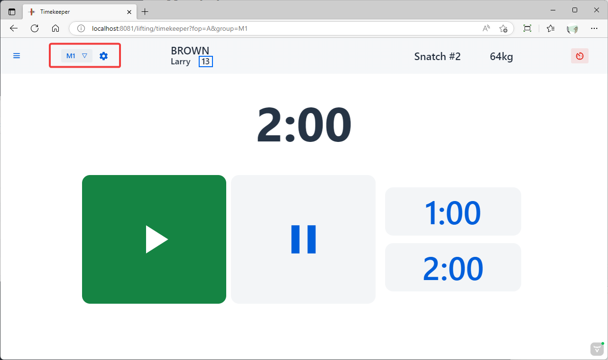

## Technical Controller

In school-age kids competitions, it is often the case that a non-standard bar is used (say 10kg) or that large lightweight bumper plates (2,5kg or 5kg) are used.  Since loaders are not used to such setups, it is useful to refer to the attempt board graphical display.

The technical controller screen is used to match what is on the platform.  Once `Apply` is clicked the attempt board(s) is updated with the proper graphics.

This has no incidence other than the graphics shown on the attempt board.

In the following example, younger boys are using a 15kg bar instead of the regular 20kg bar.  This fact has been noted by clicking on `Non-standard Bar` and entering the weight of the bar.  For even smaller kids, it is possible to enter even smaller bars (10kg) and use no collars (enter 0).  Kids competitions also sometimes use 5kg and 2.5kg large plates in addition to the small metal plates.

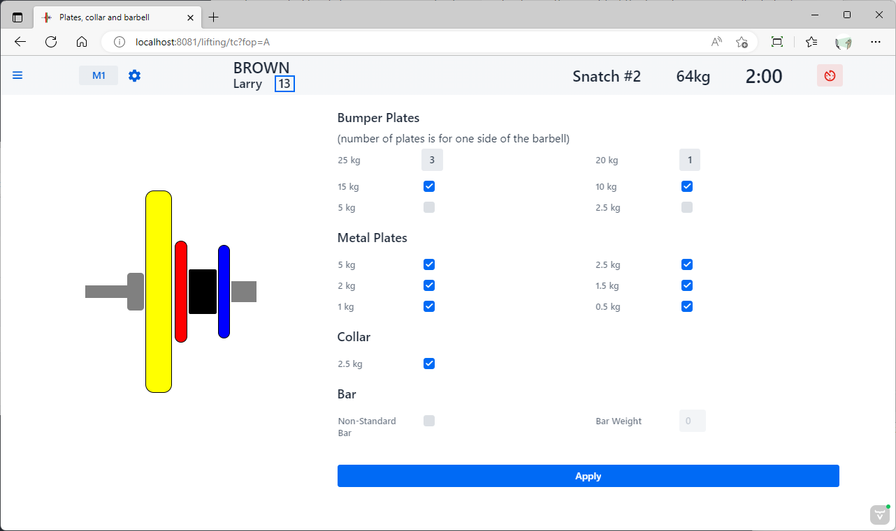
