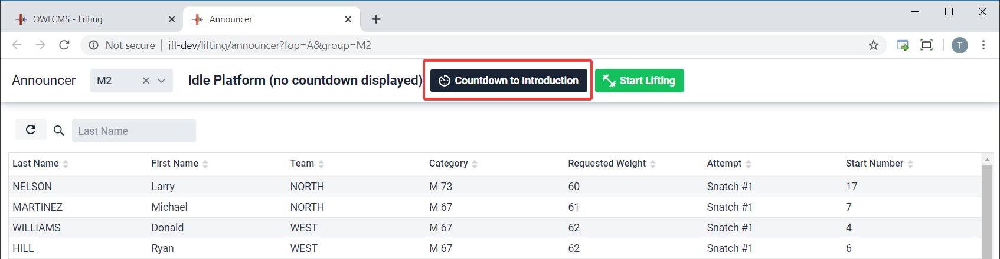
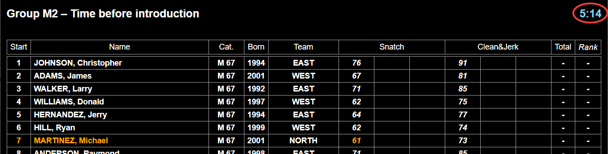
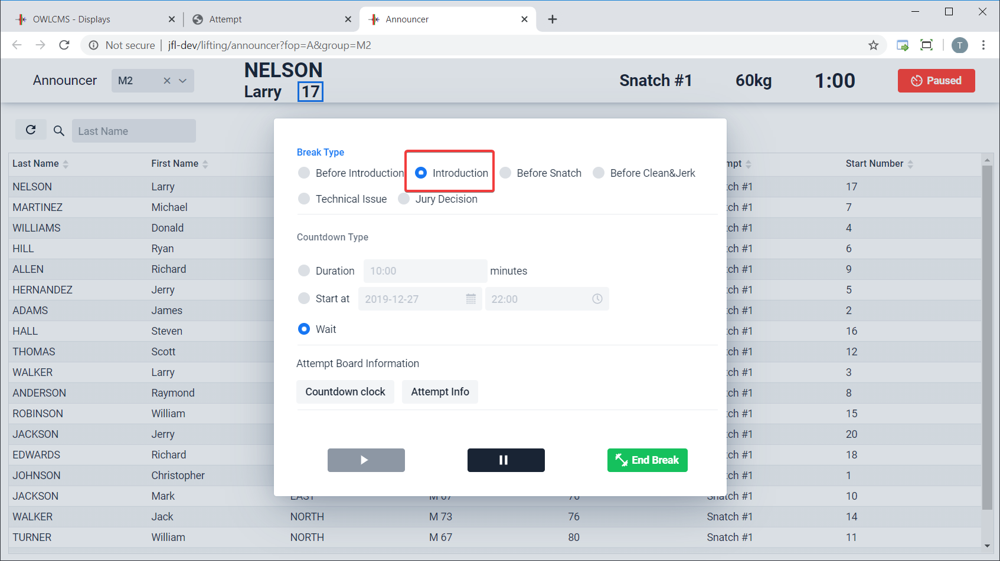
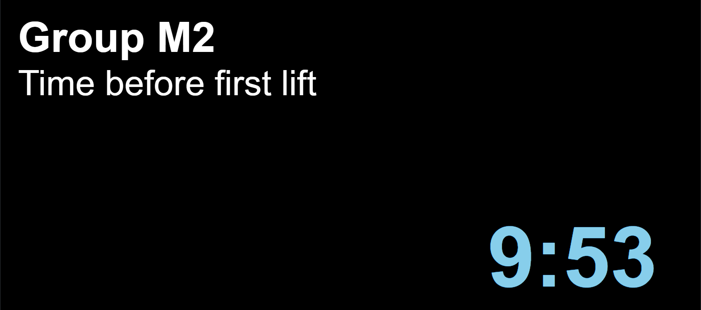
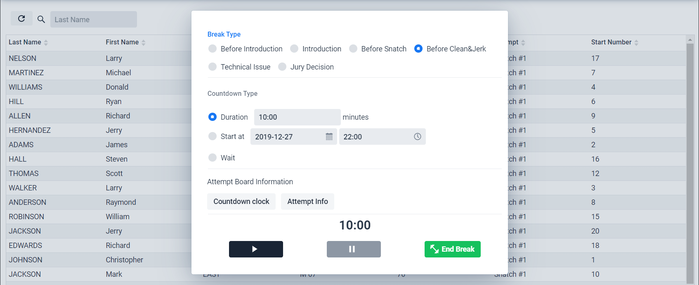
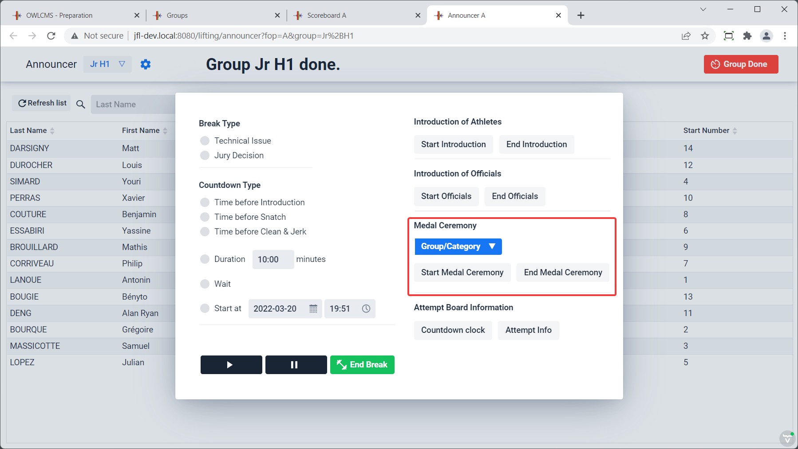
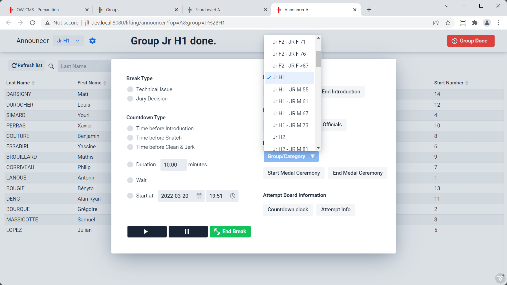
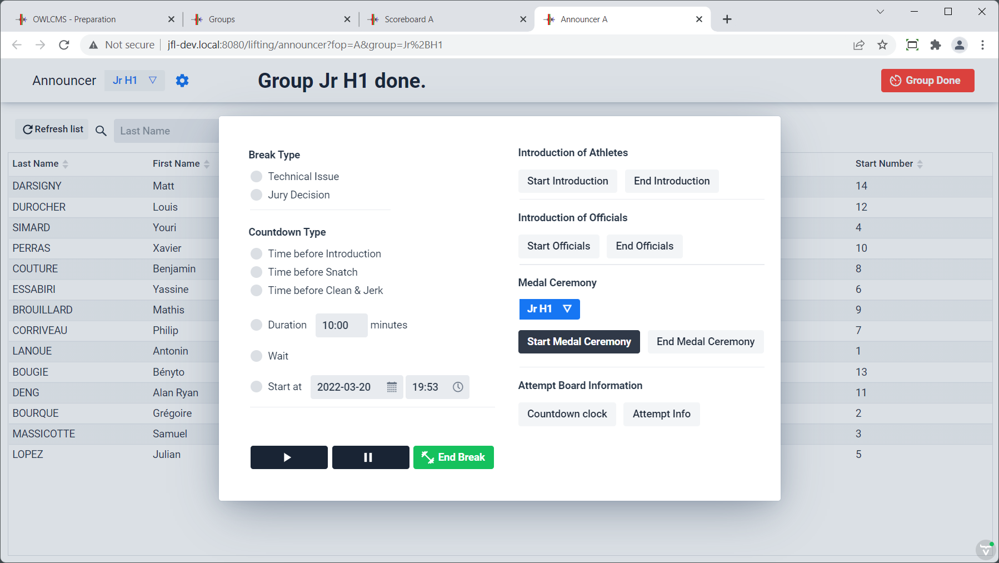
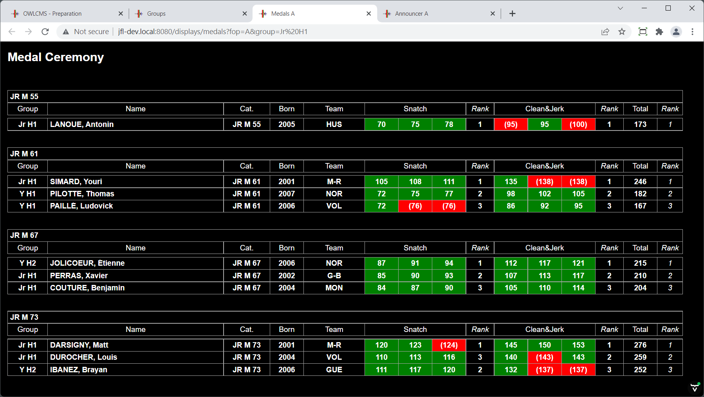
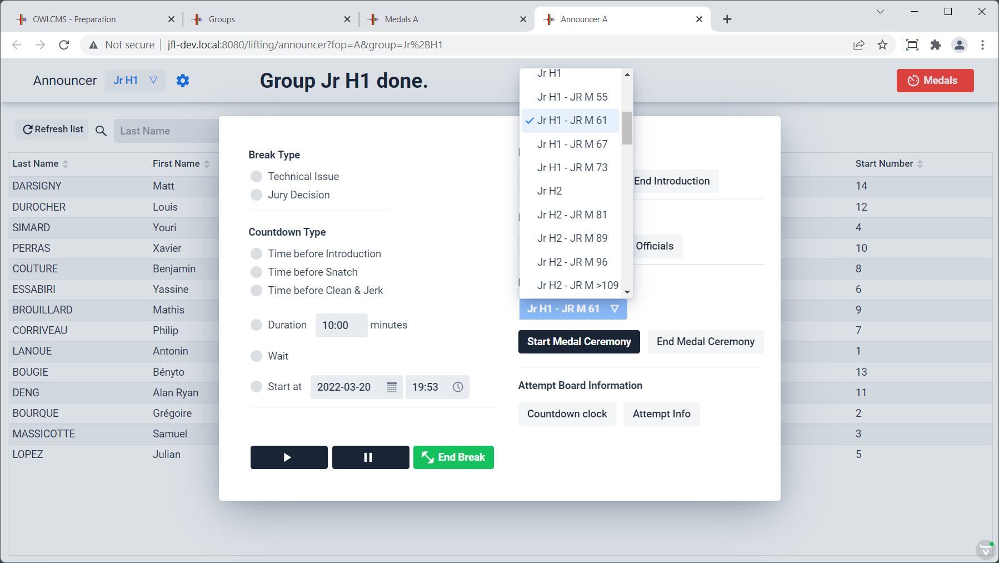

When selecting a group before the competition start, or after a group is over, the system indicates to the announcer that the normal introduction protocol should be followed.

The break timer dialog will then show up.  By default it will indicate a start time at the next half-hour.  The announcer can change this to be whatever time is on the schedule.  Clicking on the `Duration` radio button allows an alternative (useful if a competition is running late) of "introduction will start in *n* minutes".  The countdown starts when the "Play" button is clicked.

The introduction timer will run to the indicated time (21h30 in the example) or selected duration.  The public displays will switch to a mode where an appropriate message is shown and the countdown is shown in blue.

 While a break is running, is is completely possible to exit the break dialog and make changes to requested weights, etc.   You can return to the break timer by using the red `break` icon at the top left.

## Introduction of Athletes

At the end of the introduction timer, the break dialog is hidden. It is suggested that the announcer open a scoreboard tab to proceed with the introduction.

The announcer proceeds with the introduction of athletes.  The "End Introduction" button is highlighted.

This switches the attempt boards to introduction mode and the scoreboards show an informational header.  

## Countdown to First Snatch

After introduction, the announcer clicks on the red button again.  Everything is set up for the standard 10 minute delay. The announcer can just click on the triangle "Play" button to start the Countdown to snatch.  If the circumstances require it, the delay can be changed, or an exact time can be given.

## Introduction of Officials

After the countdown to snatch is started, it is customary to introduce the officials.  This is done using the "Start" and "Stop" buttons in the Introduction of Officials section.  The countdown timer is not stopped. Only the informational line at the top of the scoreboards is changed to reflect what is going on.

## Clean and Jerk Intermission

Using the Break button at the end of the snatch puts the break timer in the `Before Clean&Jerk` mode.  The process is identical to the before snatch countdown.

The process is manual (the Announcer or Timekeeper must click the button).  The delay can be adjusted if the jury grants more time (for example, if the group is very small)

## Technical Break

At any time during lifting, the announcer or technical controller or timekeeper or marshal can use the break button.  This will put the public screens in `Pause` mode.  Using the green `End Break` button exits this mode.

## Medal Ceremony

At any point when the platform is idle, or during any of the "before introduction", "before snatch" or "before clean and jerk" countdowns, it is possible to present medals.

> Note that there is a results document that shows all the medals for a group in the correct presentation order.  See the [Medals document](Documents#medals) section for details

The medal ceremony has several special features:

- The public scoreboards will switch to a special "Medal Ceremony" mode.   The "public" setting is selected at at startup or at anytime by clicking on the display.  By default, scoreboards are in "warmup" mode and do not switch (so that coaches can count attempts).  The main public-facing scoreboards are the only ones that are normally put in "public" mode.
- Because some groups can contain many categories, the announcer can select whether the whole group's medals or a specific category within the group is shown.
- Only categories where all athletes have lifted are shown as available for medals (the system automatically deals with C/B/A groups and multiple age groups, as long as proper order is followed -- B before A, masters before youth before junior before senior).

#### Starting the medal ceremony

Medals are can be awarded after a group is done, before the introduction of the next group, or after the presentation of athletes of the next group, or even later in the day.  In all cases the process is the same.

We start by hitting the red break button (if the platform is idle, the black countdown button is used).

#### Selecting the group

The group that is done is selected in the list, but all the groups that have categories where medals can be awarded are listed.  We select the group that just lifted.

The "Start Medal Ceremony" button becomes highlighted.

#### Medal Ceremony Display

Clicking on the "Start Medal Ceremony" button tells the public scoreboards to switch to the medals display.  Whether a display is public or not is selected when the display is started (it can be changed at anytime by clicking in the display).   The public-facing display is usually public, the warmup displays are not.

#### One Category at a Time mode

If there are two many categories in a single group (often the case for Masters or Youth competitions), you can select a single category instead, and go through the categories one by one.  After every selection, clicking on the "Start Medal Ceremony" will cause the display to update.

