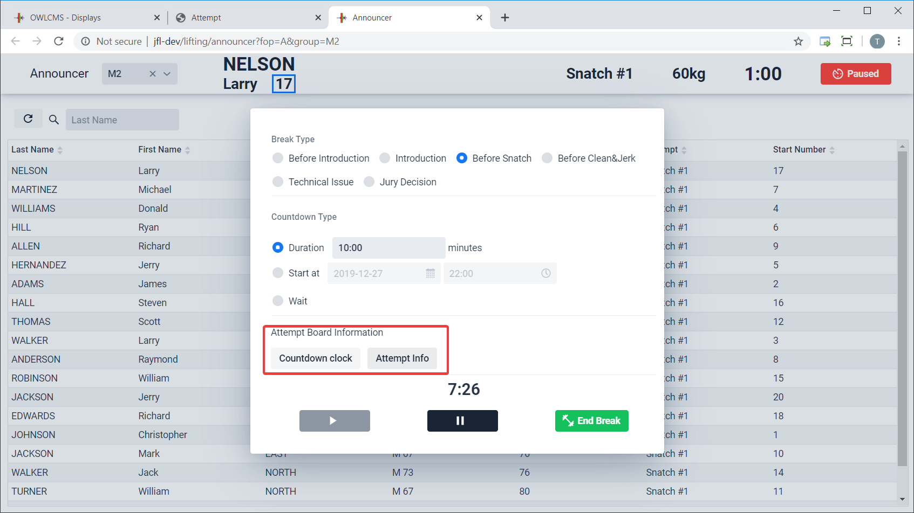
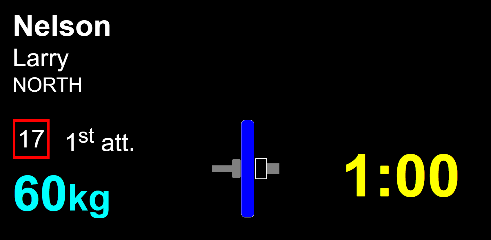
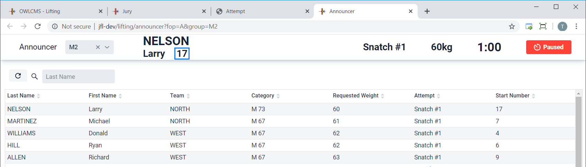
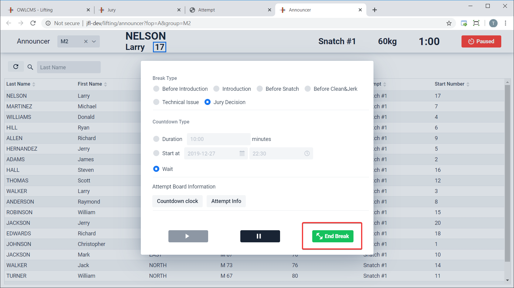

When selecting a group before the competition start, or after a group is over, the system indicates to the announcer that the normal introduction protocol should be followed.

The break timer dialog will then show up.  By default it will indicate a start time at the next half-hour.  The announcer can change this to be whatever time is on the schedule.  Clicking on the `Duration` radio button allows an alternative (useful if a competition is running late) of "introduction will start in *n* minutes".  The countdown starts when the "Play" button is clicked.

The introduction timer will run to the indicated time (21h30 in the example) or selected duration.  The public displays will switch to a mode where an appropriate message is shown and the countdown is shown in blue.

 While a break is running, is is completely possible to exit the break dialog and make changes to requested weights, etc.   You can return to the break timer by using the red `break` icon at the top left.

## Introduction

After the end of the introduction timer, the announcer proceeds with the introduction of athletes.  The proper thing to do is to put the public displays in `introduction` mode by clicking on the corresponding radio button.  You will note that the countdown type is `Wait` because there is no way to know how long introduction takes.

This switches the public displays to introduction mode

## Countdown to first snatch

After introduction, the announcer simply select `Before Snatch`.  This configures the standard 10:00 minutes delay.  If the circumstances require it, the delay can be changed.  Clicking on the Play button sets the public displays in countdown mode.

In order to allow loaders and coaches what the first lift will be, it is possible, when the countdown is down to a couple minutes, to toggle the display back to the standard.

The display then switches to the weight information (but the timer keeps running and nothing is lost by toggling between the two.)

## Intermission

Using the Break button at the end of the snatch puts the break timer in the `Before Clean&Jerk` mode.  The process is identical to the before snatch countdown.

## Technical Break

At any time during lifting, the announcer or technical controller or timekeeper or marshall can use the break button.  This will put the public screens in `Pause` mode.  Using the green `End Break` button exits this mode.

## Jury Deliberation

The jury console also has a Break button.  If the Jury uses this break button, then the announcer and other consoles switch to a red `Paused` mode.

The public displays switch appropriately

Normally, the Jury will inform the Announcer of their decision, so it can be announced.  The **Announcer** then makes changes to the decisions by editing the lifter cards.  

When the announcer is done, the red `Paused` button is clicked and the Jury Break is ended. The displays all return to normal.

