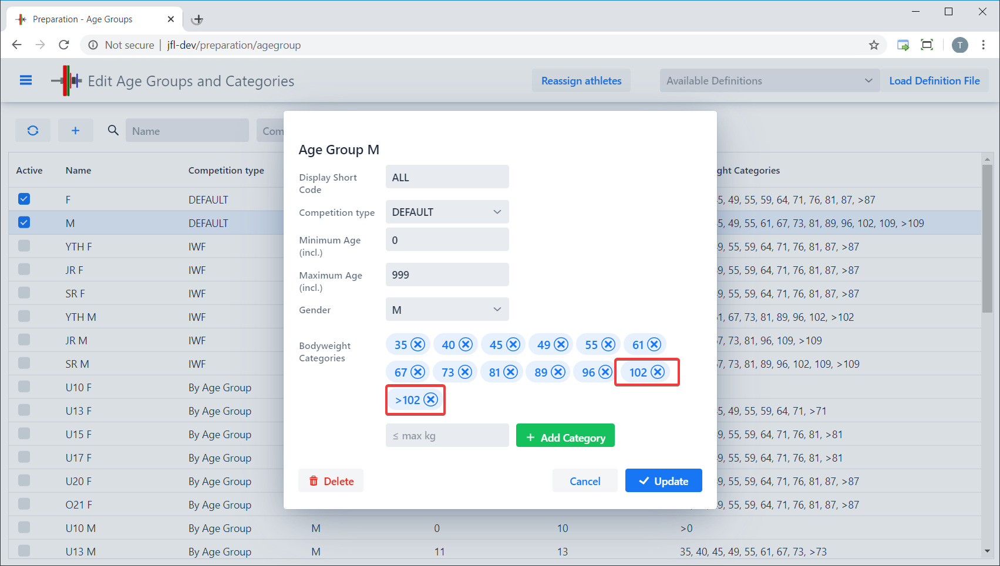

OWLCMS computes the category of an athlete based on the age group (based on the birth year) and the body weight.  For example, IWF Youth age groups have different categories than IWF Senior age groups.

The age groups and categories are fully customizable.  This section explains the full range of customizations, from how to make simple changes for a club meet to setting up a Masters event with non-standard age groups.

## Default Age Groups and Categories

In order to keep things simple for club or regional meets, by default there are are only two divisions, one for men and one for women. These divisions include all ages, and all bodyweight categories.  

So most simple meets can use these two divisions, You would only need to adjust the bodyweight categories in each of the two age groups.

## Editing Age Groups

From the  `Prepare Competition` page, select the `Define Age Groups and Categories` button.  

This leads to a list of currently defined age groups.  By default, we see that the two "All Ages Included" age groups are selected, with all the bodyweight categories.

## Editing the Categories

For the sake of the example, let's assume that we want to change the settings so that our male categories to stop at >102. Let's select the `M` age group and notice that there is a blue tag for each bodyweight category.

First, what we want to doremove the 109kg category to have 102kg as the last category with an upper limit.   This is actually very simple: it is sufficient to click on the `X` next to 109.  If we do so,

- the 109 category is removed,
- the heaviest category is automatically changed to >102 (because the last category with a limit is now 102).  The system always adjust the last "X and above" category automatically.

So there is nothing else to do, as shown on the next screen shot.

Let's now say we want a 41kg category instead of a 40kg.  This is done in two steps

1. Remove the 40kg category by clicking on its X
2. Adding the 41kg category by typing 41 in the `max kg` box and clicking on the green `Add Category` button.

The list is updated with the new bodyweight category. We can now update the definition using the `Update` button.

## Reassigning the athletes

After updating an age group with new categories, the program highlights the `Reassign Athletes` button at the top.  It is usually wise to determine age groups and categories prior to importing or entering athletes, but you can actually change the categories and re-compute the categories for each athlete at anytime.

For athletes that have not been weighed-in, the program records the presumed weight for the athlete based on the information read from the registration file, or the category information explicitly entered for the athlete.  For example, if you enter a child in a 40kg category, and later delete the 40kg category, the program remembers that the best weight information available about the child is 40kg, and will place him in a category according to this presumed weight.

The presumed weight is used until you actually edit the athlete's registration to change the category, or change the category at weigh-in.

## Selecting the active age groups

Let's now assume we want to hold a IWF Junior Championship.  The categories are already defined in the default setting, so all that is required is

- Unselect the two default groups
- Click on the checkbox next to the IWF definitions for the JR F and JR M age groups and reassign the categories

## Age Group Competitions

In order to hold a competition with age groups, you can select the predefined age groups, as follows:

## Adding an Age Group

Let's assume we need U23 age groups (one for female, the other for male).  In order to add a group, we use the `+` icon at the top of the table.  Let's add the Female U23 group:

We now fill in the information, and select Add.

Note that we would also need to change O21 to become an "over 23" group.  If we do not make that change, the program will make the most specific choice.  A 22-year old will be considered first to be a U23; you could use the `Edit Athletes` page to assign them to the O21 category manually.

This situation often arises when a Masters championship takes place together with a Senior championship. Some 35-year old athlete will not want to lift in a Masters group, and will want to be registered as Senior.

## Notes for Masters Age Groups

The default list contains non-standard age groups.  Some federations accept 30-34 year-olds in their Masters meets. If you don't want these age groups, simply leave them unselected.   Similarly, some federations have gender-equality rules and include the same age groups for women as for men.  The default list allows you to select a W70 for 70-74 and a W75 group if you so desire..

The applicability of the 15/10kg rule (as opposed to the 20kg rule) is based on the category in which the athlete is registered.

## Using a Definition File for Local or Federation Settings

If you look at the installation directory under the `local/config` directory, you will notice files with a name similar to `AgeGroups.xlsx` .  The first Tab in each file defines the bodyweight categories in use for a given federation or club.  The second Tab says which bodyweight categories are active for each age group.

The suffix on each file follows the same conventions as for the [Translation](Translation) files.  You can therefore add a file for your specific language and location that will be loaded by default when the program is first started with no database.  You can also add a file to the config directory and load it at any time -- this will however force a recalculation of the athlete categories, which is most likely what you need.

The drop-down at the top of the page shows the available files in the order they would be considered based on your current locale:

Local federations are encouraged to send their definitions to the author for inclusion in the package, so that local clubs don't have to deal with the categories.