OWLCMS computes the category of an athlete based on the age group (based on the birth year) and the body weight.  For example, IWF Youth age groups have different categories than IWF Senior age groups.

The age groups and categories are fully customizable.  This section explains the full range of customizations, from how to make simple changes for a club meet to setting up a Masters event with non-standard age groups.

## Default Age Groups and Categories

In order to keep things simple for club or regional meets, by default there are are two divisions active:  one for men and one for women. These divisions cover all ages and all bodyweight categories.  Meets with IWF requirements or multiple age groups are discussed further down this page.

## Editing Age Groups

From the  `Prepare Competition` page, select the `Define Age Groups and Categories` button.  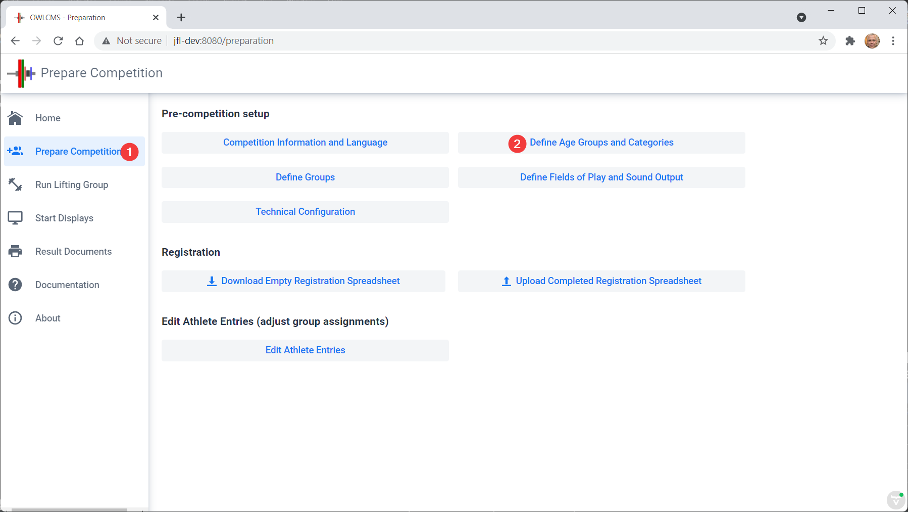

This leads to a list of currently defined age groups.  By default, we see that the two "All Ages Included" age groups are selected, with all the bodyweight categories.

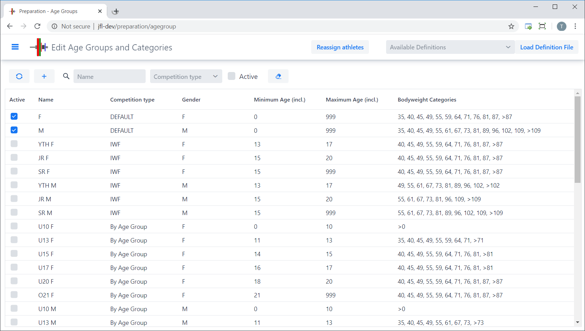

## Editing the Categories

For the sake of the example, let's assume that we want to change the settings so that our male categories to stop at >102. Let's select the `M` age group and scroll down until we see all of the grid at the bottom.

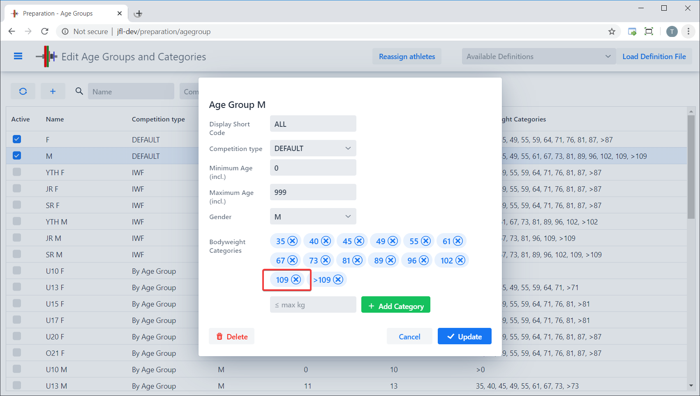

What want is to remove the 109kg category so we have 102kg as the last category with an upper limit.   We simply click "Delete" on the 109 row.

After clicking on the Delete button

- the 109 category is slated for removal,
- the heaviest category is automatically changed to >102. The system always adjust the last "X and above" category based on the heaviest category with an upper limit.

The changes to the age group are only registered when you click on the blue "Update" button at the bottom of the form.

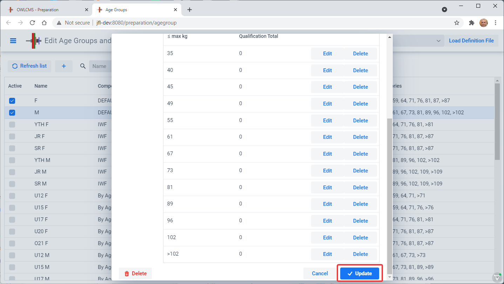

Let's now say we want a 41kg category instead of a 40kg.  This is done in two steps

1. Remove the 40kg category by clicking on Delete, as we did before
2. Adding the new 41kg category by typing 41 in the `max kg` box and clicking on the green `Add Category` button.

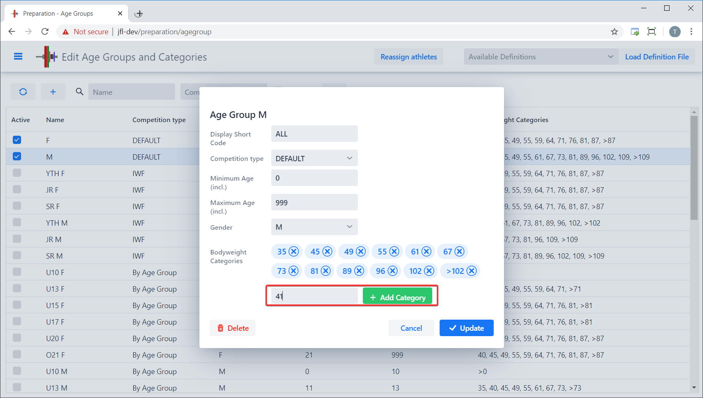

The list is updated with the new bodyweight category. We can now update the definition using the `Update` button.

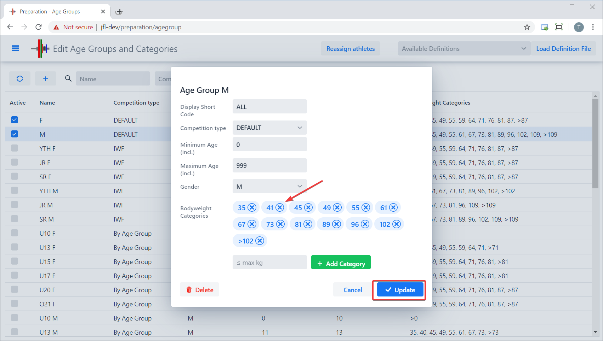

## Reassigning the athletes

After updating an age group with new categories, the program highlights the `Reassign Athletes` button at the top.  You can actually change the categories and re-compute the categories for each athlete at anytime.

For athletes that have not been weighed-in, the program uses the presumed weight of the athlete (either the weight of the category, or the weight of the athlete given at registration)..

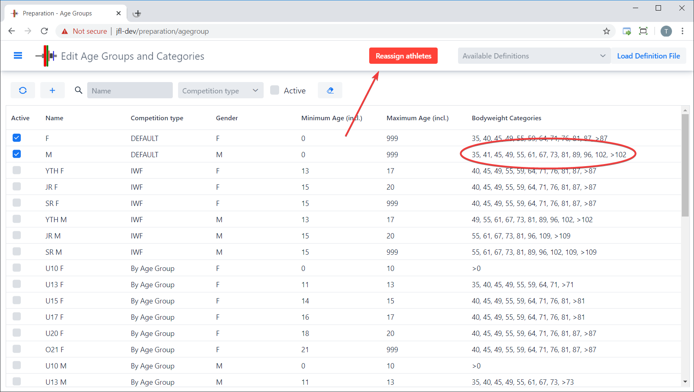

## IWF Categories and Overlapping Age Groups

Let's now assume we want to hold a national championship with IWF Categories.  The categories are already defined in the default setting, so all that is required is

- Unselect the two default groups
- Click on the checkbox next to the IWF definitions
- Note that overlapping age groups can compete in the same meet.  A youth athlete that meets the eligibility criteria for junior (or even senior) would be ranked in the eligible categories.  The athlete will be shown in the youngest category for the purpose of starting numbers and scoreboards, but ranked in all categories.
- Separate final results with ranks and team points are produced for each age group.

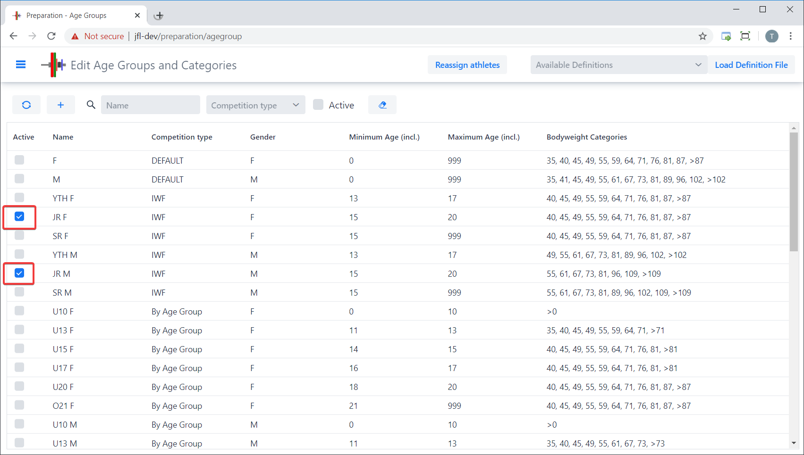

## Editing Qualifying Totals

If your championship has qualifying totals, you can edit the qualifying totals by going to the age group and clicking on the category. For example, lets create a qualifying total of 100 for Junior Men 55kg.  We click on the age group, then click on edit next to the category.

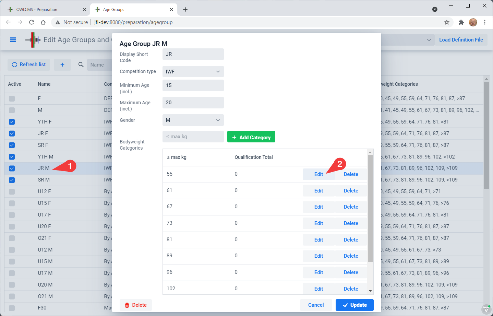

We type the desired total and click "Update".  You can do the same with the other categories.

NOTES:

1. Once we are done with all the categories, we click the blue Update at the bottom to save the Age Group.
2. Because this is time consuming, you may prefer to enter the qualifying totals using a spreadsheet.  See further down on this page.

When an athlete is eligible for multiple age groups, the registration editing form for the athlete will show the eligible categories based on age and qualifying total. The athlete's category will be the most specific one based on the actual age, for the purpose of calculating the start numbers.

## Age Group Competitions

Another common scenario is to have multiple non-overlapping age groups.  In such a competition, the athlete scores points once, in his or her age group, and a team is made up of athletes from several age groups.  You can add or delete or edit age groups as needed.    This task can instead be done using a spreadsheet if you want to share your definitions between members of your federation (see further down this page).

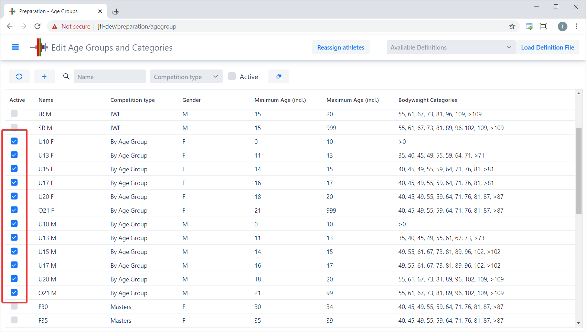

## Adding an Age Group

Let's assume we need U23 age groups (one for female, the other for male).  In order to add a group, we use the `+` icon at the top of the table.  Let's add the Female U23 group:

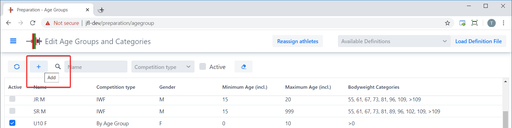

We now fill in the information, and select Add.

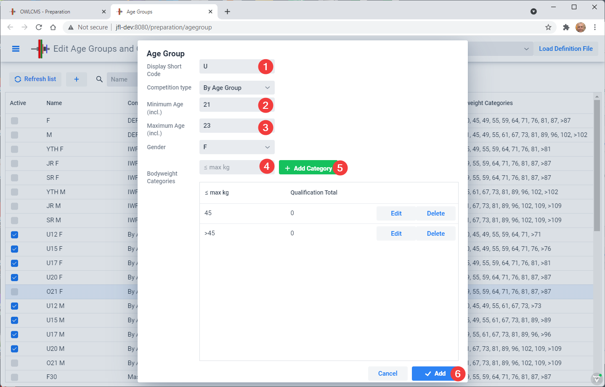

## Notes for Masters Age Groups

The default list contains non-standard Masters age groups:

- some federations accept 30-34 year-olds in their Masters meets. If you don't want these age groups, simply leave them unselected.
- Similarly, some federations have gender-equality rules and include the same age groups for women as for men.  The default list allows you to select a W70 for 70-74 and a W75 group if you so desire..

- The applicability of the percentage rule (as opposed to the 20kg rule) is based on the category in which the athlete is registered.  If an athlete has a Masters category selected, he is expected to lift in a Masters group, where the rule will apply to all lifters.  In a mixed group with senior and Masters lifters, the which rule applies would depend on the lifter.  The fairest rule would be to set the category to Senior for all athletes: Because they are qualified as Masters, the dual eligibility athletes can still appear in the Masters result sheets.

## Creating a Definition File for Local or Federation Settings

If you look at the installation directory under the `local/agegroups` directory, you will notice files with a name similar to `AgeGroups.xlsx` .  

1. The first Tab in each file defines the bodyweight categories in use for a given federation or club.  
2. The second Tab says which bodyweight categories are active for each age group.

This step needs to be done on a local installation.  Once you are ready, you can upload you local settings to a cloud installation, as explained in [this page](UploadingLocalSettings)

Let's say we want to create age groups for our annual U15 U17 competition.  We go to the local/agegroups directory, and copy the `AgeGroups.xlsx` file to another name (for example `AgeGroupsU15U17.xlsx` or whatever suits you).

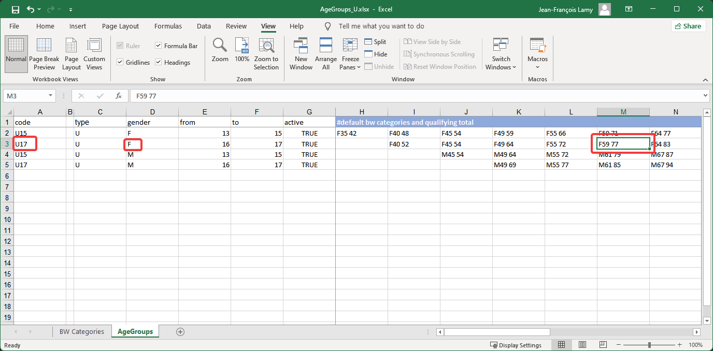

In the example above, the cells outilned in red means that in women's <u>category U17 F59, the qualifying total is 77</u>

- there are four age groups defined (U15 and U17 for women, U15 and U17 for men)
- the four groups are active (column G)
- from column H onward, each cell defines the bodyweight categories and (if present, the qualifying total)
  - The U17 female group has bodyweight categories F40, F45, F49, F55, F59, F83 and so on.
  - The first part of each cell is a code that comes from the first tab called `BW Categories`.  If you need additional categories, add them there, or edit the ones that are already present.
  - When a number is present after the category, it is the qualifying total
  - Empty cells are ignored

## Loading the Age Group  Definition File

The drop-down at the top of the page shows the available files.  After loading the file, the athletes will automatically be reassigned.

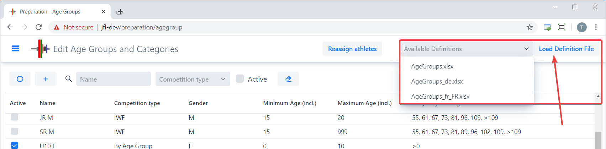
