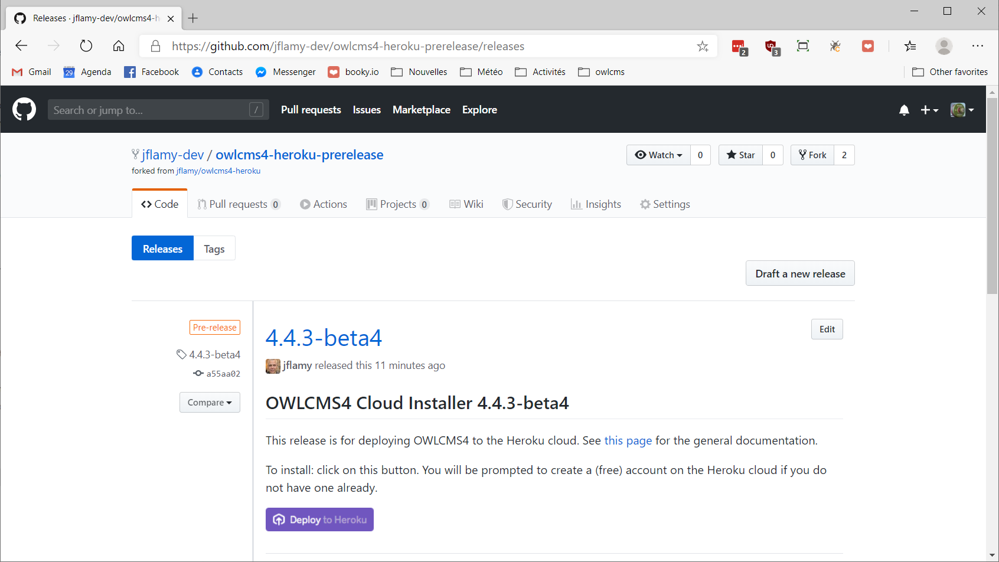

## Heroku

Heroku is a cloud service provider that provides an attractive free (0$) pricing plan for running programs like OWLCMS.  When running on Heroku you only need a good Internet connection, and you do not need to configure a primary laptop.

The installation process for Heroku has been completely redone, and is now extremely simple -- there is nothing whatsoever that needs to be installed on any of the laptops other than a browser.

**1. Create a free Heroku Account**

- Go to page https://heroku.com
- Create a free account.  Yes, it is free.  Remember the login and password information.

**2. Go to the releases repository and start the process**

The Heroku releases directory is located at https://github.com/owlcms/owlcms4-heroku/releases/latest.  Click the big `Deploy to Heroku` button.



**3. Name your application and deploy**

Enter the name that will be used on all your competition site laptops and displays.  Once you are done start the deployment (this will prepare the application and make it available)


**4. Check correct deployment**


**5. Go to the application**


**6. Optional: Time zone configuration**
Go back to your https://heroku.com home page.  Select your application, then `Settings`, then `Reveal Config Vars`.

- We strongly suggest you also set `TZ` which is your time zone.   Pick your TZ Database Name (which will something similar to America/New_York or Europe/Paris) from [this list.](https://en.wikipedia.org/wiki/List_of_tz_database_time_zones) 

## Control access to the application

In a gym setting, people can read the web addresses on the screens, and one day, some "funny" person will log in to the system and be tempted to mess things up.
- You should therefore set a PIN or Password that officials will be required to type when first logging in.  This is done on via the `Prepare Competition` page, using the `Technical Configuration` button.


- If running from a competition site, you can restrict access to the cloud application to come only from your competition site router. The access list is a comma-separated list of allowed IPv4 addresses.   In order to find the proper value:

  - From your competition site, browse to https://google.com and 
  
  - Type the string  `my ip`  in the search box.  
    This will display the address of your competition site router as seen from the cloud.  
    
  - You should see a set of four numbers separated by dots like `24.157.203.247`  . This the address you should use -- owlcms will reject connections coming from other places than your competition router. 
  

Note that if you use the OWLCMS_IP or -Dip settings, these will take precedence over what is in the database.

## Configuration Parameters

See the [Configuration Parameters](./Configuration.md ':include') page to see additional configuration options in addition to the ones presented on this page.


## Kubernetes

Support for Kubernetes is considered *beta*, in order to gather feedback.

Kubernetes is an open standard for running applications.  It is supported by most cloud providers. A low-cost (7US$ per month) provider of Kubernetes hosting is https://kubesail.com .

Configuration files that work with minikube, Docker Desktop, and with kubesail can be found at https://github.com/jflamy/owlcms4/tree/develop/owlcms-docker/src/main/assembly/k8s 

- Checkout you own copy of these files.  The `kustomize` tool is used to assemble the deployment manifests.
  
- For minikube or Docker Desktop, use
  
  ```
kubectl kustomize overlays/local | kubectl apply -f -
  ```

- For kubesail, copy and edit the files in overlays/kubesail-jflamy-dev to your own directory (myk8s for example).  Change the host name in the `ingress` file, and the whitelisting values in `networkingpolicies`.
  After making sure that your KUBECONFIG environment variable points to the file that contains the configuration and certificates you copied and pasted from kubesail, you can run

```
  kubectl kustomize overlays/myk8s | kubectl apply -f -
```

- The Docker images are located in the following repository https://bintray.com/owlcms/containers/owlcms 
  
  ```
  
  ```