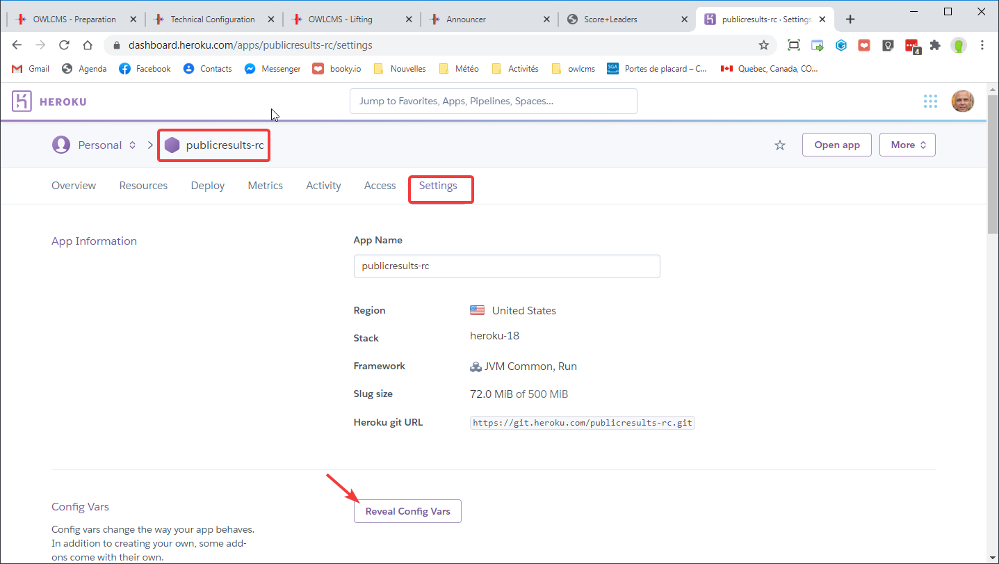
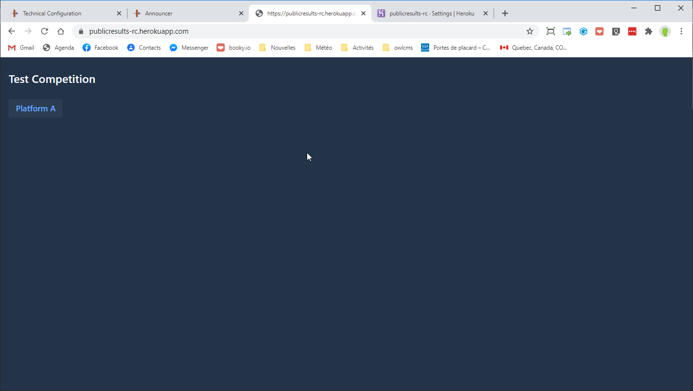

## Cloud-based Public Scoreboard Configuration

In order to make the results available to remote gyms or to the public at large, you need to have performed the following steps beforehand.

1. **install owlcms**.  For a virtual competition where officials are not all at the same competition site, you should [install owlcms in the Cloud](Heroku).
2. **install publicresults**, 
   - Normally, publicresults is installed in the cloud as explained in [this page](Remote).
   - Note that It is also possible to install publicresults locally if you do not have internet access and wish a strictly local solution. See [this page](PublicResults_local) instead of this one.
3. if you have already installed these applications, update them to the latest release by using the [automatic update procedure](UpdatingCloudApplications).

### Configuration and Testing Steps

1. Go to the publicresults application configuration and open the configuration variables section.
   

2. Check for a OWLCMS_UPDATEKEY variable.  If absent, use the add button to create it.  The  password to your Heroku account and the update key is what prevents vandals from messing up your scoreboards.  Do not share them, and make sure they cannot be guessed easily.
   

3. Copy the value for the update key (Ctrl-C)

4. Restart the publicresults application
   

5. Start a new browser tab and go to the address for the application (or you can use the `Open app` button at the top right) and check that the application is waiting.
   

6. Open the owlcms application on Heroku and go to the `Prepare Competition` - `Language and System Settings ` page.

   - paste the secret key on the right-hand side -- use the "eye" icon to see what you pasted.
   - copy and paste the correct URL for the publicresults application we opened in step 5.
   - Click on update.

   

7. Create the athletes for a group

   - load a registration file or create an athlete
   - go to the weigh-in screen and add body weight and starting weights.

8. Go to the announcer page and select a group.
   

9. As soon as a group is selected, publicresults is updated.  Switch to publicresults, and you should see
   

10. Click on "Platform A" and because no group is currently lifting, you see

    

11. The announcer selects a group, and clicks on "Countdown to Introduction", and starts the countdown.
    

12. The publicresults screen immediately switches to the countdown.

13. From then on, the publicresults screen will track the competition. It just repeats the events taking place on the local scoreboard.