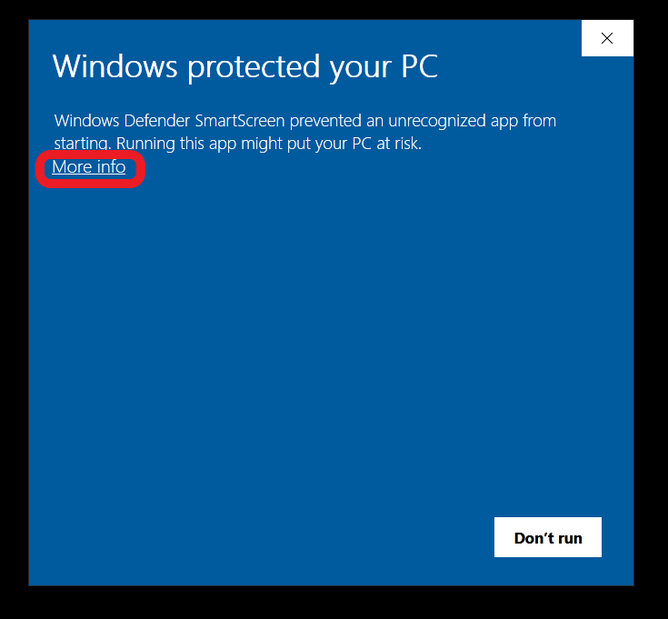
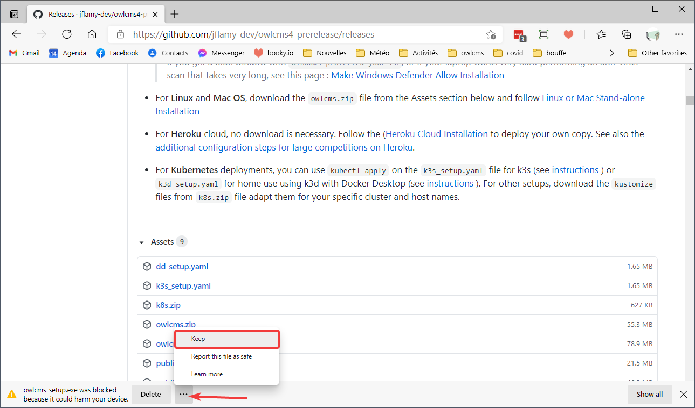
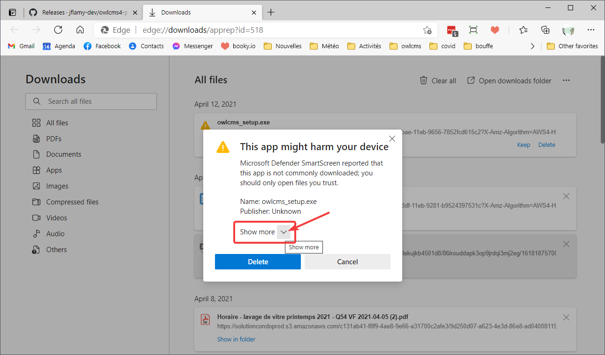
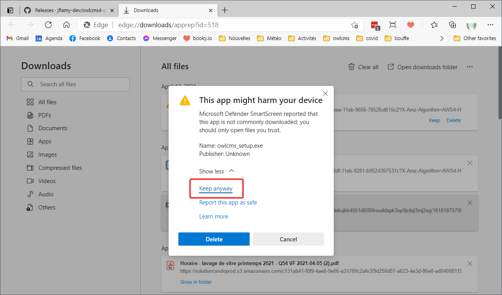
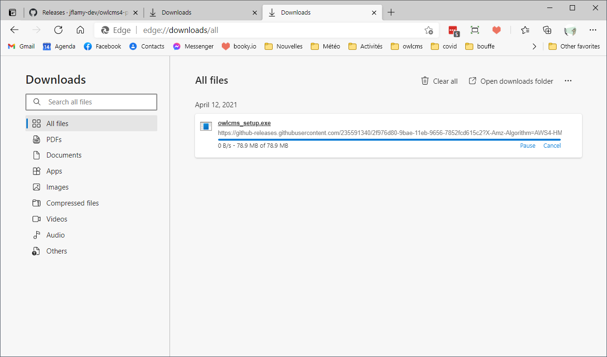

## Dealing with Protection Warnings

Microsoft has a very strong commitment towards protecting your PC from viruses.  Unfortunately, their process a little bit over-dramatic.  If you care, go to [bottom of this page](#why-are-there-warnings-anyway) for an explanation for the warnings why they can safely be ignored. 

If you just want to install, read on.

## Downloading with Chrome or Firefox

If you download with Chrome or Firefox, you will see a blue box like the following when you double-click on the file to open.  **Click on the `More info` link.**

This will make will make a `Run Anyway` button appear at the bottom. You can then **click on `Run Anyway` button to let installation proceed**.

## Downloading with Edge

Edge is the default browser on Windows.  With Edge, the warnings are given during at several occasions during the download process.

1. Go to the releases page and click on the download link. Note in passing that Microsoft owns the Github site and could very well scan the executables there.  But if we click, we get a first menacing message "was blocked because it could harm your device".

   To proceed, you must <u>Click on the `...`  button and select Keep</u>

   

2. But then comes a second warning.
   To get the option to continue you must <u>Click on `Show More`</u>
   

3. From the list of options, <u>select "Keep Anyway"</u>

   

4. You should finally see the file downloaded, and be able to click on it to open.

   

5. Normally you are done, and you will be spared the blue dialog box when you open the file (Windows remembers it has been accepted)

## Why are there warnings anyway?

In the past, the programs were signed with a certificate attesting to the author's identity, but this is not sufficient for the program to be considered as trusted.  For the warnings to go away, one of two things need to happen

- either a very large number of people download the program from a given source and Microsoft ultimately figures out it is innocuous, or
- a 500$ code-signing certificate is bought to actually bypass the warnings.

There is not enough traffic for owlcms to trigger the first escape clause

If some kind soul donates the money, I'll do the certificate song and dance, until then, we have to bear with the inconvenience.

## Is there a real risk?

Well, no.  The windows program you are downloading is a very simple packaging that just makes it easier to install the app.  Inside the packaging is the exact same program that runs on Mac, on Raspberry, and in the cloud on Fly.io or Docker.  There is simply no Windows-specific code in there, and the program runs without any special privilege whatsoever.