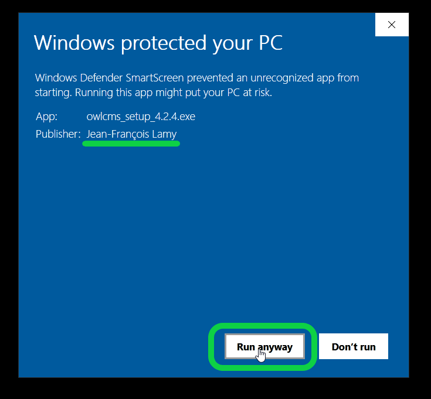

## Allowing the installation to take place

If you see a blue box like this, click on the `More info` link.

This will make will make a `Run Anyway` button appear at the bottom. You can then click on the `Run Anyway` button to let the installation proceed.

- **Notice the publisher information**: this attests that the code was digitally signed by the author and was not tampered with.  Microsoft takes note that nothing wrong happens when people install the application, and if enough different people install the application, the warning will eventually go away.  Skipping this step requires a complicated procedure and costs several hundred dollars, sorry.

## Why does opening the installer take forever for me ?

Windows Defender on your laptop may decide to scan the installer even though the application is signed.  If a scan is performed, unfortunately Windows Defender is extremely slow.  This is due to the nature of modern web applications, which are built of a very large number of small files as opposed to one big program.

The easiest work-around is to disable the real-time scan feature of Windows 10.  After installing, you can re-enable it.  The installer will be scanned anyway the next time the nightly scan is run (which will reassure you that there was nothing evil inside). 

## Telling Defender to skip the scan

In order to allow the install to go ahead, proceed as follows

1. Click on the start menu at the bottom left and then on the cogwheel
   

2. Type "defender" in the search box and select the Windows Defender settings
   

3. Select the Virus & threat protection settings
   

4. Select the "Virus Protection" Settings
   

5. Select the "Real-time Protection" Manage Settings option and turn it off
   

6. Proceed with the installation by double-clicking on the `owlcms_setup.exe` file you downloaded

    - See the top of this page if you get a warning about Windows protected your PC.

8. In order to re-enable real-time protection after installing, just flip the switch back on.

