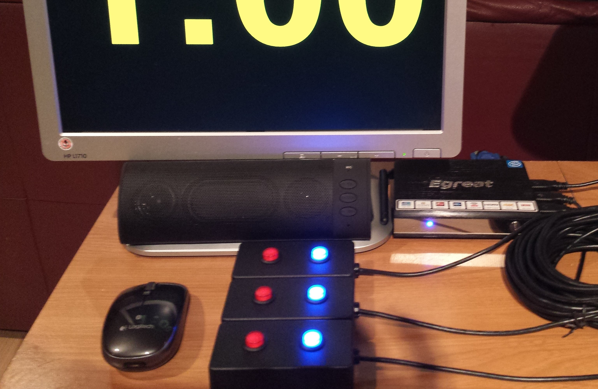
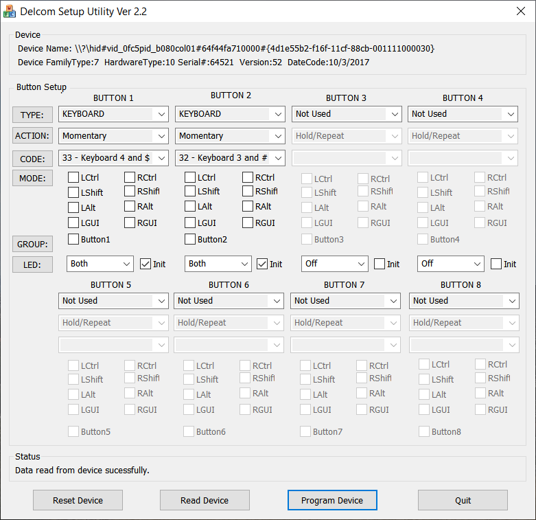

# Using Delcom USB Keypads

Delcom is a US company (no ties whatsoever with the author of OWLCMS) and happens to build an industrial-strength [two-button device](http://www.delcomproducts.com/productdetails.asp?PartNumber=706502-5M) with long-enough USB cables that is suitable for use as a refereeing device. 

## Sample Setup

The following picture shows the devices connected to a Windows 10 mini PC.  The devices are known to work with Windows laptops and Chromebooks.  Use with Raspberry Pi is possible, but requires special settings (see below)

## Configuration

OWLCMS interprets Even digits as red, and Odd digits as white. 

| Referee# | Jury# | Good | Bad  |
| -------- | ----- | ---- | ---- |
| 1        | 1     | 1    | 2    |
| 2        | 2     | 3    | 4    |
| 3        | 3     | 5    | 6    |
|          | 4     | 7    | 8    |
|          | 5     | 9    | 0    |

The following image shows the configuration of a device for **referee number 2**.

- Button 1 on the device is the red button. It is configured to have the code for `keyboard 4`  Note that the action is `Momentary` so that the value is sent immediately when the button is pressed down.
- Button 2 is the blueish quasi-white button, and is configured to be `keyboard 3.`  It is also configured to be Momentary.
- The LED setting says that both buttons should be lit as soon as the device is connected ("init")

## Using Legacy Delcom Keypads with Raspberry Pi

If you bought Delcom keypads **and** are connecting them to a Raspberry Pi,  be aware that Delcom has unfortunately [introduced a bug in its device drivers](http://www.delcomproducts.com/webnote.asp?id=3) that prevents the operating system from recognizing their devices on *Raspberry Pi* (and likely other Linux distributions).

The only practical workaround proposed by Delcom is to reprogram the device identifier (see the second bullet in the [bug report](http://www.delcomproducts.com/webnote.asp?id=3) ).  Unfortunately this requires firmware at version 53 or later.

If you have Delcom keypads with firmware older than version 52, you will need 

1. To use an alternate operating system which currently only supports model 3 (not model 4)
2. To configure your sound differently

## Alternate Raspberry Pi Linux for Legacy Delcom Switches

#### Installation

To copy the installation on the SD card, proceed as follows:

1.	Install Etcher from the https://www.balena.io/etcher/ site).
2.	Go to https://github.com/jflamy/rpi-delcom-legacy and download the image file (the file is called an image because it is a exact copy of what is found on the bootable SD card).  The compressed file is 2GB (that's a *big* download) and occupies 8GB once copied to an SD card.
3.	Use a [USB adapter](https://www.amazon.ca/IOGEAR-MicroSD-Reader-Writer-GFR204SD/dp/B0046TJG1U/ref=sr_1_20?keywords=micro+sd+adapter+usb&qid=1564876396&s=electronics&sr=1-20) (often provided with the Blackberry kits)  or an [SD Card Adapter](https://www.amazon.ca/SanDisk-MicroSD-Memory-Adapter-MICROSD-ADAPTER/dp/B0047WZOOO) to insert the SD card into a Windows PC
4.	Run Etcher to write the image file to your SD card
5.	Insert the SD card in the Blackberry and boot

#### Browser Configuration

You can just use Chromium according to the instructions in the rest of this guide.

#### Workarounds for Sound

The alternate OS is unfortunately very bad for sound, so

- <u>If your are running locally</u>, you can use the ["Define Fields of Play"](Preparation#associating-an-audio-output-with-a-platform) screen in the "Preparation" section to run the audio on the primary laptop **OR**

- <u>If you are running from the cloud</u>, run the Attempt Board on a non-Raspberry computer.  You may even use the Announcer's laptop, as long as you start a **new browser window** (Control-N) and that the Attempt Board is the **visible tab** in that new browser.  The new window can be hidden behind other windows, it doesn't matter as long as the Attempt Board is visible in its browser.

  You can use this approach even if running locally, if you don't want to run a wire to the primary laptop.

#### End of Competition
Raspberry Pi do not have a power switch. It is therefore extremely advisable to shut down the device cleanly before unplugging power.

1. At the end of the competition, right-click on the Competition browser screen to exit Full-Screen mode
2. Double-click on the Shutdown icon or use the System menu to shut down.

