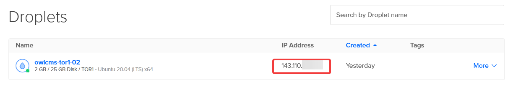
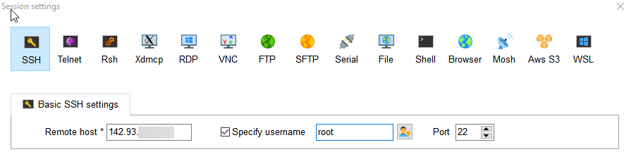
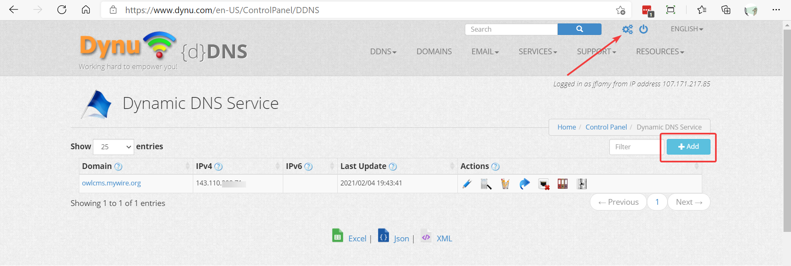

# Cloud Deployment using Kubernetes

As an alternative to Heroku suitable for larger competitions, this page explains how to run owlcms and publicresults in the cloud using Kubernetes.

The recipe allows you to create a setup in the cloud that you can create in a few minutes. You will be charged a small amount (0.06 US$) per hour.  If you take 3 days to prepare for a 2-day competition, this comes up to 7.20 US$.  Then you can take a backup of your machine, and destroy it. You can restore the machine before the next competition (keeping the backup is less than 0.30 US$ per month).

## Install SSH

We suggest that you install [mobaxterm](https://mobaxterm.mobatek.net/) or [putty](https://www.chiark.greenend.org.uk/~sgtatham/putty/latest.html)

## Create a Digital Ocean Host

Digital Ocean (DO) is a cloud provider where you can create your own server.  Even though DO provides pre-built Kubernetes clusters, our case is very simple because we only need one machine.  In such cases DO suggests installing a simple setup ourselves on a machine.  DO calls their machines "droplets".  We will be installing the k3s distribution on a Digital Ocean Droplet.

1. Create an account on [Digital Ocean](https://cloud.digitalocean.com/droplets)
2. Create a Droplet: 
    1. Select Ubuntu 20.04 as the operating system
    2. Start with the **Basic** plan (1GB RAM + 25GB SSD image).  We will resize it in an upcoming step. The disk size is large enough and gives us the opportunity to increase memory, number of CPUs, or both. 
    3. If you use the "password" option, make sure that your password is very long.  A phrase of 12 characters or more is recommended.  Something like "IReallyLikeGymNoise!". For a more secure alternative go to the [SSL Instructions](#using-ssl) bottom of this page for instructions and come back here.
    4. Copy the internet address for the machine (4 numbers separated by dots)
        
3. Configure ssh access to the machine
    1. start `mobaxterm` and use the Sessions/New Session menu to create an SSH session.
    2. Provide the information to reach your machine (the numerical address that you should use is shown.  If you are using a private key, give it inside the "Advanced SSH settings" on the same screen.
4. Check access and prepare for resizing
    1. login to the machine by double-clicking on the session you just defined
    2. type the `poweroff` command to make the machine 
5. Go to Digital Ocean, select your Droplet.  Use the `Resize` menu.  Select the `Change CPU and RAM` button. Select to increase the memory 2GB RAM and turn on. 
6. Use the `Networking` menu,  select `Firewall`, allow SSH, HTTP, HTTPS

## Configure the Internet Name

Modern web applications use the https protocol to protect privacy.  Not using this protocol causes an irritating warning in the browser.  However, using this protocol requires using a registered name in order to obtain the certificates used to encrypt the traffic.

#### Alternative 1: You own a DNS domain

If so, go to your DNS provider and configure records to reach the new host. There are two options

- Create a wildcard A record using the droplet IP address (the same as used above) for the name you want for the main owlcms application that the officials will use.   For example, in my `jflamy.dev` domain I created an entry for `*.owlcms` that points to the142.93.x.y address of my droplet.
  So I can use https://officials.owlcms.jflamy.dev  and https://results.owlcms.jflamy.dev and they will both be sent to the droplet (or any other name -- the kubernetes configuration we will do later will decide what is actually expected)
- Create two separate A records under the top level for the two names (results and officials in my example)

#### Alternative 2: You do not own a DNS domain

There are several .free services that are typically used to give a name to home networks.  We use one of them as an example:

- Create a free account on https://dynu.com
- Once you have the account, select the "Gear" icon at the top and then the `DDNS Service` icon
- Add the domain you want to use.  By default a wildcard will be added, so in the following example, "officials.owlcms.mywire.org" will work
  

- You can also create two records, one for the application used by the officials, the other used for the results.

## Install Kubernetes

Log in to the host using `ssh` as configured earlier.

1. We install `k3s` which is a lightweight implementation of Kubernetes that is conveniently packaged as a single executable.    We disable one of the modules, which we will substitute in the next step.  
   Reminder: you can move your mouse over to  the right of the text and click to copy.

```bash
curl -sfL https://get.k3s.io | INSTALL_K3S_EXEC="server --disable traefik" sh 
```

## Install owlcms

1. First we define our names.  Type the following two lines, <u>but with the actual names you want</u>.  The names must match what you picked as a wildcard address in your DNS.  If your wildcard is *.heavy.mygym.com then your addresses must end with heavy.mygym.com

```
export OFFICIALS=officials.owlcms.mywire.org
export RESULTS=results.owlcms.mywire.org
```
2. This step fetches the configuration and substitutes the values for OFFICIALS and RESULTS before applying it.  

```powershell
curl -sfL https://github.com/owlcms/owlcms4-prerelease/releases/download/38.3.0-beta01/k3s_setup.yaml | envsubst | kubectl apply -f - 
```

> Note: you may have to execute the command several times, because some steps take time to complete.  There is no harm done repeating the steps.  Wait 30 seconds or so between each attempt, every attempt will get further down the steps.  This is simpler than breaking down the setup in several steps. 

## Using SSL

For additional protection, you should use SSL to protect the host.

1. In MobaXterm, use the Tools/MobaKeyGen tool to generate a key pair (or PuttyGen if you installed Putty)
2. Save the private key file (.ppk) in a private area
3. Copy the public key that is displayed to the clipboard
4. When creating a Droplet, select the option to use an ssh key.  Create the key by pasting the public key from the key generation tool.  If you have previously created a key you can reuse it.

## Install Lens as Kubernetes Management Tool

1. Go to Digital Ocean and edit the Networking/Firewall settings
2. Add a Custom rule that allows port 6443 from your home address (type "my ip" in the search bar of Chrome to get it)
3. Create a `.kube` directory in you home directory (%HOMEDIR%%HOMEPATH%)
4. Using your SSL session in MobaXterm, use the Sftp tab at the left of your session to locate /etc/rancher/k3s
5. Use the download button at the top of the Sftp tab to copy the file in the .kube directory
6. Download and install lens from [Lens | The Kubernetes IDE (k8slens.dev)](https://k8slens.dev/)
7. Create a cluster definition using the + at the left and select the configuration file.

## Backing up the database

In order to backup the database, you can use the `kubectl exec` command to reach the Postgres pod inside the cluster, as follows, using PowerShell, bash or Git-Bash.

```
kubectl exec $(kubectl get pods -l app=postgres --no-headers -o name) -- pg_dump -U owlcms -d owlcms_db
```

The part between `$()` is a sub-command that gets the name of the postgres pod, which is then substituted in the `kubectl exec` command.   You can add additional parameters to pg_dump to select the format you want.