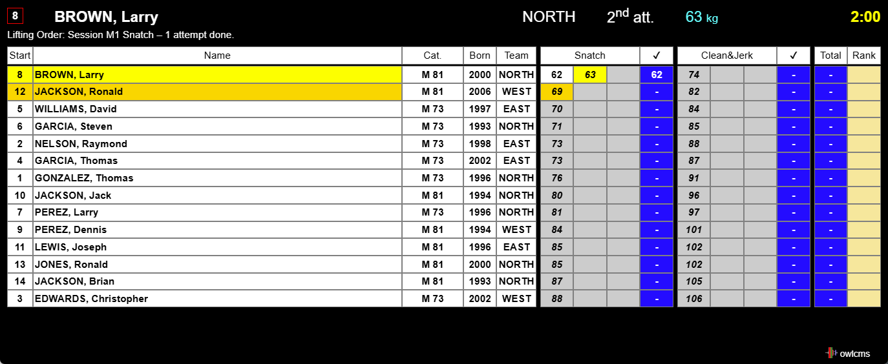
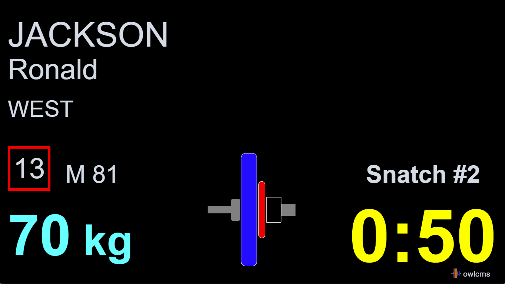
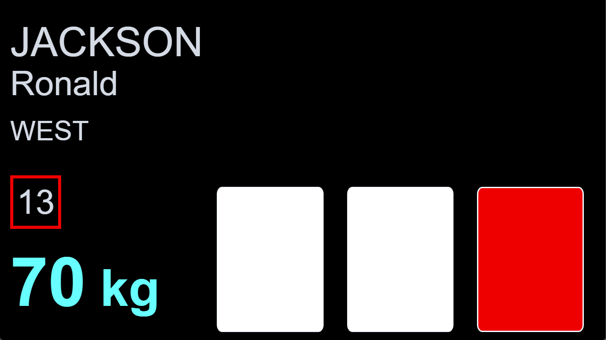

Starting the displays is performed from the `Start Displays`  page.  

Notes 

- Each display will open in a new tab (or window, depending on your browser preferences).  This allows the announcer to have several displays open in addition to the announcer's own -- for example, to have the scoreboard open in a second tab.
- Displays meant for the public should be maximized.  Use the F11 key or right-click to go to full-screen mode.
- each display manages its own timer. If a display is hidden because it is in a tab that is not shown, the display refreshes don't take place, and the time will lag.  Obviously, a display meant for the public or the athletes will not be hidden, so this behavior has no real consequences.

## Scoreboard

A standard scoreboard showing the athletes in official order (per category, then per start number) is provided.  The current athlete (having been called or about to be called) is shown in blinking yellow, the next athlete in orange.  The top line contains the information about that athlete.  The timer will run, and when a decision is made, it is shown in the top right.

The scoreboard can be used both for the main platform and in the warm-up room.

## Lifting Order

In regional meets, not all coaches are able to figure out the lifting order or how many attempts remain for their athletes.  The lifting order screen is a non-official screen that is useful in these situations.  It is normaly used in the warm-up area.

## Attempt Board

When a lifter is announced, the attempt board shows all the information required by the referees

- Who is lifting
- Their team
- The start number
- The attempt number
- The requested weight
- The loading chart for the requested weight
- The time remaining

When the clock is started, the time counts down.

Refereeing devices can be connected directly to the attempt board (see [Refereeing](Refereeing)).  If that is the case, as soon as two referees have hit the same button, a down signal and a sound are emitted.  If the devices are not connected directly to the attempt board, the board will be informed by the server, and will emit the signal and sound as soon as it is told (usually, the delay is not perceptible at all).

As soon as the down signal has been given, the system waits for the third decision to be given.  By rule, a 3-second delay is required before showing the decisions to the public (in case there is a decision reversal)

After the 3 seconds, the decisions are shown.

## Athlete-facing Decision Display

In front of the athlete, a separate display can be used.  It has less information to be less distracting.  Also, the decision lights are reversed to match the physical location of the referees (referee number 1 is on the right-hand side of the athlete looking at the public, and on the left-hand side for the public looking at the athlete).

Refereeing devices are usually connected to the computer or laptop driving the athlete-facing display (see [Refereeing](Refereeing)).  If that is the case, as soon as two referees have hit the same button, a down signal and a sound are emitted. 

The exact same sequence takes place as for the Attempt Board: first there is the allowed time (1 or 2 minutes, or whatever time is left from a lifter change)

Running time is shown:

Down signal is shown, and sound is emitted.

Three-second waiting period after all three decisions have been entered.

Final decision.

