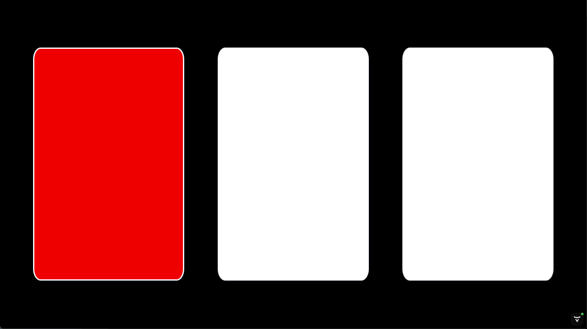

Starting the displays is performed from the `Start Displays`  page.  

Notes 

- Each display will open in a new tab (or window, depending on your browser preferences).  This allows the announcer to have several displays open in addition to the announcer's own -- for example, to have the scoreboard open in a second tab.
- Displays meant for the public should be maximized.  Use the F11 key or right-click to go to full-screen mode.
- Each display manages its own timer. If a display is hidden because it is in a tab that is not shown, the display refreshes don't take place, and the time will lag.  Obviously, a display meant for the public or the athletes will not be hidden, so this behavior has no real consequences.

## Display Settings

When a display is first started, a dialog comes up to control the the behavior.

- Displays that show a clock give the option to emit the warning sounds at 90, 30 and 0 seconds, as well as the down signal.  
  - <u>By default, the display is silent</u>. 
  - To avoid confusion, it is recommended to have only one display with sound in each room.  For example, you can choose to have the attempt board emit sound on the main area, and a scoreboard in the waiting area.
  - Note that the announcer and marshall consoles always emit the warnings, so it is often convenient to just connect the announcer laptop to the sound system.
- Displays that show a table have the option to have a white or black table background.
- The scoreboards that show the attempts and ranks can switch to a medal ceremony display.  
  - By default, <u>the displays do NOT switch during the medal ceremony</u>.  The default is appropriate for warmup rooms, waiting areas, the jury, etc.
  - The large public-facing displays can switch, simply by clicking on the display and selecting the "Public" option in the ceremony settings (see the screen capture below)
- Once the dialog is closed, it can be brought back by clicking anywhere in the window.

## Scoreboard

A standard scoreboard showing the athletes in official order (per category, then per start number) is provided.  The current athlete (having been called or about to be called) is shown in blinking yellow, the next athlete in orange.  The top line contains the information about that athlete.  The timer will run, and when a decision is made, it is shown in the top right.

The scoreboard can be used both for the main platform and in the warm-up room.

## Scoreboard with Leaderboard

This scoreboard should be used in meets where the same category is split in several lifting groups.

The `Scoreboard with Leadboard` button opens a scoreboard that also shows the leaderboard for the currently lifting athlete's category at the bottom (in a large meet, a group is usually a single category, so the leaderboard is the same for the whole session).

The other difference with the ordinary scoreboard is that the rankings shown are those across all lifting groups, including those that have lifted earlier (in the image below, the athlete Williams has lifted 70, which currently puts him third, because the 70 from Scott in group M2 shown at the bottom was achieved earlier.)

The image shows the "black on white" display setting.

## Lifting Order

In regional meets, some novice coaches may have difficulty tracking the the lifting order to determine how many attempts remain for their athletes.  The lifting order screen is a non-official screen that is useful in these situations.  It is normally used in the warm-up area.

## Attempt Board

When a lifter is announced, the attempt board shows all the information required by the referees

- Who is lifting
- Their team
- The start number
- The attempt number
- The requested weight
- The loading chart for the requested weight
- The time remaining

When the clock is started, the time counts down.

Refereeing devices can be connected directly to the attempt board (see [Refereeing](Refereeing)).  If that is the case, as soon as two referees have hit the same button, a down signal and a sound are emitted.  If the devices are not connected directly to the attempt board, the board will be informed by the server, and will emit the signal and sound as soon as it is told (usually, the delay is not perceptible at all).

As soon as the down signal has been given, the system waits for the third decision to be given.  By rule, a 3-second delay is required before showing the decisions to the public (in case there is a decision reversal)

After the 3 seconds, the decisions are shown.

## Athlete-facing Decision Display

In front of the athlete, a separate display can be used.  It has less information to be less distracting.  Also, the decision lights are reversed to match the physical location of the referees (referee number 1 is on the right-hand side of the athlete looking at the public, and on the left-hand side for the public looking at the athlete).

Refereeing devices are usually connected to the computer or laptop driving the athlete-facing display (see [Refereeing](Refereeing)).  If that is the case, as soon as two referees have hit the same button, a down signal and a sound are emitted. 

The exact same sequence takes place as for the Attempt Board: first there is the allowed time (1 or 2 minutes, or whatever time is left from a lifter change)

Running time is shown:

Down signal is shown, and sound is emitted.

Three-second waiting period after all three decisions have been entered.

Final decision.

## Top Teams Scoreboard

Team competitions are supported by a Top Teams Scoreboard that show the teams in contention for a medal.  The full Teams results are available to the competition secretary (see [this page](Documents#Team_Results) for details).  Both pages consider points as computed when the athlete's group is done.  So in competitions where there are multiple groups for a single category the points shown are not definitive.

## Top Sinclair and Top Team Sinclair

Sinclair-based competitions are supported by two scoreboards.  The first one shows the athletes in contention for the "best lifter" awards, as well as the weight needed to catch up with first place. 

Note that the Sinclair score (and not the SMF) is used for this scoreboard.

The second display show the sum of the Sinclair scores for the team members.  The top 5 teams are shown.

