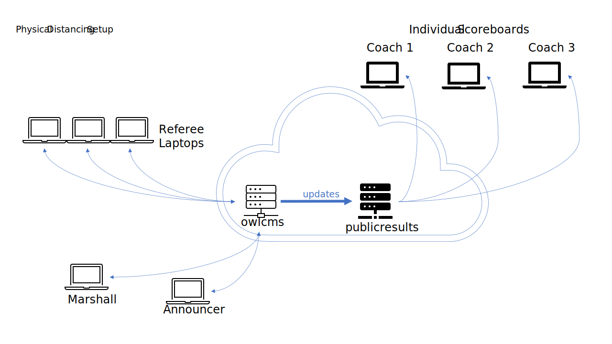

This page discusses how to respect physical distancing guidelines using individual scoreboards at each warm-up platform instead of a shared scoreboard.

## Cloud-based Individual Scoreboards

In order to provide individual scoreboards to coaches and allow them to stay on their own warm-up platform there is a sister application to owlcms called *publicresults*. 

Whenever possible,  Publicresults is installed in the cloud, and anyone can access it (coaches, athletes, even members of the public).  Publicresults gets its updates from owlcms.  No one other than the officials gets access to the competition system owlcms, to reduce the security risks.

The cloud-based setup is explained in [this page](PublicResults).

## Local Individual Scoreboards

It is also possible to install `publicresults` locally, on a second laptop.  By giving coaches access to a second competition Wi-Fi network, they can get access to the scoreboard on their tablets or phones. This is more involved because we cannot rely on the cloud provider to protect the competition network from foul play and we have to do it ourselves.

The local setup is explained in [this page](PublicResults_Local).

