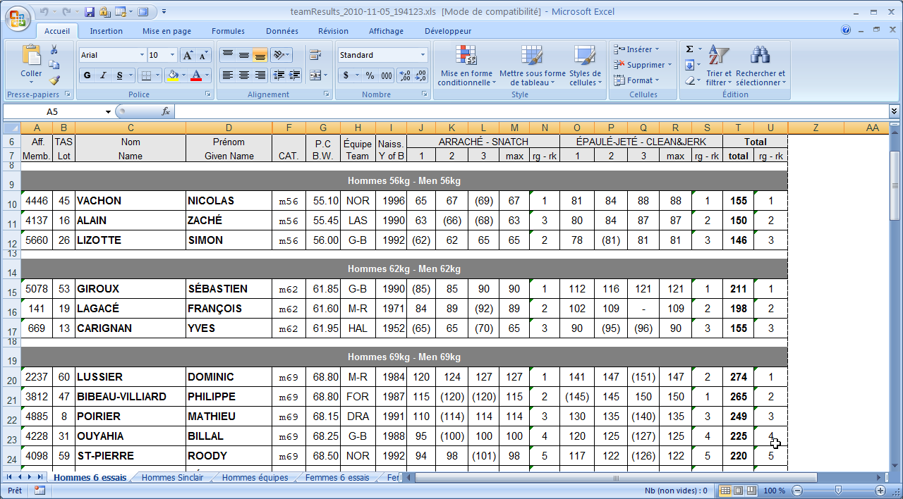

From the `Result Documents` page, it is possible to get a protocol sheet for each group, and a full results package.

## Group Results

The Group Results button opens a page where it is possible

- To correct a mistake on a result in a group that has finished lifting

- To select a group and produce a result sheet

- If no group is selected, all the lifters are included.  This is typically the format expected to send results to a federation.

  In the current version, the template used is determined by the language.  The ability to pick from a list of templates will be reintroduced in an upcoming release.

## Team Results

The full Team results are available, both in IWF-style points and in Team Sinclair modes.
To see the results, filter to Men or Women using the dropdown, and use the sorting controls at the top of the list.
Details for each team are available by clicking on the team name.

## Competition Package

The competition package contains the 6-lift results for men and women, the Robi rankings, and the team results.

Alternate competition packages with alternate team points schemes are also available (for Example, Masters, or School Championships with combined men and women scores, etc.).

