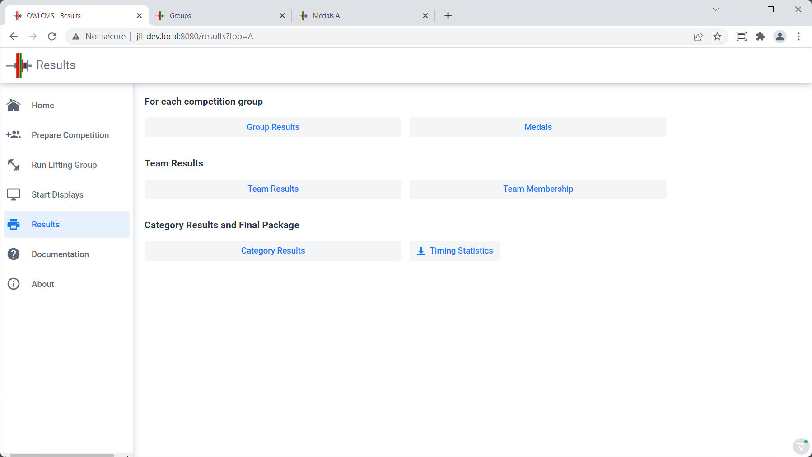
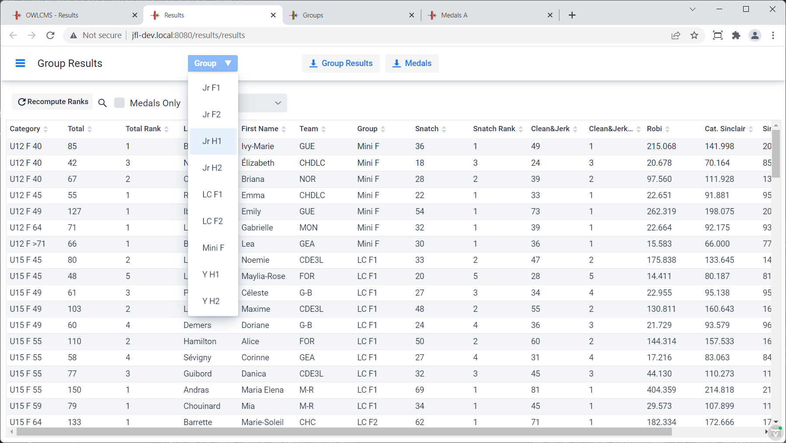
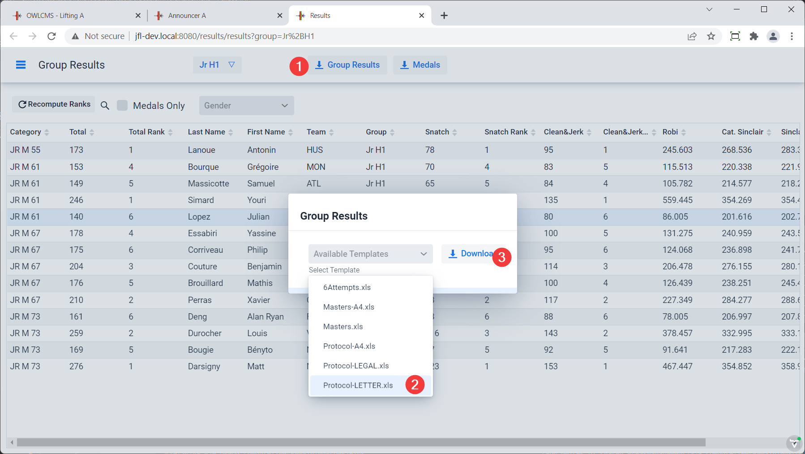
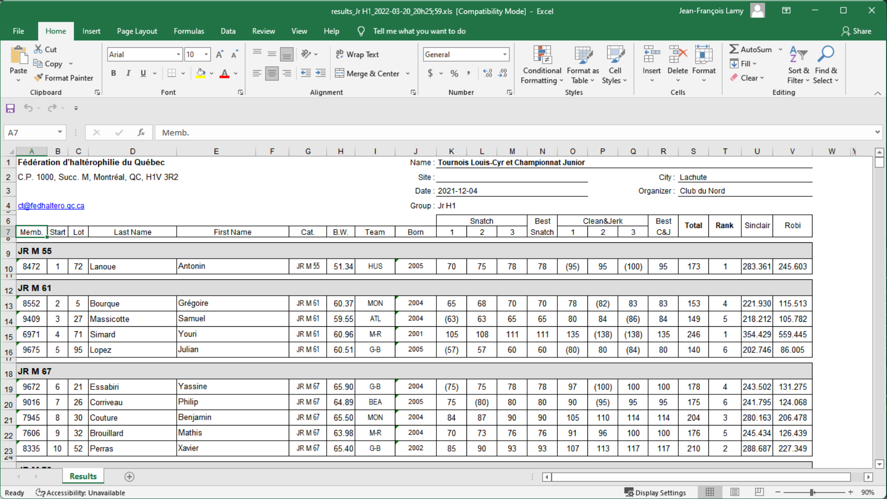
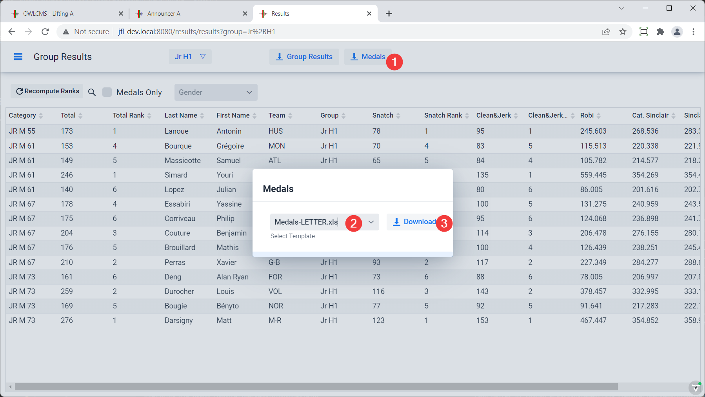
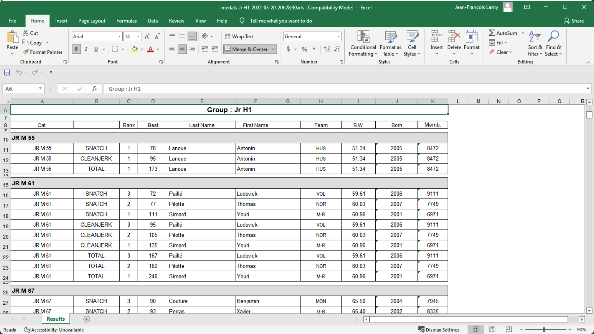
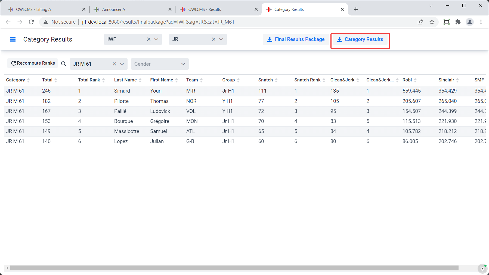
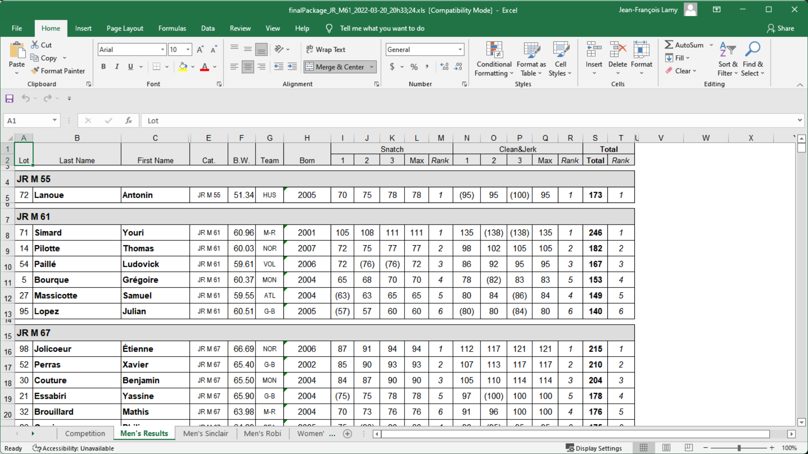

From the `Result Documents` page, it is possible to get the various competition document.

## Group Results

The Group Results button opens a page where all athletes are listed.  By selecting the group, the list is narrowed to the group.  Clicking on an athlete brings up the athlete card, in case a correction is required.

To produce the protocol sheet for a group

Then select "Group Results", the template you want, and click "Download" . The different templates show slightly different information, and use different paper sizes.  You can also add your own.

The document is downloaded -- the exact location to retrieve the document depends on your browser.  In the case of Chrome, the download is shown at the bottom. Edge and Firefox show the downloads at the top right.

Clicking on the file opens Excel (or your spreadsheet editor if you use another one). After clicking on "Enable Editing" when the file opens, you get the protocol sheet:

## Medals

In order to have a smooth medal ceremony, printing out the medals is recommended.  The process is the same as for the protocol sheet.

The resulting Excel shows all medals in the Bronze, Silver, Gold order.  Whether there are medals for all lifts or just the total is controlled on the competition rules page.

## Category Results

The category results page gives access to a page per category.  This is useful when there are A B C groups to show the full rankings.

## Final Package (Competition Book)

The final package contains several tabs for each of the 6 attempts, Sinclair and Robi rankings.  It also contains team scores.  The process for creating the book is the same as above.

The team ranking tabs shows the team cumulative points, and the details for each athlete at the bottom.

If you wish to sort the points table, please note that due to the way Excel works you will need to copy the table area somewhere else in the page and use the "Paste as values" option before you are able to sort it.

## Time Statistics

The time statistics Excel shows how much time was spent per lift in each group, on average.  It gives the number of athletes that can lift in an hours - if the number is 8 athletes per hour, then a 12 person group will take 90 minutes, on average.  Youth championships often go faster (9 or 10), whereas senior championships are slower (7,5 athletes per hour for example).