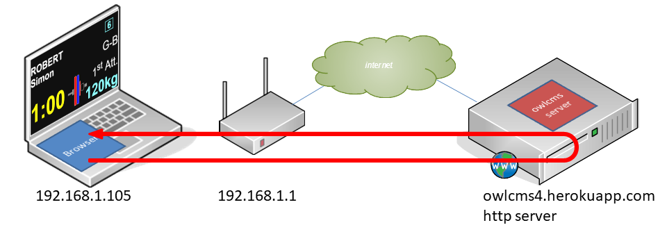
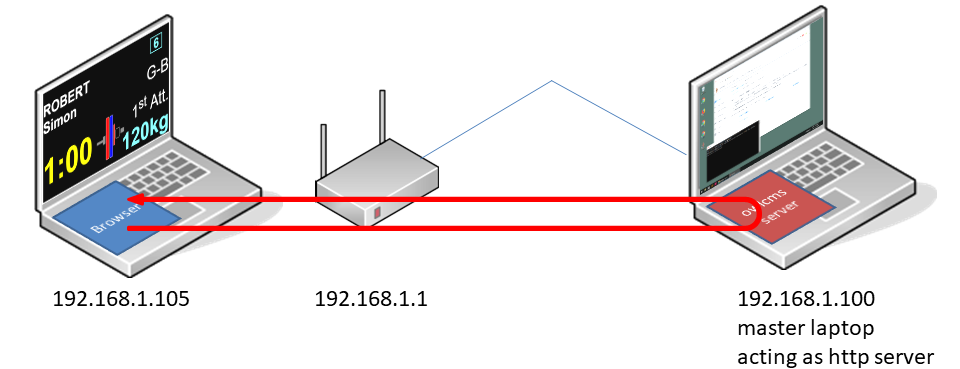
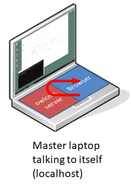

## Physical Setup

Each screen or display is attached to a laptop or miniPC (Windows, Linux, ChromeOS).  A setup for a state competition using refereeing devices might look as follows.

You can use any subset of this setup.  In fact, many club meets use only one laptop or two (see below for [examples](#local-access-over-a-local-network).) 

Alternately, you can scale up and replicate the full setup on multiple platforms (but you only need a single master laptop or a single cloud service no matter how many platforms you have). You can even have 5-person juries on each platform if you so wish.

If you are not familiar with computer networking, read on to the [Networking Requirements](#networking-requirements) section below.

## Computer Requirements

- The server software will run either 
  - on any recent laptop acting as a server (or on a cloud) with Java8 installed.
  - or on a cloud service. We test and support the Heroku cloud service, which has a free tier suitable for owlcms.
- For the user interface and displays,  It is recommended to use a recent version of **Chrome** or **Firefox** on a **laptop** or **miniPC** (Windows, Mac Linux, ChromeOS). 

  - You can use just about any laptop.  Refurbished Chromebooks or Windows laptops work well.
  - Even [75$ full-kit Raspberry Pi 3B](https://www.canakit.com/raspberry-pi-3-model-b-plus-starter-kit.html) work well for displays [^1] .
  - Apple iPhones and iPads are currently only supported as [mobile refereeing devices](Refereeing#mobile-device-refereeing). The author does not own a Mac to fully debug the quirky Safari browser.

## Sound Requirements

#### Chrome configuration

Recent versions of Chrome no longer allow web pages to emit sounds by themselves.  In order to hear the signals from the clock and the down signal, we have to override this setting.

- in Chrome, go to page ``chrome://flags``  and search for ``autoplay policy``  in the search bar.
  Set the parameter to ``No user gesture is required``

- OR --  Create a shortcut to chrome and add the following flag `--autoplay-policy=no-user-gesture-required`

#### Master Laptop Sound

Some combinations of browser and operating system produce garbled sound. If that is the case, you may want to use the master laptop to produce the sound (and wire your speakers to the audio output of the master laptop.)   See [these explanations.](Preparation#associating-an-audio-output-with-a-platform)

## Networking Requirements

There are three ways to use OWLCMS4: cloud-based, local, and solo.  Which one you use depends on your circumstances, please read on.

### Cloud access over the Internet

In this setup, OWLCMS4 executes on an external cloud service (we provide instructions for [Heroku](Heroku), which is physically hosted on Amazon AWS).  Nothing is installed locally: all the laptops and miniPCs simply run a browser, which connects to the remote site.  The address that all the browsers need to use is determined when configuring the cloud service -- in the following example, our demo site https://owlcms4.herokuapp.com is used.

### Local access over a local network

If there is no Internet access where you hold your meet, or if you prefer not having to rely on it, the second option is to install OWLCMS4 on a good laptop.  OWLCMS4 is started on this laptop, which is designated as the *master*.  

It is perhaps surprising to use a laptop as a server, but as the picture shows, in both cases the display browsers query OWLCMS4 which pushes back its updates.  The differences are minor:

- in a simple local network, the router assigns numerical addresses when it first sees a device, and the easiest way they can refer to each other is using the numerical addresses 
- there is no need for the Internet, all the networking takes place in the router.  As long as the browser provides the numerical address of the master, the router will route back and forth and things will work.

In order to simplify matters, at startup OWLCMS4 digs the addresses that have been assigned to the master laptop.  It then opens a browser window which tells you [what address the other laptops should use](LocalSetup#initial-startup) to connect to OWLCMS4.

### Single-computer setup

When preparing for a competition that will use a local setup, or when hosting a club meet where there is no networking, you can actually do all the work on the master laptop itself.  

The laptop will then be running two programs: OWLCMS4 (pictured in red, which will display its messages in a black window), and Chrome (pictured in blue, which will display its output in a white window).   When a browser is trying to reach a program running on the very same computer, it can always use an address that starts with http://localhost or http://127.0.0.1 .   

Using a phone network analogy again, we're making an intercom call.

[^1]: The only caveat is that some refereeing devices require [workarounds](Refereeing#notes-for-raspbery-pi-users-with-delcom-keypads)