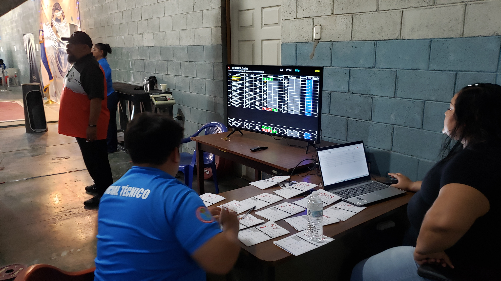
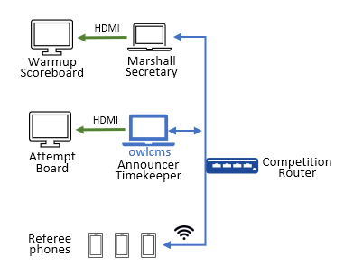
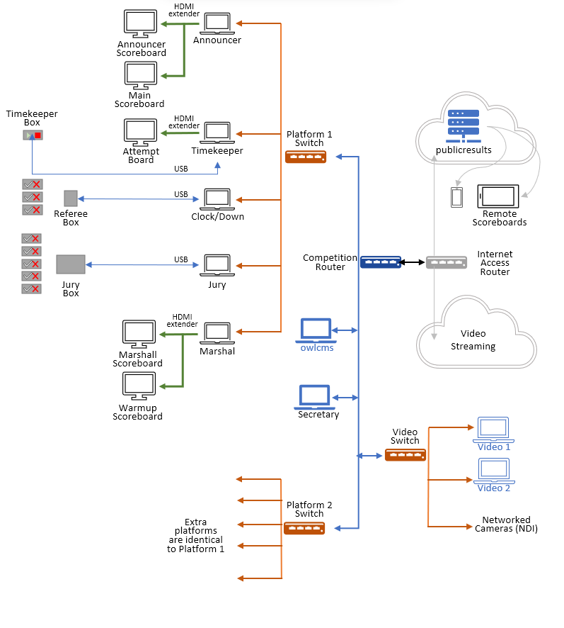

## Physical Setup

owlcms is a web-based application.  All the displays connect to owlcms using a browser.  In most scenarios, owlcms runs on a good laptop at the competition site, and all the other displays connect to that laptop.  For virtual meets, the computer running owlcms is actually running somewhere in the internet -- everything else on this page still applies.

### Minimalistic Setup

In a small club meet, the announcer will often do everything - announce, enter the weight changes, and operate the clock. This can be done on a single laptop, as demonstrated in this [video](Demo1).  You can sometimes even do away with the scoreboard.

### Suggested Small Competition Setup

If you have a meeting with multiple groups, the following setup will allow you to comply with most requirements.  This adds a computer in the warmup area, and there is an attempt board on the platform.

<table>
<tr><td></img></td><td></img></td></tr></table>

- The clock and decisions are visible on the attempt board.  The attempt board should visible from the chalk box and from the center of the platform.
- This uses the "extend desktop" capability of the laptop to have a different output on the monitor. To avoid moving the mouse non-intentionally on the external monitor, you can use [DualMonitorTool](https://dualmonitortool.sourceforge.net/) 
  - Many people have also had success using Chromecast devices to drive the extra screens.
- If you have an extra laptop and a projector at your disposal, you can add a scoreboard for the public. 
- The next step up is to have the secretary on a separate laptop so that weigh-in data can be entered while the competition is going on.

### Full Competition Setup

At the opposite end of the spectrum, a setup for a state competition using refereeing devices would provide all the requisite displays and technical official stations.  To keep costs down, TVs and projectors can be driven using cheap devices such as Fire TV Sticks or Raspberry Pi.

There are basically two ways to achieve such as setup.  The first one uses fewer computers and relies on HDMI extenders, the second (illustrated above) uses old laptops, or small devices such as FireSticks, ChromeCasts, or mini PC sticks to feed the displays.  The two approaches can be combined as needed.

#### Approach 1: Fewer laptops, HDMI extenders

In this approach, officials use the main display of the laptop.  The monitor output is used to show scoreboards.  

You can either use an HDMI Extender or use HDMI Fiber cables.  Use extenders that can provide a second output that is connected to a monitor next to the laptop.  In this way, the announcer can see the main scoreboard, and the marshall can see the warmup scoreboard.  If using HDMI Fiber cables, then you will need a splitter to send one signal to the monitor and one signal to the far-away TV.

The diagram below illustrates the "full setup" that would be used in a multi-platform competition with a full jury.

- A software like [DualMonitorTool](https://dualmonitortool.sourceforge.net/) is used to prevent the mouse from moving out of sight during the sessions.

- The advantage to that setup is that HDMI extension is comparatively cheap (50-100$ per screen) and that there are extenders with an HDMI loop-out that allow the officials to have the same output on a monitor. This also makes it easy to control what is seen on the remote screens. 
- The laptops are wired using a networking switch.
- If needed, the laptops can also provide power or control refereeing/jury/timekeeping devices (that typically use Arduino or ESP32 chips).
- *Two laptops are shared between all competition platforms*; one runs owlcms, the other is for the competition secretary. In a large meet the competition secretary needs a dedicated computer to do the data entry and to produce the results.  They can be connected to the router or to a switch.  In a smaller meet it is often the case that either the announcer laptop or the secretary laptop will run owlcms, but due to the risk of human error, a separate laptop is preferred.
- *Four laptops are required per platform*, plus one for the jury if there is one, plus one for video streaming if needed.  The laptops are wired to a switch.
- If there is only one platform, the video streaming computer can be attached to the competition router

#### Approach 2: Fully Networked

In this second approach, every screen is connected to a networked device.  The small green boxes in the diagram represent the networked devices.  In pre-pandemic times, it was easy to buy a Raspberry Pi for roughly 100$, which made this option price-competitive with the HDMI scenario described above.  These times are gone, so this approach is good when devices are already available and can be scrounged.

Anything that can still run a recent version of Chromium is fine  This includes:

- Old laptops (old laptops can often be converted to Chromebooks and get a second life).  Most old laptops that are too slow for anything else can still run Chrome or Edge.
- Raspberry Pi (the [model 400](https://www.raspberrypi.org/products/raspberry-pi-400/), has everything built-in and is an excellent choice - when available).
- PC Sticks or MiniPCs (preferably with an Ethernet port)
- [Amazon Fire TV sticks](FireTV) (this requires WiFi to be of excellent quality)
- Chromecasts (this requires internet access to start up, and WiFi has to be of excellent quality). A computer must provide the display being replicated -- a single laptop can drive multiple displays)

The disadvantage to this approach is that each display must be setup separately, and the cost of the devices if you don't have a plentiful supply of obsolete laptops.  The reliance on good WiFi for certain devices is also something to take into account. This advantage is that every display is independent, so this is extremely flexible.

## Computer Requirements

- The server software will run either 
  - on any reasonably recent laptop (this laptop will act as a primary server in a local networking setup, see [below](#local-access-over-a-local-network) for details.  In our experience, a Core i5 or equivalent is plenty.
  - or on a cloud service.  The the minimum image size required is 512MB, and 1024 is preferred for large competitions.
- As stated above, for the user interface and displays,  It is recommended to use a recent version of **Chrome**, **Edge** or **Firefox** on any laptop/miniPC (Windows, Linux, Mac), or on a specialized display device (Amazon FireStick).  **Safari** also works on iPads, but the smaller screen resolution needs to be taken into account.
- Apple iPhones and iPads are ok as [mobile refereeing devices](Refereeing#mobile-device-refereeing).   Display features such as the Scoreboard and the refereeing displays (attempt board, athlete-facing decisions) also work.

## Sound Requirements

By default, only the athlete-facing decision display emits sound.  See this [page](Displays#display-settings) for controlling the sound parameters for the various displays if you need to enable it on another display.  Enable sound only on one display per room, multiple sources are confusing.

If the equipment used for display has no speakers, you can get the main computer to generate the sounds.   See [these explanations.](Preparation#associating-an-audio-output-with-a-platform)