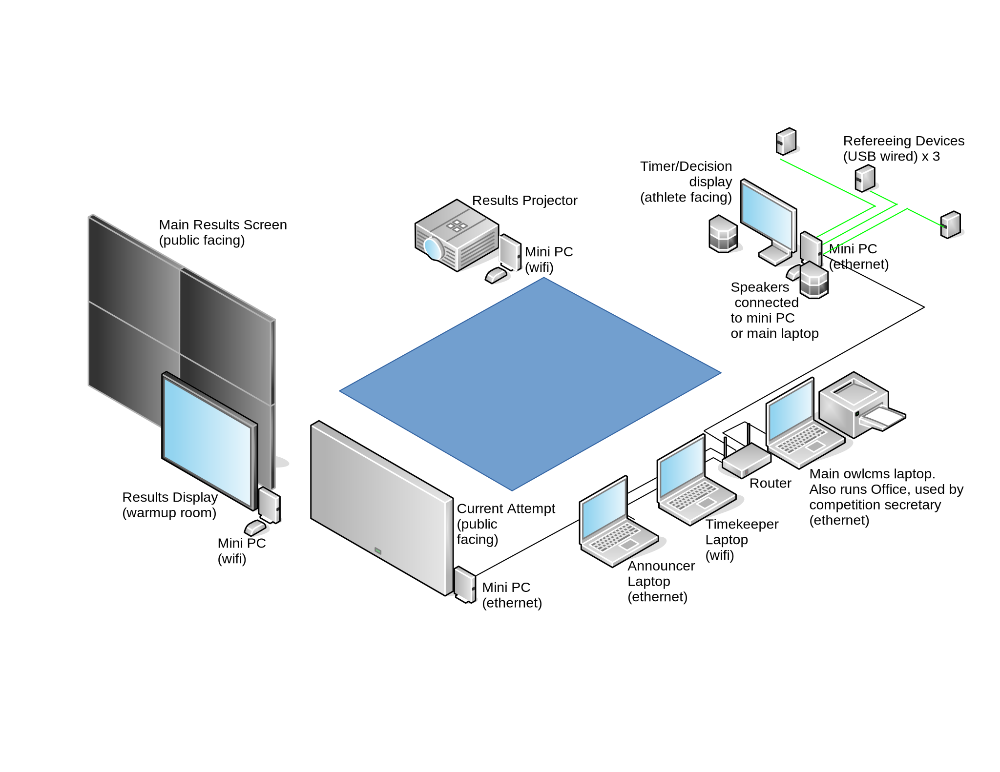

# Equipment Setup

## Physical Setup

Each screen or display is attached to a laptop or miniPC (Windows, Linux, ChromeOS).  A setup for a regional competition without a jury might look as follows.  If [running on the cloud](Heroku.md), the router would be connected to the Internet, and the owlcms software would be accessed remotely.  If [running remotely](LocalSetup.md), the software runs on the master laptop, which is typically that used by the competition secretary.




## Pre-requisite for sound : Chrome configuration

Recent versions of Chrome no longer allow web pages to emit sounds by themselves.  In order to hear the signals from the clock and the down signal, we have to override this setting.

- in Chrome, go to page ``chrome://flags``  and search for ``autoplay policy``  in the search bar.
  Set the parameter to ``No user gesture is required``


OR

- Create a shortcut to chrome and add the following flag
  ```bash
   --autoplay-policy=no-user-gesture-required
  ```
  The path in the shortcut would look like this
  ```bash
  "C:\Program Files (x86)\Google\Chrome\Application\chrome.exe" --autoplay-policy=no-user-gesture-required
  
  ```

