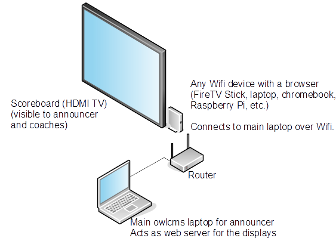
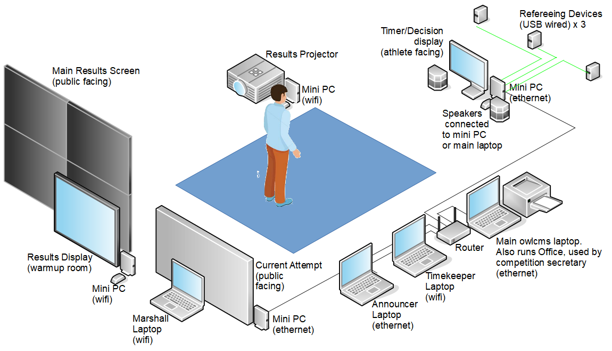
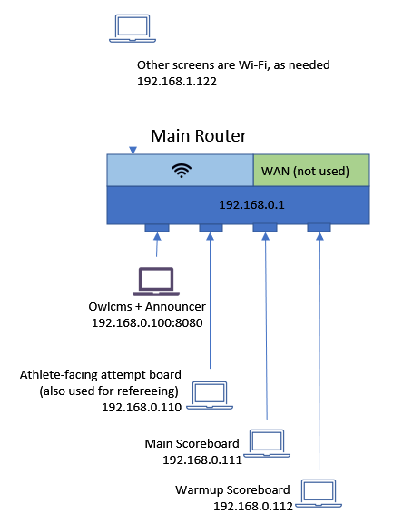

## Physical Setup

OWLCMS is a web-based application.  

- All the displays run using a browser. You can use *any* device that can run a browser - the cheapest available device will do.  This can be an old laptop, a [FireTV stick with the Silk web browser](FireTV),  a [Raspbery Pi](https://www.raspberrypi.org/products/raspberry-pi-400/), or an entry-level Chromebook. 
- The OWLCMS program runs in one of two ways: on a local laptop, or in the cloud.  The only need for a good laptop is if you want to run the program locally (see [Computer Requirements](#computer-requirements) below)

### Small Club Meets

In the simplest setup, a single person will act as announcer, register changes, and operate the clock.  This can be done on a single laptop, as demonstrated in this [video](Demo1).

Typically however, you will want to have a scoreboard so athletes and coaches can follow the competition as they warm up.  So a no-nonsense setup a small club meet might look like

### Full Competition Setup

At the opposite end of the spectrum, a setup for a state competition using refereeing devices would provide all the requisite displays and technical official stations.  To keep costs down, TVs and projectors can be driven using cheap devices such as Fire TV Sticks or Raspberry Pi.

You can also add a jury laptop with 5 refereeing devices, add additional results displays, as many as you want.  You can even replicate the full setup on multiple platforms, all running at once.  No matter how many platforms, there is only one OWLCMS primary server (either a laptop running locally, or a cloud application) 

## Computer Requirements

- The server software will run either 
  - on any reasonably recent laptop (this laptop will act as a primary server in a local networking setup, see [below](#local-access-over-a-local-network) for details.  In our experience, a Core i5 or equivalent is plenty.
  - or on a cloud service. We test and support the [Heroku cloud service](Heroku#Heroku), which has a free tier suitable for small competitions owlcms, and a reasonably priced paying tier you can use on the actual days of a [large competition](HerokuLarge)
- For the user interface and displays,  It is recommended to use a recent version of **Chrome**, **Edge** or **Firefox** on any laptop/miniPC (Windows, Linux, Mac), or on a specialized display device (Amazon FireStick).  **Safari** also works on iPads, but the smaller screen resolution needs to be taken into account.
  -  The cheapest solutions to drive TV screens are [Amazon Fire TV sticks](FireTV), and Raspberry Pi  computers (the [model 400](https://www.raspberrypi.org/products/raspberry-pi-400/), has everything built-in).
  - For the officials, you can use just about any laptop.  Refurbished Chromebooks or refurbished Windows laptops work well -- all that is needed is the ability to run a recent version of Chrome or Firefox.
  - Apple iPhones and iPads are ok as [mobile refereeing devices](Refereeing#mobile-device-refereeing).   Display features such as the Scoreboard and the refereeing displays (attempt board, athlete-facing decisions) also work.
  - Android phones and tablets work fine for all features (just install Chrome)

## Networking Requirements

When running locally, all that is required is a local Wi-Fi router.  We recommend that the main laptop be connected using an ethernet wire to the router.   If there is Wi-Fi interference in the competition area (which is fairly common), the following minimal setup using Ethernet wires can be used. 

In the diagram above, computers that are essential to the competition flow are wired.  Other computers such as the one used to enter weigh-in information or to print results can be connected using Wi-Fi.   If you need to wire more devices, you can [connect as many switches as you want](https://www.linksys.com/support-article?articleNum=139602) to your router.

When running over the cloud, the additional requirement is that the main router be connected to the internet with a reliable connection.

When running several platforms, we recommend that you use a well-designed setup with multiple Wi-Fi access points.  Ask a technical person for advice.

## Sound Requirements

By default, all the displays that show timers can emit sound, but are silent by default.  Having warnings come from several locations is confusing, you should pick one display per room to have sound on and leave the others silent.  See this [page](Displays#display-settings) for controlling the sound parameters for the various displays.

Another option is to get the primary laptop to generate the sounds.  This is mostly done for backward compatibility with the old behavior of the program, or when the equipment used for display has no speakers.   See [these explanations.](Preparation#associating-an-audio-output-with-a-platform)