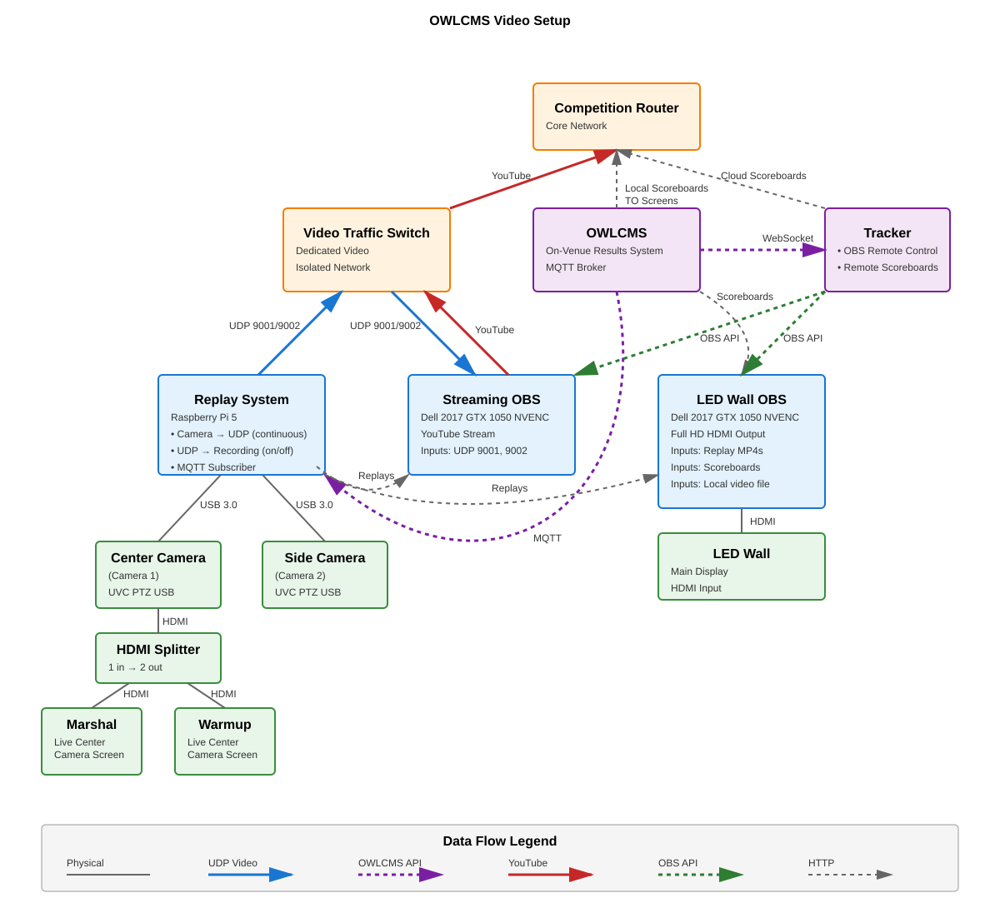

# OBS Dual-Stream Architecture with Replay System

## System Overview

This document describes a dual-stream OBS setup with integrated replay system for live sports/events broadcasting. The system streams to both YouTube and an LED wall while providing instant replay capabilities.

## Network Topology



The complete network topology diagram shows:
- **Competition Router**: Core network hub (192.168.1.x)
- **OWLCMS**: Master controller with MQTT broker for replay triggers and timing
- **Tracker**: OBS remote control and remote scoreboards server
- **Video Traffic Switch**: Dedicated switch for video streams (isolated network)
- **RPi 5** (192.168.1.42): Camera capture, replay system, and MQTT subscriber
- **Streaming OBS**: OBS streaming to YouTube (UDP inputs 9001, 9002)
- **LED Wall OBS**: OBS streaming to LED wall (HTTP replay inputs and scoreboards from OWLCMS)

## System Components

### Camera Setup
- **2x UVC PTZ Cameras**
  - Output: H.264 compressed @ 1080p60
  - Connection: USB 3.0 to RPi 5
  - Camera 1: `/dev/video0`
  - Camera 2: `/dev/video2`

### Replay System (RPi 5) - 192.168.1.42
**Hardware:**
- Raspberry Pi 5
- SSD storage for recordings
- 2x USB 3.0 ports for cameras

**Functions:**
1. Camera capture (H.264 from USB)
2. UDP streaming to both laptops
3. Continuous recording (2-minute segments)
4. Replay clipping system
5. MQTT subscriber for OWLCMS commands
6. HTTP server for replay MP4s

### Streaming OBS
**Hardware:**
- Gaming laptop with GTX 1050 (Dell 2017)
- 2x USB 3.0 ports
- Windows OS

**Software:**
- OBS Studio
- NVENC encoding (GPU)
- WebSocket plugin for remote control

**OBS Inputs:**
- Camera 1: `udp://@:9001`
- Camera 2: `udp://@:9002`

**OBS Output:**
- YouTube RTMP stream

### LED Wall OBS
**Hardware:**
- Gaming laptop with GTX 1050 (Dell 2017)
- 2x USB 3.0 ports
- Windows OS

**Software:**
- OBS Studio
- NVENC encoding (GPU)
- WebSocket plugin for remote control

**OBS Inputs:**
- Replay MP4 URLs from RPi 5
- Example: `http://192.168.1.42:8080/replay_001.mp4`

**OBS Output:**
- LED wall stream (RTMP/SDI/other)

### OWLCMS - Master Controller
**Functions:**
- Issues MQTT commands for:
  - Recording start/stop triggers
  - Replay clip timing
  - Idle time removal parameters
- Serves HTTP scoreboards to LED Wall OBS and Competition Router (for remote screens)
- Connects to Tracker via WebSocket for OBS remote control

### Tracker - Control Hub
**Functions:**
- OBS remote control via WebSocket API
- Remote scoreboards server
- Connects to OWLCMS via WebSocket
- Routes scoreboard data to Competition Router for internet-accessible displays

## Data Flow

### Video Streams (UDP)
- **Cameras** → RPi 5 via USB 3.0 (H.264 compressed @ 1080p60)
- **RPi 5** → Video Traffic Switch → Both OBS systems (UDP ports 9001, 9002)

### YouTube Upstream
- **Streaming OBS** → Video Traffic Switch → Competition Router → YouTube

### Replay System (HTTP)
- **RPi 5** → Both OBS systems (HTTP-served MP4 replay clips)
- Triggered by MQTT commands from OWLCMS

### Scoreboards (HTTP)
- **OWLCMS** → Competition Router (Local scoreboards to screens)
- **OWLCMS** → LED Wall OBS (LED wall overlays)
- **OWLCMS** → Tracker → Competition Router (Cloud scoreboards for remote access)

### Control (WebSocket & API)
- **OWLCMS** → Tracker (WebSocket connection for competition data)
- **Tracker** → Both OBS systems (API connections for scene control)

### MQTT Control
- **OWLCMS** → RPi 5 (direct MQTT connection)
- Commands include replay triggers, timing parameters, and idle time removal

## FFmpeg Commands

### Design Intent: Zero-Copy Architecture

The FFmpeg commands are designed for **minimal overhead and minimal latency**:

- **No re-encoding**: Cameras output H.264 directly; FFmpeg uses `-c:v copy` to stream the compressed data without decoding/re-encoding
- **Zero CPU/GPU load**: No transcoding means the RPi 5 CPU/GPU are free for other tasks (replay clipping, HTTP serving)
- **Minimal latency**: Direct copy from camera → network has <100ms delay (vs. 2-5 seconds with re-encoding)
- **Dual output**: Each FFmpeg process simultaneously streams to UDP (real-time) AND writes to disk (replay source) using the same zero-copy approach

**Note:** These commands are configured and managed by the RPi 5 replay system, which handles camera initialization, stream startup, and recording management.

### RPi 5 - Camera 1 Capture, Stream & Record

```bash
ffmpeg -f v4l2 -input_format h264 -video_size 1920x1080 -framerate 60 -i /dev/video0 \
  -c:v copy -f mpegts udp://192.168.1.255:9001?pkt_size=1316 \
  -c:v copy -f segment -segment_time 120 -reset_timestamps 1 /recordings/cam1_%03d.mp4 &
```

### RPi 5 - Camera 2 Capture, Stream & Record

```bash
ffmpeg -f v4l2 -input_format h264 -video_size 1920x1080 -framerate 60 -i /dev/video2 \
  -c:v copy -f mpegts udp://192.168.1.255:9002?pkt_size=1316 \
  -c:v copy -f segment -segment_time 120 -reset_timestamps 1 /recordings/cam2_%03d.mp4 &
```

**Note:** Each command produces TWO outputs from a SINGLE input stream:
1. **UDP stream** (real-time to laptops) - uses MPEG-TS container for resilient network transmission
2. **Disk recording** (2-minute MP4 segments for replay system) - uses MP4 container for efficient HTTP serving

Both outputs use `-c:v copy` (stream copy mode) - the H.264 data from the camera is written directly to both destinations without any processing.

### Key Parameters Explained

- `-f v4l2`: Video4Linux2 input format (Linux camera API)
- `-input_format h264`: Specify H.264 input (camera outputs compressed)
- `-c:v copy`: Copy video stream without re-encoding (zero CPU/GPU load)
- `-f mpegts`: MPEG Transport Stream format (ideal for streaming)
- `udp://192.168.1.255:9001`: UDP broadcast to port 9001
- `?pkt_size=1316`: Optimal UDP packet size for video
- `-f segment`: Split output into segments
- `-segment_time 120`: 2-minute segments
- `-reset_timestamps 1`: Reset timestamps for each segment

## OBS Configuration

### Streaming OBS - YouTube Stream Scenes

Streaming OBS streams to YouTube with automatic scene switching based on competition state. The scene transitions are triggered by OWLCMS events via the display-control system.

#### Scene Flow (Competition Cycle)

| Competition State | Scene | Video Source | Overlay |
|-------------------|-------|--------------|---------|
| Athlete in waiting room | **Attempt Board** | Attempt board from OWLCMS | None |
| Athlete at chalk box | **Side Camera** | Side camera (UDP 9002) | Lower third (athlete name, team, attempt) |
| Athlete on platform | **Front Camera** | Center camera (UDP 9001) | None |
| Decision visible | **Front Camera** | Center camera (UDP 9001) | Lower third (decision result) |
| After decision | **Replay** | Replay MP4 from RPi 5 | None |
| After replay | **Scoreboard** | Scoreboard from OWLCMS | None |

#### Scene Configuration

**Scene 1: Attempt Board**
- Browser source: `http://<owlcms>:8080/displays/attemptBoard?fop=A`
- Used during: Wait time between athletes

**Scene 2: Side Camera + Lower Third**
- Media source: `udp://@:9002` (side camera)
- Browser source overlay: Lower third with athlete info from OWLCMS
- Used during: Athlete preparation at chalk box

**Scene 3: Front Camera**
- Media source: `udp://@:9001` (center camera)
- Used during: Athlete on platform, lift attempt

**Scene 4: Front Camera + Decision**
- Media source: `udp://@:9001` (center camera)
- Browser source overlay: Lower third with decision lights/result
- Used during: Decision display (2-3 seconds)

**Scene 5: Replay**
- Media source: Replay URL from RPi 5 (e.g., `http://192.168.1.42:8080/replay_001.mp4`)
- Updated dynamically by display-control system
- Used during: Instant replay after decision

**Scene 6: Scoreboard**
- Browser source: `http://<owlcms>:8080/displays/scoreboard?fop=A`
- Used during: Between athletes, session breaks

### Streaming OBS - Media Source Setup (UDP Cameras)

1. **Add Media Source**
   - Source → Add → Media Source
   - Uncheck "Local File"
   - Input: `udp://@:9001` (center camera) or `udp://@:9002` (side camera)
   - Network Buffering: 0-100ms (low latency)

2. **Add Browser Source (Scoreboards/Overlays)**
   - Source → Add → Browser Source
   - URL: OWLCMS display URL
   - Width: 1920, Height: 1080

### LED Wall OBS - LED Wall Stream

LED Wall OBS provides a simplified feed for the venue LED wall, focused on replays and scoreboards.

| Content | Source |
|---------|--------|
| Scoreboard | Browser source from OWLCMS |
| Replay | HTTP MP4 from RPi 5 |

The LED wall typically shows the scoreboard with automatic replay insertion after each lift.