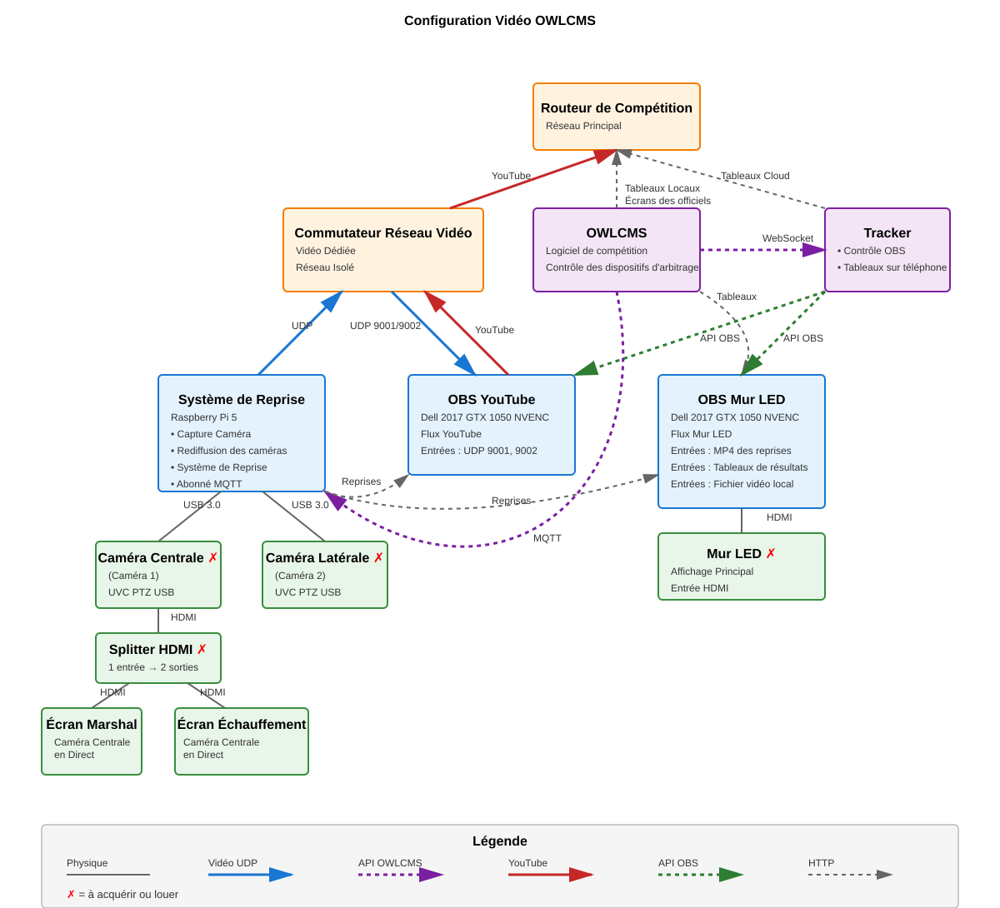

# Architecture OBS à Double Flux avec Système de Reprise

## Vue d'Ensemble du Système

Ce document décrit une configuration OBS à double flux avec système de reprise intégré pour la diffusion en direct d'événements sportifs. Le système diffuse simultanément vers YouTube et un mur LED tout en offrant des capacités de reprise instantanée.

## Topologie Réseau



Le diagramme complet de topologie réseau montre :
- **Routeur de Compétition** : Hub réseau central (192.168.1.x)
- **OWLCMS** : Contrôleur maître avec courtier MQTT pour les déclencheurs de reprise et le chronométrage
- **Tracker** : Contrôle à distance OBS et serveur de tableaux d'affichage distants
- **Commutateur de Trafic Vidéo** : Commutateur dédié pour les flux vidéo (réseau isolé)
- **RPi 5** (192.168.1.42) : Capture de caméra, système de reprise et abonné MQTT
- **OBS Streaming** : OBS diffusant vers YouTube (entrées UDP 9001, 9002)
- **OBS Mur LED** : OBS sortant HDMI Full HD vers le mur LED (entrées de reprise HTTP et tableaux d'affichage d'OWLCMS)

## Composants du Système

### Configuration des Caméras
- **2x Caméras PTZ UVC**
  - Sortie : H.264 compressé @ 1080p60
  - Connexion : USB 3.0 vers RPi 5
  - Caméra 1 : `/dev/video0`
  - Caméra 2 : `/dev/video2`

### Système de Reprise (RPi 5) - 192.168.1.42
**Matériel :**
- Raspberry Pi 5
- Stockage SSD pour les enregistrements
- 2x ports USB 3.0 pour les caméras

**Fonctions :**
1. Capture de caméra (H.264 depuis USB)
2. **Diffusion UDP continue** vers les deux ordinateurs portables OBS (FFmpeg #1 par caméra)
3. **Enregistrement à la demande** depuis le flux UDP (FFmpeg #2 par caméra, déclenché par MQTT)
4. Système de découpage de reprise
5. Abonné MQTT pour les commandes OWLCMS
6. Serveur HTTP pour les MP4 de reprise

### OBS Streaming
**Matériel :**
- Ordinateur portable de jeu avec GTX 1050 (Dell 2017)
- 2x ports USB 3.0
- Système d'exploitation Windows

**Logiciel :**
- OBS Studio
- Encodage NVENC (GPU)
- Plugin WebSocket pour contrôle à distance

**Entrées OBS :**
- Caméra 1 : `udp://@:9001`
- Caméra 2 : `udp://@:9002`

**Sortie OBS :**
- Flux RTMP YouTube

### OBS Mur LED
**Matériel :**
- Ordinateur portable de jeu avec GTX 1050 (Dell 2017)
- 2x ports USB 3.0
- Système d'exploitation Windows

**Logiciel :**
- OBS Studio
- Encodage NVENC (GPU)
- Plugin WebSocket pour contrôle à distance

**Entrées OBS :**
- URLs MP4 de reprise depuis RPi 5
- Exemple : `http://192.168.1.42:8080/replay_001.mp4`

**Sortie OBS :**
- HDMI Full HD vers Mur LED (1920x1080)

### OWLCMS - Logiciel de gestion de compétition
**Fonctions :**
- Émet des commandes MQTT pour :
  - Déclencheurs de démarrage/arrêt d'enregistrement
  - Chronométrage de découpage de reprise
  - Paramètres de suppression du temps d'inactivité
- Sert les tableaux d'affichage HTTP vers OBS Mur LED et Routeur de Compétition (pour les écrans distants)
- Se connecte au Tracker via WebSocket pour le contrôle à distance OBS

### Tracker - Hub de Contrôle
**Fonctions :**
- Contrôle à distance OBS via API WebSocket
- Serveur de tableaux d'affichage distants
- Se connecte à OWLCMS via WebSocket
- Achemine les données de tableau d'affichage vers le Routeur de Compétition pour les affichages accessibles par Internet

## Flux de Données

### Flux Vidéo (UDP)
- **Caméras** → RPi 5 via USB 3.0 (H.264 compressé @ 1080p60)
- **RPi 5** → Commutateur de Trafic Vidéo → Les deux systèmes OBS (ports UDP 9001, 9002)

### Diffusion YouTube
- **OBS Streaming** → Commutateur de Trafic Vidéo → Routeur de Compétition → YouTube

### Système de Reprise (HTTP)
- **RPi 5** → Les deux systèmes OBS (clips MP4 de reprise servis via HTTP)
- Déclenché par les commandes MQTT d'OWLCMS

### Tableaux d'Affichage (HTTP)
- **OWLCMS** → Routeur de Compétition (Tableaux d'affichage locaux vers les écrans)
- **OWLCMS** → OBS Mur LED (Superpositions du mur LED)
- **OWLCMS** → Tracker → Routeur de Compétition (Tableaux d'affichage cloud pour accès distant)

### Contrôle (WebSocket & API)
- **OWLCMS** → Tracker (Connexion WebSocket pour les données de compétition)
- **Tracker** → Les deux systèmes OBS (Connexions API pour le contrôle de scène)

### Contrôle MQTT
- **OWLCMS** → RPi 5 (connexion MQTT directe)
- Les commandes incluent les déclencheurs de reprise, les paramètres de chronométrage et la suppression du temps d'inactivité

## Commandes FFmpeg

### Intention de Conception : Architecture Zéro-Copie avec Diffusion et Enregistrement Séparés

Les commandes FFmpeg sont conçues pour une **charge minimale et une latence minimale** :

- **Pas de réencodage** : Les caméras produisent du H.264 directement ; FFmpeg copie le H.264 encodé sans décodage/réencodage
- **Remuxing seulement** : FFmpeg change uniquement le format de conteneur (muxing en MPEG-TS pour la diffusion, demuxing/remuxing en MP4 pour l'enregistrement)
- **Charge CPU/GPU zéro** : Pas d'encodage/décodage signifie que le CPU/GPU du RPi 5 est libre pour d'autres tâches (découpage de reprise, service HTTP)
- **Latence minimale** : La copie directe de caméra → réseau a un délai <100ms (vs. 2-5 secondes avec encodage)
- **Processus séparés pour la diffusion et l'enregistrement** :
  - **FFmpeg #1** (par caméra) : Diffusion UDP continue depuis la caméra (toujours en cours d'exécution)
  - **FFmpeg #2** (par caméra) : Enregistrement à la demande depuis le flux UDP (démarré/arrêté par les commandes MQTT)

**Justification de l'Architecture :**
- OBS nécessite un **flux vidéo continu** - ne peut pas avoir d'interruptions dans le flux UDP
- Le système de reprise nécessite un **enregistrement à la demande** - démarre quand l'athlète se prépare, s'arrête après la décision
- La lecture du flux UDP localement est plus fiable que la double lecture de la même caméra USB

---

### Diffusion UDP Continue (Script Shell)

Ces processus FFmpeg sont démarrés par un script shell avant de démarrer le système de reprise et s'exécutent en continu. Ils fournissent des flux vidéo ininterrompus à OBS.

**Paramètres de diffusion caméra-vers-UDP :**
- `-f v4l2` : Format d'entrée Video4Linux2 (API de caméra Linux)
- `-input_format h264` : Spécifier l'entrée H.264 (la caméra produit de la vidéo encodée en H.264)
- `-video_size 1920x1080` : Résolution de la caméra
- `-framerate 60` : Fréquence d'images de la caméra
- `-i /dev/video0` : Périphérique d'entrée (caméra)
- `-c:v copy` : Copier la vidéo encodée en H.264 sans décodage/réencodage (charge CPU/GPU zéro)
- `-bsf:v dump_extra` : Filtre de flux binaire qui répète les en-têtes H.264 SPS/PPS périodiquement, permettant à OBS de commencer le décodage immédiatement lors de la connexion
- `-f mpegts` : Muxer dans le format de conteneur MPEG Transport Stream (surcharge minimale, idéal pour la diffusion)
- `udp://192.168.1.255:9001` : Diffusion UDP vers le port 9001
- `?pkt_size=1316` : Taille de paquet UDP optimale pour la vidéo

#### Caméra 1 - Diffusion UDP

```bash
# Toujours en cours d'exécution - fournit un flux continu aux systèmes OBS
ffmpeg -f v4l2 -input_format h264 -video_size 1920x1080 -framerate 60 -i /dev/video0 \
  -c:v copy -bsf:v dump_extra -f mpegts udp://192.168.1.255:9001?pkt_size=1316
```

#### Caméra 2 - Diffusion UDP

```bash
# Toujours en cours d'exécution - fournit un flux continu aux systèmes OBS
ffmpeg -f v4l2 -input_format h264 -video_size 1920x1080 -framerate 60 -i /dev/video2 \
  -c:v copy -bsf:v dump_extra -f mpegts udp://192.168.1.255:9002?pkt_size=1316
```

---

### Enregistrement à la Demande (Système de Reprise)

Ces processus FFmpeg sont démarrés et arrêtés par le système de reprise basé sur les déclencheurs MQTT d'OWLCMS. L'enregistrement commence quand un athlète est appelé et s'arrête après la décision.

**Paramètres UDP-vers-enregistrement :**
- `-f mpegts` : Demuxer l'entrée MPEG Transport Stream (contenant la vidéo encodée en H.264)
- `-i udp://127.0.0.1:9001` : Lire depuis le flux UDP local
- `-c:v copy` : Copier la vidéo encodée en H.264 sans décodage/réencodage (remuxing seulement : MPEG-TS → MP4)
- `-an` : Pas d'audio (les caméras ne fournissent pas d'audio)

#### Caméra 1 - Enregistrement

```bash
# Démarré/arrêté par les commandes MQTT - enregistre depuis le flux UDP local (H.264 en MPEG-TS)
ffmpeg -f mpegts -i udp://127.0.0.1:9001 \
  -c:v copy -an /recordings/cam1.mp4
```

#### Caméra 2 - Enregistrement

```bash
# Démarré/arrêté par les commandes MQTT - enregistre depuis le flux UDP local (H.264 en MPEG-TS)
ffmpeg -f mpegts -i udp://127.0.0.1:9002 \
  -c:v copy -an /recordings/cam2.mp4
```

---

**Avantages de l'Architecture :**
1. **Continuité OBS** : La diffusion UDP ne s'arrête jamais, OBS a toujours une entrée vidéo
2. **Contrôle d'enregistrement** : L'enregistrement démarre quand l'athlète est appelé, s'arrête après la décision
3. **Efficacité des ressources** : Lecture de caméra unique (FFmpeg #1), l'enregistrement lit depuis la pile réseau (FFmpeg #2)
4. **Fiabilité** : La multidiffusion UDP permet plusieurs consommateurs sans contention USB

## Configuration OBS

### OBS Streaming - Scènes de Flux YouTube

OBS Streaming diffuse vers YouTube avec commutation automatique de scène basée sur l'état de la compétition. Les transitions de scène sont déclenchées par les événements OWLCMS via le système display-control.

#### Flux de Scène (Cycle de Compétition)

| État de la Compétition | Scène | Source Vidéo | Superposition |
|------------------------|-------|--------------|---------------|
| Athlète en salle d'attente | **Tableau des Tentatives** | Tableau des tentatives d'OWLCMS | Aucune |
| Athlète au bac de magnésie | **Caméra Latérale** | Caméra latérale (UDP 9002) | Tiers inférieur (nom athlète, équipe, tentative) |
| Athlète sur plateforme | **Caméra Frontale** | Caméra centrale (UDP 9001) | Aucune |
| Décision visible | **Caméra Frontale** | Caméra centrale (UDP 9001) | Tiers inférieur (résultat décision) |
| Après décision | **Reprise** | MP4 de reprise depuis RPi 5 | Aucune |
| Après reprise | **Tableau d'Affichage** | Tableau d'affichage d'OWLCMS | Aucune |

#### Configuration de Scène

**Scène 1 : Tableau des Tentatives**
- Source navigateur : `http://<owlcms>:8080/displays/attemptBoard?fop=A`
- Utilisée pendant : Temps d'attente entre les athlètes

**Scène 2 : Caméra Latérale + Tiers Inférieur**
- Source média : `udp://@:9002` (caméra latérale)
- Superposition source navigateur : Tiers inférieur avec informations athlète d'OWLCMS
- Utilisée pendant : Préparation de l'athlète au bac de magnésie

**Scène 3 : Caméra Frontale**
- Source média : `udp://@:9001` (caméra centrale)
- Utilisée pendant : Athlète sur plateforme, tentative de levée

**Scène 4 : Caméra Frontale + Décision**
- Source média : `udp://@:9001` (caméra centrale)
- Superposition source navigateur : Tiers inférieur avec lumières/résultat de décision
- Utilisée pendant : Affichage de décision (2-3 secondes)

**Scène 5 : Reprise**
- Source média : URL de reprise depuis RPi 5 (ex : `http://192.168.1.42:8080/replay_001.mp4`)
- Mise à jour dynamique par le système display-control
- Utilisée pendant : Reprise instantanée après décision

**Scène 6 : Tableau d'Affichage**
- Source navigateur : `http://<owlcms>:8080/displays/scoreboard?fop=A`
- Utilisée pendant : Entre les athlètes, pauses de session

### OBS Streaming - Configuration Source Média (Caméras UDP)

1. **Ajouter Source Média**
   - Source → Ajouter → Source Média
   - Décocher "Fichier Local"
   - Entrée : `udp://@:9001` (caméra centrale) ou `udp://@:9002` (caméra latérale)
   - Mise en Mémoire Tampon Réseau : 0-100ms (faible latence)

2. **Ajouter Source Navigateur (Tableaux d'Affichage/Superpositions)**
   - Source → Ajouter → Source Navigateur
   - URL : URL d'affichage OWLCMS
   - Largeur : 1920, Hauteur : 1080

### OBS Mur LED - Affichage Mur LED

OBS Mur LED fournit un signal HDMI Full HD simplifié pour le mur LED de la salle, axé sur les rediffusions et les tableaux d'affichage.

| Contenu | Source |
|---------|--------|
| Tableau d'Affichage | Source navigateur d'OWLCMS |
| Reprise | MP4 HTTP depuis RPi 5 |

Le mur LED affiche généralement le tableau d'affichage avec insertion automatique de reprise après chaque levée.
