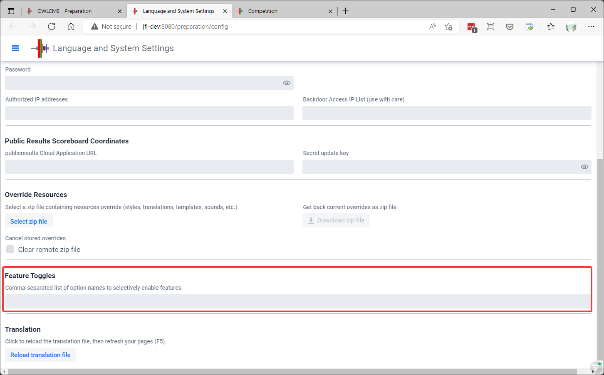

Feature Switches (also known as Feature Toggles) are parameters that can be turned on or off to change the application behavior.  They are typically used when a feature is added, before it becomes clear how to control through the regular interface. To access the list, use to the Languages and System Settings button from the "Preparation" page and scroll down.

Feature switches are not case sensitive.  Enter them separated by a comma if you need more than one.

| Feature Switch       | Description                                                  | Normal Way to Activate                                       |
| -------------------- | ------------------------------------------------------------ | ------------------------------------------------------------ |
| localTemplatesOnly   | If present, the default templates distributed inside the owlcms binary will not be shown.  Only the templates found in the local folder will be used.  If a .zip file is used to package the local folder and upload it to the program, then only these templates will be shown. This is normally used to create a zip with only the files used in a given federation, potentially renamed in the local language. | This feature can be activated on the Languages and Settings page. |
| mqttDecisions        | If present, the decisions from the referee displays are sent using MQTT messages (as if a separate referee box was used).  This is used for testing - the backend receives the information from the browser, but instead of updating the application state immediately, sends out an MQTT Message.  The decision message goes through the MQTT broker, comes back to the MQTT listener in owlcms, which then updates the back end.  The various displays are then informed to show the decision. | Only available as a feature switch.                          |
| sinclairMeets        | Treat the competition as if there is only a single weight category for men and one for women.  Use Sinclair to compute rankings and leaders | Use the checkbox on the Competition parameter page.          |
| forceAllGroupRecords | The records display at the bottom of the scoreboard will show all the records for the current group. | Only available as a feature switch.                          |