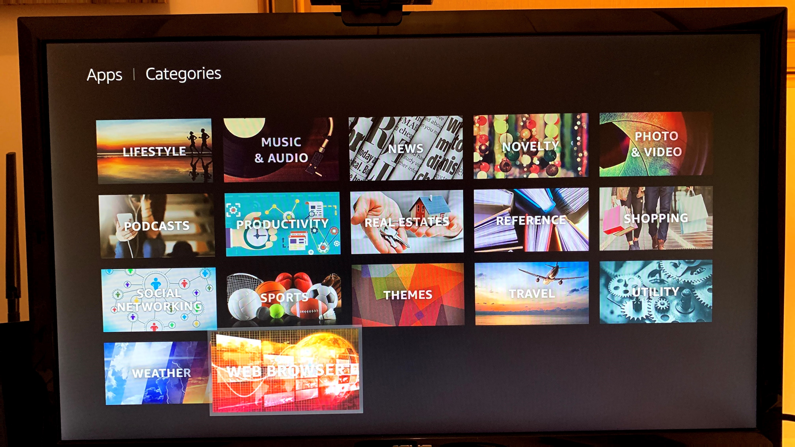
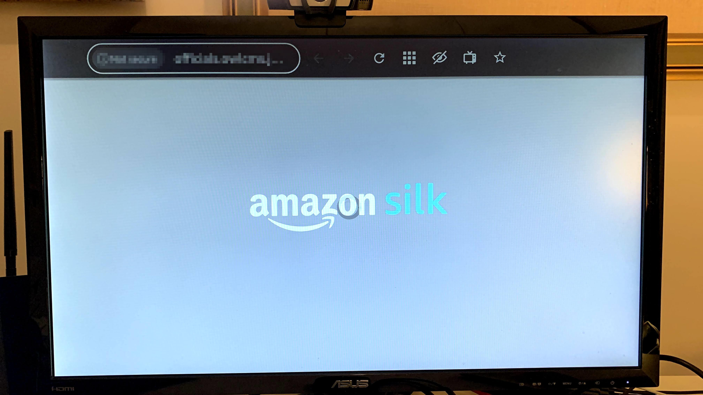
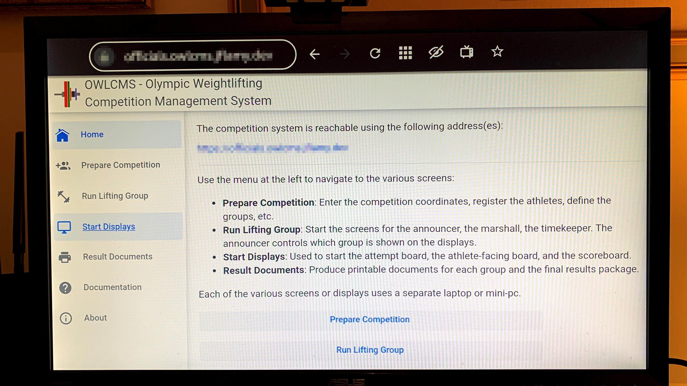
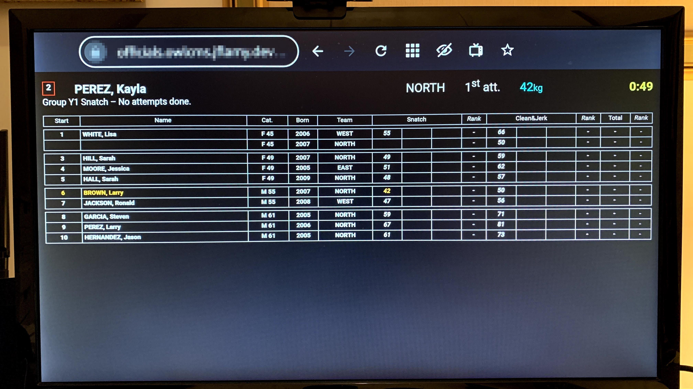
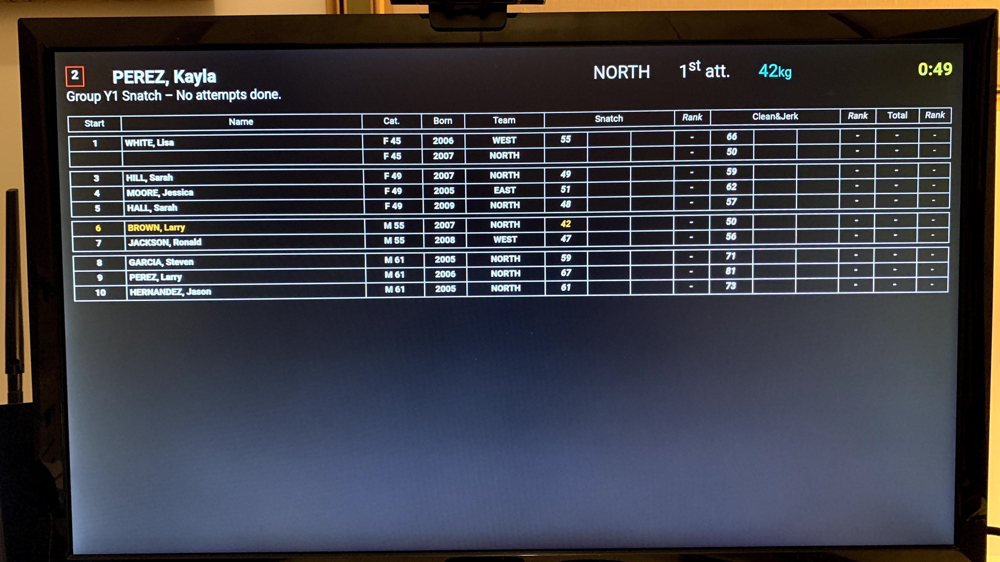

# Using a Fire TV Stick as a Display Device

Perhaps the cheapest way to get a display going is to use a 3rd generation Fire TV Stick (Full HD, no need for the newer 4K resolution).

In order to do so, all you need is to connect the stick to the local Wi-Fi, and to install the free Silk browser.

1. Go to the "Apps" menu, select "Categories", and go to the "Web Browser" category at the bottom
   

2. Click on "Silk" which is the free Amazon browser; this will download it and install it on your device
   

3. Click on the address area and enter the URL for your owlcms site

   

4. Add a bookmark to the home page using the star icon on the top bar
5. Select the display you want from the "Start Displays" section. Typically this will be a scoreboard.
   

6. Move the cursor all the way to the bottom so the address bar is hidden
   