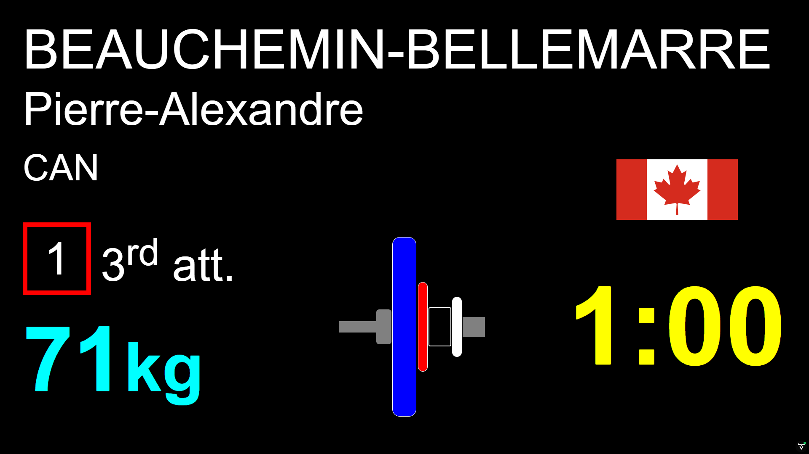
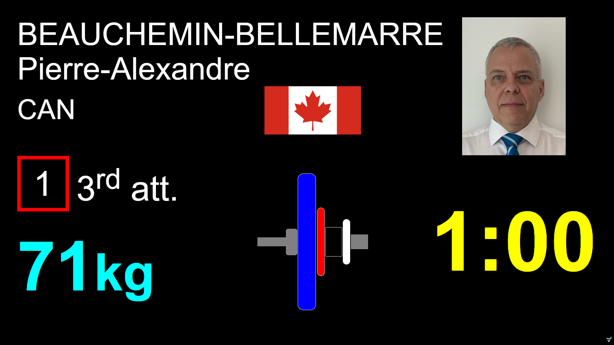

Warning:  This feature is new and may evolve.  It has been implemented in the simplest way to validate its usefulness. 

> NOTES
>
> - The presence of flags is detected when starting the scoreboards.  You may need to refresh the scoreboards after adding flags.

### Including a Flag

The current implementation is very simple and is meant for inter-provincial or international meets where the team name matches the flag. 

- Flags are expected to be in `.svg` or `.png` format and are copied to the  `local/flags` folder in the installation directory.
- In the above example, the team name for the athlete is CAN and the flag is expected to be found in the `local/flags/CAN.svg` file.  
  - The file name cannot include the characters `: \ / * ? | < >`  If these are present in the team name, they will be replaced by `_`    A team name `Good/Bad Lifts` will need to have its logo stored as `Good_Bad Lifts.svg` (or `.png`)
  - All the other characters in the spelling of the file name must be identical to the team name (spaces, lower and upper case, accented characters, etc.).  Only the characters listed above are replaced.
- If the flag is not found, the space will be left empty
- This feature can be used in the cloud  Once you have tested your setup on a laptop, you will package the local directory and upload it to the cloud.  See the [Customization](Customization) page for details.

### Finding Flags to Display

The easiest place to find flags is Wikipedia.

1. Go to the [List of ISO 3166 country codes](https://en.wikipedia.org/w/index.php?title=List_of_ISO_3166_country_codes&oldid=1119572367)
2. Find the country you want and click on the link
3. On the right-hand side of each country is a picture of the flag. CLICK on the flag to display it in full size.
4. At the bottom right of the window there is a download link to retrieve the SVG file.
5. Rename the flag whatever name you are using for the team.  For an official IWF competition the codes are found [here](https://iwf.sport/focus-on-iwf/federations/) example, `CAN.svg` would be the name for Canada. 

Another source, where all the flags are in the same size (4:3 ratio) is [flag-icons/flags/4x3 at main · lipis/flag-icons (github.com)](https://github.com/lipis/flag-icons/tree/main/flags/4x3)

1. Go to the [List of ISO 3166 country codes](https://en.wikipedia.org/w/index.php?title=List_of_ISO_3166_country_codes&oldid=1119572367)
2. Locate the two-letter code for the country you want
3. Find the file in [flag-icons/flags/4x3 at main · lipis/flag-icons (github.com)](https://github.com/lipis/flag-icons/tree/main/flags/4x3) and click to download it.
4. Rename the flag to be the name of the team with the exact spelling.  So `ca.svg` becomes `CAN.svg`

### Including a Picture of the Athlete

The current implementation is very simple.

- Athlete pictures are expected to be in JPEG format.  They can be stored under the `.jpg` (preferred) or `.jpeg` extension.

- Due to the presence of the picture, the font size for the last name is slightly smaller and the flag is moved to the center section.

- The picture should be edited and saved to a small size (100KB).  Pictures are saved in the `local/pictures` folder (see below for the conventions)

  > Because of the size of the pictures you should NOT use pictures when running in the cloud.  Under the current very simple implementation you will run out of memory.

- The picture should be named using the *Membership* number of the athlete.  This will allow you to create a folder with all the pictures of the athletes in a federation and reuse it.

  - If running a multi-federation event, you can use the membership field to assign a competition-specific registration number.
  - In the above example, the athlete's registration number is 4123.  The picture must be stored in the `local/pictures/4123.jpg` file.

- There is no need to have a flag in order to have a picture.  The two features are independent.