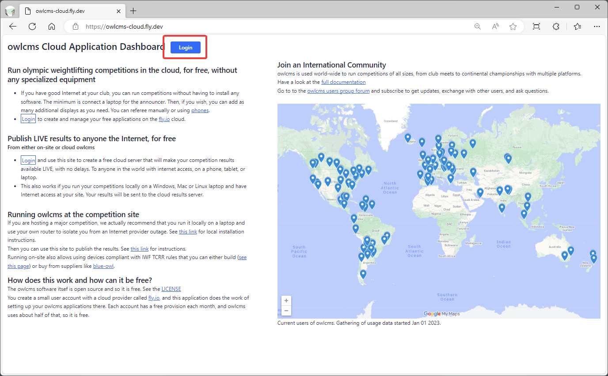
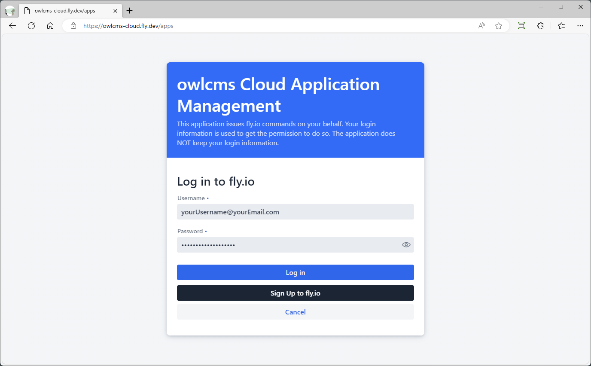
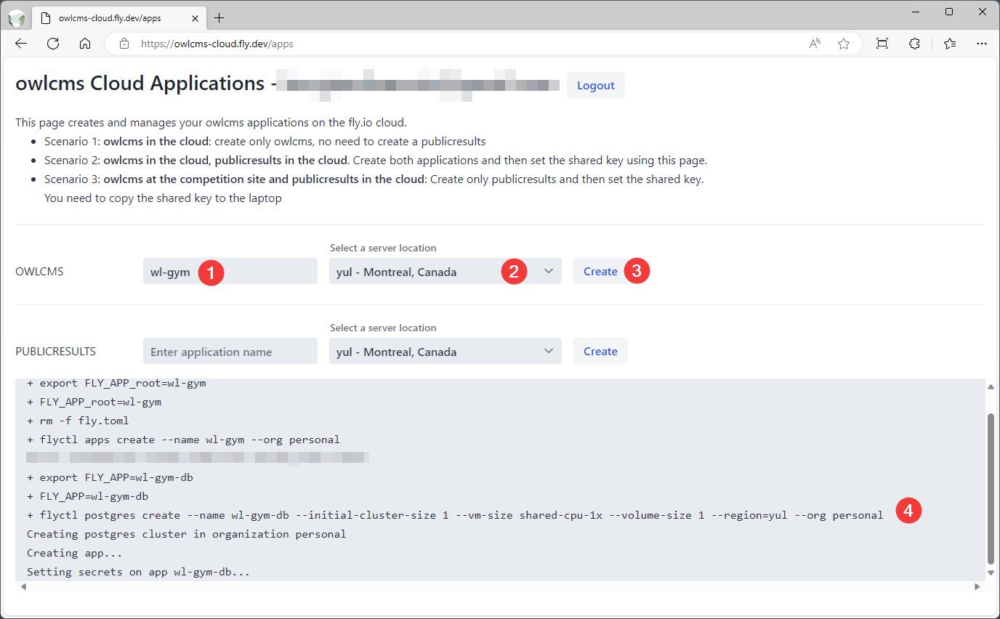
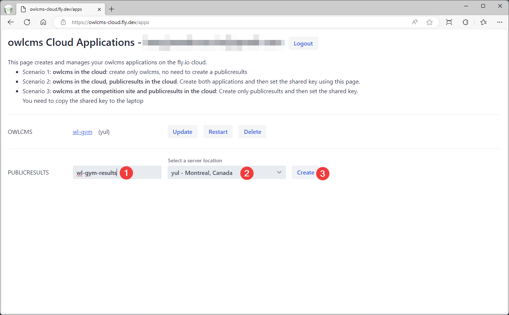
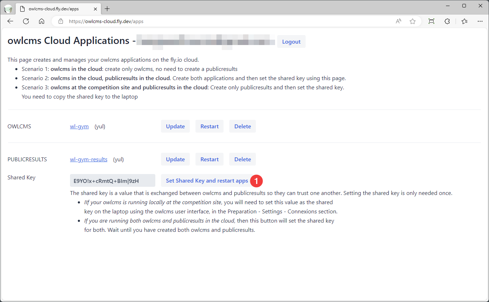

# Installation on fly.io

Fly.io is a cloud service that is, in effect, free, because the monthly charges are extremely low (2 to 3US$), below the minimum billable amount of 5 US$

To make the process easier, a web application dashboard has been created.  If you prefer doing all the steps by hand, you can see the manual installation process [here](Fly_Manual) .

### Login to the Dashboard

The first step is to open the installation application at  https://owlcms-cloud.fly.dev . Use the login button to proceed.

You need a fly.io account to proceed.  If you don't have one, use the black button to create an account. You will need a credit card number, but as explained above, it will not be charged.  Once you have an account, enter your fly.io credentials and login.

The applications that will be created will belong to you.  The only thing the application does is type commands for you.  At any time, you can switch to using the fly commands directly and do what you want.

### Create owlcms

The first application we will create is owlcms.  *If you run owlcms on-site and only want to publish results, skip this step.*

1. Type the name you want for your owlcms site.  The suffix `.fly.dev` will be added to create the site location. In this example, this would be [https://wl-gym.fly.dev](https://wl-gym.fly.dev)   If you own a domain name, you can later alias [a name you own](https://fly.io/docs/apps/custom-domain/).

2. Select a location in the world where the owlcms will run.  There are more than 20 available.  The locations are normally shown to you from the closest to the farthest to where you are.  However, it is usually preferable to pick one in your own country, even if it is further than one in a neighboring country.

3. Click the Create button.   An area at the bottom of the page will appear to show you the work being done.

   > NOTE: There is a step in the process that sometimes takes two minutes to complete (but is sometimes instantaneous).  Just be patient.

If all you wanted was to run owlcms, you are done.

### Create publicresults

If you want people on the Internet to see the competition scoreboard, keep going.  The process is the same whether you are running owlcms in the cloud or on a laptop at the competition site.

Pick a name for your internet scoreboard application.  Pick something short. In this fake example, people would have to type `wl-gym-results.fly.dev` on their phone, so that would not be a good choice.     If you own a domain, you can later make the scoreboard accessible [under a name you own](https://fly.io/docs/apps/custom-domain/).

The process is normally very quick because there is no database creation.

### Make publicresults trust owlcms

The next step is needed so owlcms can be trusted to send information to publicresults.  A random character string is created.  Clicking the button saves it as a secret in both applications and connects them together.  If you are running your owlcms at the competition site, it is easier to pick your own character string, as you will need to type it again.

If you are running both owlcms and publicresults in the cloud, you are done.

### Connecting an on-site owlcms to a cloud publicresults

This step is only required if you are running owlcms on a machine at the competition site.  Go to the Preparation | Language and System Settings | Connections page.  

Set the URL to reach publicresults cloud application.  Set the secret update key to be the same as you set before for publicresults.  You are now done.

