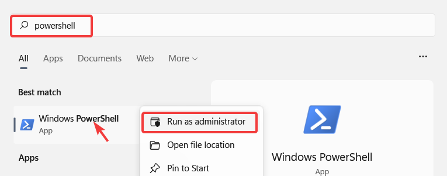

# Installation on fly.io

Fly.io is a cloud service that makes it easy to start from a very affordable service for small competitions, and also support a still affordable tier for larger meets.  Fly.io cheaper than Heroku, but the setup take a few more steps.

As an order of magnitude, running a small competition would cost less than 5 cents per day, and large national competition would cost something like 1US$ per day (from the time you scale it up to the higher performance mode).  You can create your application as a hobby-level setup, and scale it up to high-capacity, then scale it down back to the hobby tier when you are done. To stop billing, you can turn off the application (scale it to 0), or delete it.  Pricing is by second, based on the actual elapsed time the application is running.

> The key thing when using paid tiers is to *scale down* when done, otherwise billing continues. See the [Scale Down](#scale-down) section below for details.

## Initial Setup

1. Install the `flyctl` tool as explained on [this page](https://fly.io/docs/hands-on/installing/).  
   On Windows

   1. Start PowerShell as an administrator (click on the start icon, search for powershell, right-click to run as administrator
      
   
   2. Then paste the creation command.
   
      ```powershell
       iwr https://fly.io/install.ps1 -useb | iex 
      ```


2. Create a fly.io account, and associate a credit card number (or buy a preset amount of credits)

3. Open a terminal/command line interface and login to your account. provide the same information as you used for your account.

   ```powershell
   fly login
   ```

### Install an owlcms application


1. Create a directory to contain your configuration files.  Create a separate directory for each of your applications. In this example `fly_myclub` for the owlcms application that we will name `myclub` and that will be available as `myclub.fly.dev` .

   ```powershell
   mkdir fly_myclub
   cd fly_myclub
   ```

2. Create an owlcms application.  `owlcms/owlcms:latest` is the name in the public repository of Docker images (use `prerelease` instead of `stable` if you want the early adopter versions). The application will launch, but won't work with the default settings.  You will be prompted for a region - MAKE SURE you pick a meaningful region for your application, and note it.

   ```
   fly launch --image owlcms/owlcms:latest
   ```

3. Make the application big enough to run.

   ```
   fly scale memory 512 vm shared-cpu-1x
   ```

4. We now need to create a file area to store the database.  Make sure to use the region where you created the application (replace ABC with the 3-letter code for your region). This will associate a volume called `myclub_database` with your application

   ```
   fly volumes create myclub_database --region ABC --size 1
   ```

5. Edit the application configuration.  The file is called `fly.toml` .  On Windows, use notepad to edit it (right-click on the file). Add a `[mounts]` section as shown below. The source is the name you used for your volume.  The destination should not be changed.

   ```
   # fly.toml file generated for owlcms on 2022-08-25T22:49:26-04:00
   
   app = "myclub"
   kill_signal = "SIGINT"
   kill_timeout = 5
   processes = []
   
   [mounts]
     source="myclub_database"
     destination="/database"
   
   ```

6. Tell fly to reload

   ```
   fly deploy
   ```

7. If you want to stop the application

   ```
   fly scale count 0
   ```

8. If you want to restart the application that you stopped. Do NOT use any other value than 0 or 1.

   ```
   fly scale count 1
   ```

### Scale-up and Scale-down

For a larger competition, you might want to get a dedicated virtual machine with more memory

1. Make the application bigger.

   ```
   fly scale memory 1024 vm dedicated-cpu-1x
   ```

2. Make the application smaller and shut it down (count 0) or count 1 if you want to keep it running.

   ```
   fly scale memory 512 vm shared-cpu-1x count 0
   ```