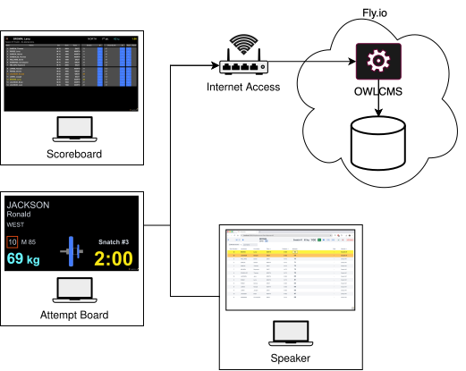
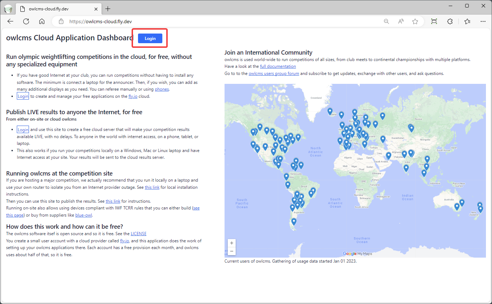
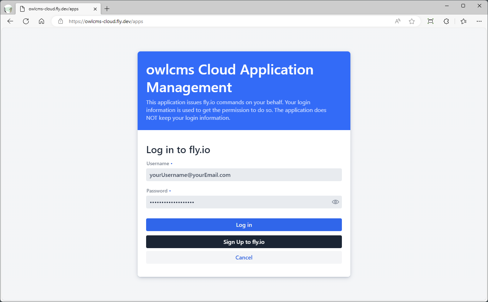
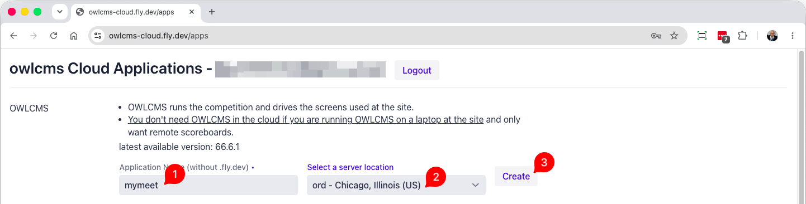
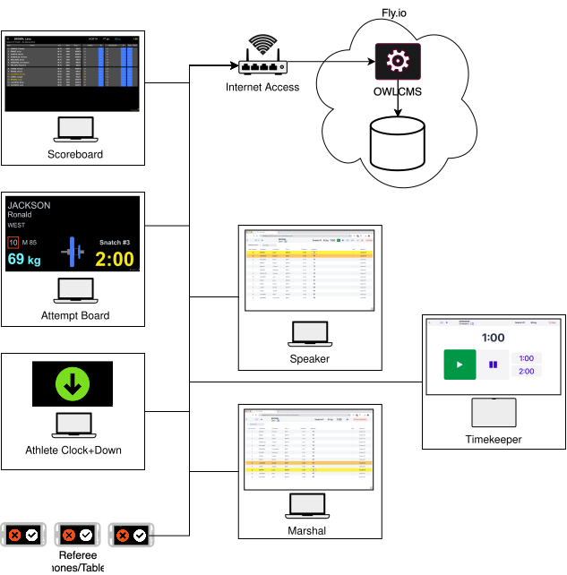
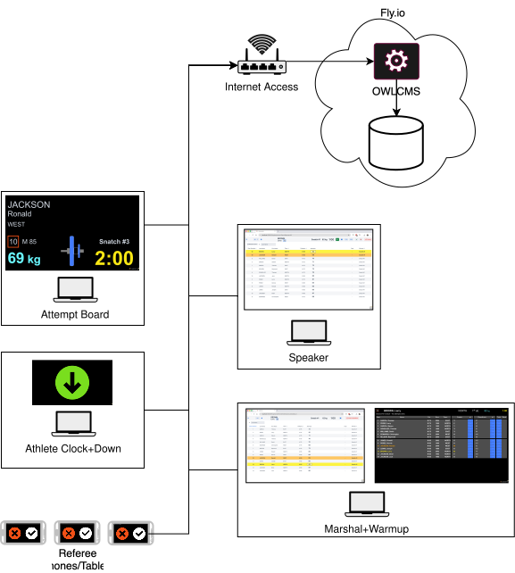

In a Cloud-based installation, all that is needed is a few devices with an internet browser a most importantly a good internet connection.

### Basic Cloud-Based Setup

 The diagram below shows a simple club meet setup.  In this example, flags are used for refereeing, and the [speaker enters the decisions](Refereeing.md#manual-refereeing).  For such a club meet,  the venue's WiFi provides the internet access. This is a starting point; you can then add all the other technical official stations and scoreboards that you may wish for; see later on this page.

### Fly.io

To run in the cloud, the simplest solution is to use [Fly.io](https://fly.io).   Fly.io is a cloud service that is, in effect, free, because the monthly charges are extremely low (2 to 3US$), below the minimum billable amount of 5 US$.  And if you delete your applications after your competition, there is no charge, ever.

When running on fly.io, you get your own personal copy of OWLCMS and of all your data.  OWLCMS only provides an application dashboard to run the installation and upgrade commands on your behalf.

### Login to the Dashboard

The first step is to open the installation application at  https://owlcms-cloud.fly.dev . Use the login button to proceed.

You need a fly.io account to proceed.  If you don't have one, use the black button to create an account. You will need a credit card number, but as explained above, it will not be charged.  Once you have an account, enter your fly.io credentials and login.

The applications that will be created will belong to you.  The only thing the application does is type commands for you.  At any time, you can switch to using the fly commands directly and do what you want.

### Create a cloud-based OWLCMS

1. Type the name you want for your owlcms site.  The suffix `.fly.dev` will be added to create the site location. In this example, this would be [https://mymeet.fly.dev](https://mymeet.fly.dev)   If you own a domain name, you can later alias [a name you own](https://fly.io/docs/apps/custom-domain/).

2. Select a location in the world where the owlcms will run.  There are more than 20 available.  The locations are normally shown to you from the closest to the farthest to where you are.  However, it is usually preferable to pick one in your own country, even if it is further than one in a neighboring country.

3. Click the Create button.   An area at the bottom of the page will appear to show you the work being done.

4. You can now start, stop, update or delete your OWLCMS from that page.

### Additional Displays and Stations

You can add as many scoreboards as you need, as well as any additional technical official station you need.  All that matters is they connect to the OWLCMS address through the WiFi link,.  In this example

- [Phones are used as refereeing devices](Refereeing.md#mobile-device-refereeing)
- A timekeeper uses a tablet
- A laptop is positioned in front of the athletes

### Using Fewer Laptops

You can reduce the number of required computers by connecting additional displays to the laptops you have (see [Setting up dual monitors](https://www.wikihow.com/Set-Up-Dual-Monitors) ; if your laptop does not have a screen port, you can use an [adapter](https://www.amazon.com/AmazonBasics-USB-C-Male-Female-Adapter/dp/B0898BYFSB?th=1)).  

- A common setup uses the Marshal computer to drive the warmup room scoreboard
- It is common for the speaker to start and stop the clock (acting as timekeeper)

### Additional Modules

It is possible to connect your OWLCMS to additional modules, for example to provide scoreboards that can be watched on any phone connected to the internet.  To do so, activate the TRACKER module further down on the same page, and set a Shared Key, also on the same page.
