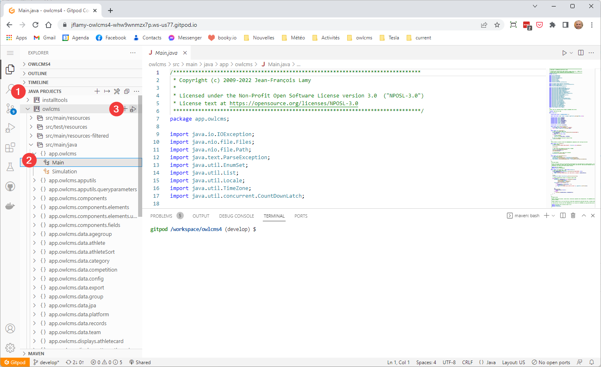

OWLCMS is a Java and JavaScript-based project that follows the modern open-source practices.  It relies on Maven and Git for its build and version control.

A complete, fully-functional copy of a development environment can be obtained in the cloud in a matter of minutes using a service called [Gitpod.io](https://www.gitpod.io).  For our purposes, the service is free. Gitpod provides a fully configured environment based on Visual Studio Code and Eclipse and checks out the source from the OWLCMS repository.  Contributors can then create `pull requests` so that their changes are merged with the official release.

Developers more at ease with the desktop versions of Eclipse or VS Code can obviously use these tools instead. The github repository contains the settings files that should work with both these environments with minimal adjustments.  Should anyone provide settings files for other tools like IntelliJ IDEA we would integrate them, of course.

### Create the GitPod workspace

Click on the following link https://gitpod.io#https://github.com/jflamy/owlcms4/tree/develop 

What this link does is tell gitpod to open the `develop` branch of the owlcms4 source directory.  Gitpod notices that there is a Docker instruction file inside, and proceeds to create a workspace according to these instructions.  The first time around, this may take a couple minutes, because gitpod fetches Java installation files and other things.

You will need to 

### Initial Setup

A few steps are necessary to get going

1. Some of the dependencies used by the project are stored in an owlcms-specific Maven repository for convenience.  To gain access to that repository
   ```
   cp .gitpod/settings.xml ~/.m2/settings.xml
   ```

2. The project uses a shared library.  The simplest way to get going is to compile it

   ```
   cd shared
   mvn install
   cd ..
   ```

3. The next step is usually automatic, but it does not hurt to do this manually

   ```
   cd owlcms
   mvn clean
   mvn vaadin:prepare-frontend
   ```

### Running the application

To run the application, open the Java Projects section.  There will be a triangle next to the `owlcms` project name.  You can start the application using the triangle -- just select the Main class when asked what class to run.



### Framework Documentation

The application is built using the [Vaadin framework, version 14](https://vaadin.com/docs/v14/flow/overview).   The frontend modules (all the scoreboards, the timers, the decisions) are coded in JavaScript and are located in the `frontend` directory.
