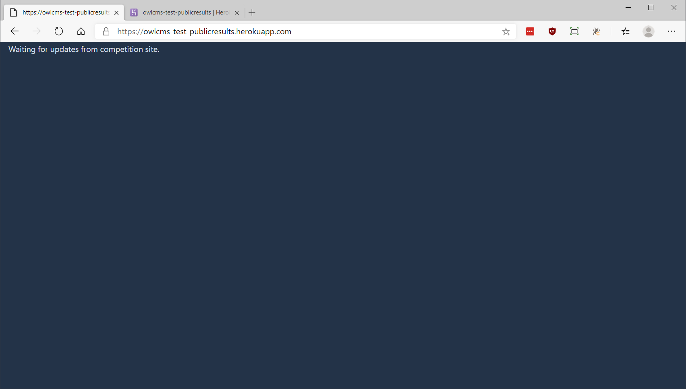
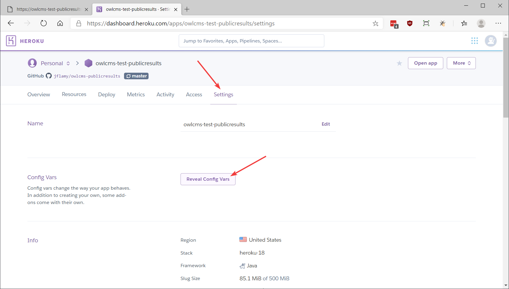
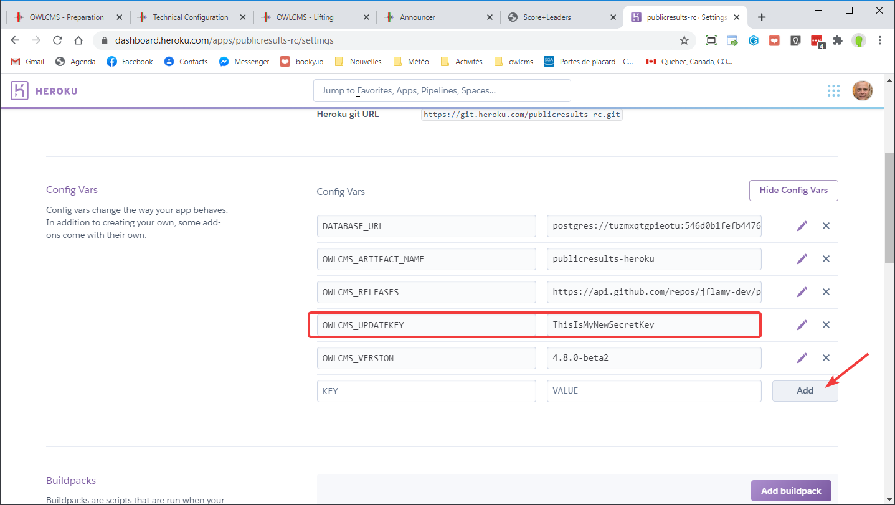
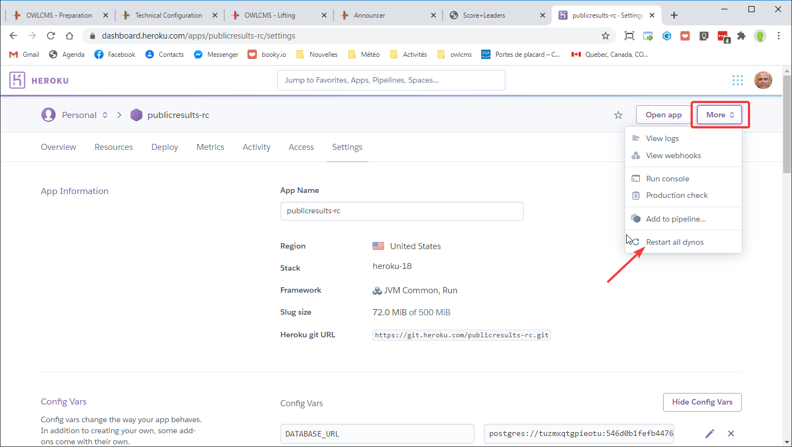

# (Deprecated) Deploy OWLCMS on Heroku

> **Heroku has made changes to its platform and the simple deployment method is no longer available**
>
> **If you need a cloud version of owlcms, we strongly recommend that you use the [fly.io](https;//fly.io) service because installation is much simpler.  See the instructions on the [Fly](Fly) page.**
>
> Deploying a Heroku app requires installing Java, installing their command-line took, and typing commands.

Heroku is a cloud service provider that provides an affordable pricing plan for running programs like OWLCMS.   Running a site costs just under 10$ per month.

Heroku bills by the second, and you can actually turn off your site when you don't use it (see the [Stopping and Resuming Billing](#stopping-and-resuming-billing) section below)

## Installing owlcms

- Install Java
  - Go to https://adoptium.net/ and download a version (there is a .pkg installer for Mac)

- Install Heroku CLI from [The Heroku CLI | Heroku Dev Center](https://devcenter.heroku.com/articles/heroku-cli)   You can ignore the steps about `git`, they are not needed.
- Run the following commands

```
heroku login
heroku plugins:install java
```

- Get a current release [zip](https://github.com/owlcms/owlcms4-prerelease/releases/download/40.0.0-rc03/owlcms_40.0.0-rc03.zip) from the [release repository](https://github.com/owlcms/owlcms4-prerelease/releases)
- Unzip file to your desired installation location and change directory (`cd`) to that location
- Run the following commands.  Replace `myclub` with you own application name.

```
heroku deploy:jar owlcms.jar --app myclub
heroku addons:create heroku-postgresql:mini --app myclub
heroku ps:restart --app myclub
```

- In order to update your application, you only need to unzip the new release and run the deploy command again.

```
heroku deploy:jar owlcms.jar --app myclub
```


### Installing the Public Results Scoreboard (optional)

The public results scoreboard is an optional module.  It allows people with internet access to follow the competition scoreboard.  This can be the coaches using in a tablet in the warmup room, people in the audience, or people watching a live stream of the competition.

See [this page](PublicResults) for details.

The process is the same as for the owlcms application

1. Use the new instructions at the top of the page, but replace `owlcms` with `publicresults`

2. You can check that the application is running by starting a new browser tab. In our example, we connect to `https://owlcms-test-publicresults.herokuapp.com`.  Since we have not yet connected owlcms to feed publicresults, you will see this screen.
   

3. We now need to configure a secret code to keep communications secure between the competition site and the publicresults repeater.  Go to the `Settings` page for the application.
   
4. Create configuration variable `OWLCMS_UPDATEKEY` and set it to the secret key that will be shared with owlcms.  **Use something easy to type, but quite long**, and not easily guessed.  The  password to your Heroku account and the update key is what prevents vandals from messing up your scoreboards.  Do not share them, and make sure they cannot be guessed easily.
   
5. Copy the value for the update key (Ctrl-C)

6. Restart the publicresults application
   

7. Start a new browser tab and go to the address for the application (or you can use the `Open app` button at the top right) and check that the application is again waiting.
   

8. You now need to connect the two applications together, so that publicresults receives updates from owlcms.  See [this page](PublicResults) for instructions.

### Stopping and Resuming Billing

In order to stop billing on your application "myclub" (use your own name).  The same apply for myclub-results

- ```
heroku scale web:0 -a myclub
  ```
  
  Repeat with any other app you may have (for example, if you have installed publicresults)

- In order to restart the application

  ```
  heroku scale web:1 -a myclub
  ```

