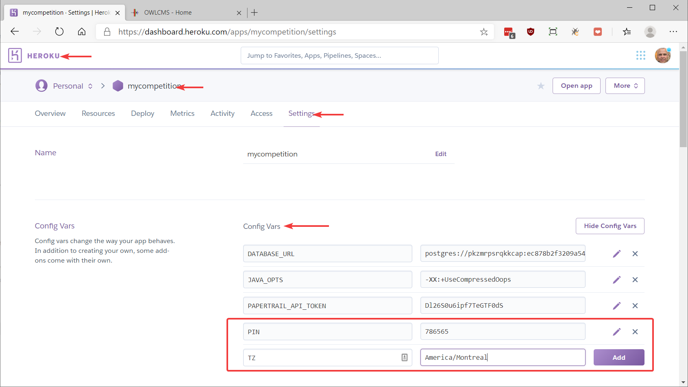

Heroku is a cloud service provider that provides an attractive free (0$) pricing plan for running programs like OWLCMS4.  When running on Heroku you only need a good Internet connection, and you do not need to configure a master laptop.

The installation process for Heroku has been completely redone, and is now extremely simple -- there is nothing whatsoever that needs to be installed on any of the laptops other than a browser.

**1. Create a free Heroku Account**

- Go to page https://heroku.com
- Create a free account.  Yes, it is free.  Remember the login and password information.

**2. Go to the releases repository and start the process**

The Heroku releases directory is located at https://github.com/owlcms/owlcms4-heroku/releases/latest.  Click the big `Deploy to Heroku` button.

**3. Name your application and deploy**

Enter the name that will be used on all your competition site laptops and displays.  Once you are done start the deployment (this will prepare the application and make it available)

**4. View the application**

The application will now be available under the name you picked followed by `.herokuapp.com`

**5. Success!**

**6. Protect your application from mischief.**

In a gym setting, people can read the web addresses on the screens, and one day, some funny person will log in to the system and be tempted to mess things up.

Go back to your https://heroku.com home page.  Select your application, then `Settings`, then `Reveal Config Vars`.  Add two variables:

- PIN: this variable is a password that will be required when each screen is started for the first time after the system is started. 
- We strongly suggest you also set `TZ` which is your time zone.   Pick your TZ Database Name (something similar to America/New_York or Europe/Paris) from [this list.](https://en.wikipedia.org/wiki/List_of_tz_database_time_zones) 

- For additional protection from outside mischief (including people with phones or tablets), you can restrict access to the cloud application to come only from your competition site router. `IP` is a comma-separated list of white-listed addresses.   In order to find the proper value:

  - From your competition site, browse to https://google.com and 
- Type the string  `my ip`  in the search box.  
  This will display the address of your competition site router as seen from the cloud.  
  - You should see a set of four numbers separated by dots like `24.157.203.247`  . This the address you should use -- the Heroku application will reject connections coming from other places than your competition router.                      

### Configuration Parameters

See the [Configuration Parameters](./Configuration.md ':include') page to see additional configuration options in addition to the ones presented on this page.
